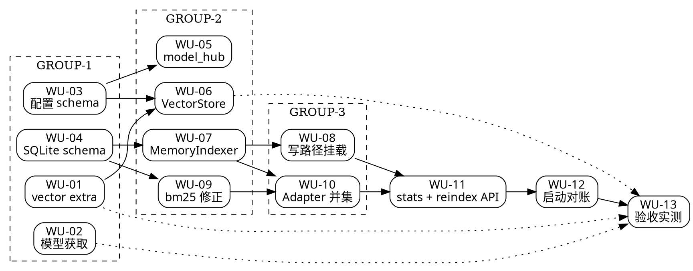

# nanobot 向量检索接入 — Harness 执行图

> 实施步骤以 **plan** 为准；本文件只描述并行 GROUP / WU 与派发。多轮审阅时优先改本文件，避免扰动 plan 内 Task 细步。
>
> **Task ↔ WU 映射**：plan 的 `Task N` ↔ 本文件的 `WU-0N`（一对一）。`Task 0`（合并修复分支）已完成，不占 WU 号。

## 0. 并行前提：契约已冻结

`.ai-runtime-artifacts/contracts/2026-09-16-vector-retrieval-contract.md` 已 `status: frozen`。

**没有这份契约，本执行图不成立**——`WU-06`（`VectorStore`）与 `WU-07`（`MemoryIndexer`）本应串行（后者消费前者的方法集）。契约把 `VectorStore` 的**方法集与不变量**先行冻结，使二者可并行：`WU-07` 的单测用纯内存替身（`_FakeStore`），根本不 import 真实 `VectorStore`。

派发各 WU 时，**必须把契约文件的对应小节一并交给 coder**。

## 1. 执行图

```markdown
GROUP-1:  起步组（4 WU 全并行）
  WU-01: Task 1 新增 vector extra | 标题: 新增 vector extra 与 CPU-only torch index | 文件: pyproject.toml | 依赖: 无 | wu_type: config | agent_role: implementer | workspace_scope: wu | worktree_path: .worktrees/wt-2026-09-16-vector-retrieval | branch: harness/wt-2026-09-16-vector-retrieval | wu_skills: auto
  WU-02: Task 2 模型获取与冒烟 | 标题: 预下载 bge-small-zh-v1.5 并冒烟自检 | 文件: 无（用户目录 + 验证产物） | 依赖: 无 | wu_type: chore | agent_role: implementer | workspace_scope: none | worktree_path: n/a | branch: n/a | wu_skills: auto
  WU-03: Task 3 配置 schema | 标题: 新增 memorySearchBackend 与 memoryVector 配置 | 文件: nanobot/config/schema.py, nanobot/memory/vector/{__init__,settings}.py | 依赖: 无 | wu_type: feature | agent_role: coder | workspace_scope: wu | worktree_path: .worktrees/wt-2026-09-16-vector-retrieval | branch: harness/wt-2026-09-16-vector-retrieval | wu_skills: auto
  WU-04: Task 4 SQLite schema | 标题: 新增 vector_sync_state 表并把 schema 版本升至 2 | 文件: nanobot/memory/database.py, nanobot/memory/repository.py | 依赖: 无 | wu_type: feature | agent_role: coder | workspace_scope: wu | worktree_path: .worktrees/wt-2026-09-16-vector-retrieval | branch: harness/wt-2026-09-16-vector-retrieval | wu_skills: auto

GROUP-2:  向量核心组（4 WU 并行；契约已冻结）
  WU-05: Task 5 model_hub | 标题: 新增 model_hub 三源探测与 HF endpoint 双写 | 文件: nanobot/memory/vector/model_hub.py | 依赖: WU-03 | wu_type: feature | agent_role: coder | workspace_scope: wu | worktree_path: .worktrees/wt-2026-09-16-vector-retrieval | branch: harness/wt-2026-09-16-vector-retrieval | wu_skills: auto
  WU-06: Task 6 VectorStore | 标题: 新增 VectorStore 状态机与优雅降级 | 文件: nanobot/memory/vector/store.py | 依赖: WU-03, WU-01 | wu_type: feature | agent_role: coder | workspace_scope: wu | worktree_path: .worktrees/wt-2026-09-16-vector-retrieval | branch: harness/wt-2026-09-16-vector-retrieval | wu_skills: auto
  WU-07: Task 7 MemoryIndexer | 标题: 新增 MemoryIndexer 双向对账与写路径钩子 | 文件: nanobot/memory/vector/indexer.py | 依赖: WU-04, WU-06（仅契约） | wu_type: feature | agent_role: coder | workspace_scope: wu | worktree_path: .worktrees/wt-2026-09-16-vector-retrieval | branch: harness/wt-2026-09-16-vector-retrieval | wu_skills: auto
  WU-09: Task 9 bm25 修正 | 标题: 语义召回改用真实 bm25 页内归一化 | 文件: nanobot/memory/repository.py | 依赖: WU-04（同文件，须后置） | wu_type: bugfix | agent_role: coder | workspace_scope: wu | worktree_path: .worktrees/wt-2026-09-16-vector-retrieval | branch: harness/wt-2026-09-16-vector-retrieval | wu_skills: auto

GROUP-3:  接线组（2 WU 并行，互不重叠）
  WU-08: Task 8 写路径挂载 | 标题: 在 5 个记忆写入点挂载 best-effort 向量索引钩子 | 文件: nanobot/memory/extractor.py, nanobot/memory/database.py, nanobot/webui/memory_api.py | 依赖: WU-07 | wu_type: feature | agent_role: coder | workspace_scope: wu | worktree_path: .worktrees/wt-2026-09-16-vector-retrieval | branch: harness/wt-2026-09-16-vector-retrieval | wu_skills: auto
  WU-10: Task 10 Adapter 并集 | 标题: MemoryStoreAdapter 做向量与 FTS5 最高分并集 | 文件: nanobot/memory/retrieval/store_adapter.py | 依赖: WU-07, WU-09 | wu_type: feature | agent_role: coder | workspace_scope: wu | worktree_path: .worktrees/wt-2026-09-16-vector-retrieval | branch: harness/wt-2026-09-16-vector-retrieval | wu_skills: auto

GROUP-4:  API 组（1 WU；须等 WU-08 释放 memory_api.py）
  WU-11: Task 11 stats + reindex API | 标题: stats 暴露向量状态并新增 reindex/sync 端点 | 文件: nanobot/webui/{memory_api,memory_routes,settings_routes,gateway_services}.py, nanobot/cli/gateway_runtime.py | 依赖: WU-10, WU-07, WU-08 | wu_type: feature | agent_role: coder | workspace_scope: wu | worktree_path: .worktrees/wt-2026-09-16-vector-retrieval | branch: harness/wt-2026-09-16-vector-retrieval | wu_skills: auto

GROUP-5:  收口组（1 WU）
  WU-12: Task 12 启动对账与默认回归 | 标题: 启动后台对账并把默认配置回归固化为测试 | 文件: nanobot/cli/gateway_runtime.py | 依赖: WU-11 | wu_type: feature | agent_role: coder | workspace_scope: wu | worktree_path: .worktrees/wt-2026-09-16-vector-retrieval | branch: harness/wt-2026-09-16-vector-retrieval | wu_skills: auto

GROUP-6:  验收组（1 WU）
  WU-13: Task 13 验收实测 | 标题: 落盘 V/D/R 三组验收证据 | 文件: .ai-runtime-artifacts/verifications/2026-09-16-vector-retrieval-verification.md | 依赖: WU-01~WU-12 全部 | wu_type: test | agent_role: test-engineer | workspace_scope: wu | worktree_path: .worktrees/wt-2026-09-16-vector-retrieval | branch: harness/wt-2026-09-16-vector-retrieval | wu_skills: auto
```

## 2. 依赖图



**关键路径（8 WU 深）**：
`WU-01 → WU-03 → WU-06 → WU-07 → WU-10 → WU-11 → WU-12 → WU-13`

**次关键路径**：`WU-01 → WU-03 → WU-06 → WU-07 → WU-08 → WU-11 → …`（比关键路径短 1 环，因 WU-08 与 WU-10 并行）

## 3. 冲突防范（重要）

| 文件 | 涉及 WU | 处置 |
| --- | --- | --- |
| `nanobot/memory/repository.py` | WU-04（末尾追加）、WU-09（替换 `:693-708`） | 已分到不同 GROUP（WU-09 在 GROUP-2，WU-04 在 GROUP-1）**强制串行** |
| `nanobot/webui/memory_api.py` | WU-08（写路径钩子）、WU-11（stats/reindex） | WU-11 显式依赖 WU-08，**强制串行** |
| `nanobot/memory/database.py` | WU-04（`_SCHEMA_STATEMENTS`）、WU-08（fallback replay） | 不同 GROUP，**强制串行** |
| `nanobot/cli/gateway_runtime.py` | WU-11（接线）、WU-12（启动对账） | WU-12 依赖 WU-11，**强制串行** |
| `pyproject.toml` | WU-01 独占 | 无冲突 |

> **GROUP-2 的 WU-05 / WU-06 / WU-07 分别新建不同文件，零重叠；WU-09 只动 repository.py 的一处函数。** 三者与 WU-09 并行安全。

## 4. 风险提示（派发时须转达）

| # | 风险 | 影响的 WU | 转达内容 |
| --- | --- | --- | --- |
| R-1 | torch 误装 CUDA 版（+2 GB） | WU-01 | 必须走 `[tool.uv.sources]` 的 `pytorch-cpu` index；验收检查 `torch.cuda.is_available()` 为 False |
| R-2 | `HF_ENDPOINT` 模块级常量缓存 | WU-05 | 必须**双写** `os.environ` + `huggingface_hub.constants.ENDPOINT`；WU-05 有此单测 |
| R-3 | 维度不匹配静默错排 | WU-06 | `_activate` 必须比对 `get_sentence_embedding_dimension()`，不等则 `failed` + 写 `vector_error` |
| R-4 | 量纲混排 | WU-09, WU-10 | FTS5 侧必须是**真 bm25 页内归一化**（WU-09），否则 `max()` 并集被阶梯分压制 |
| R-5 | `_MIN_COMPOSITE = 0.35` 击穿 | WU-13 | 强制实测；若击穿按 plan Task 13 Step 3 的 (a)/(b) 处置 |
| R-7 | 本机 3.13 vs CI 3.11 | WU-13 | `ruff` / `basedpyright` 结论**不得**声称已在 3.11 验证，除非真在 3.11 跑过 |
| R-8 | `collection.get()` 全量拉 id | WU-07 | v1 接受；若记忆量超预期再分页 |

## 5. WU 交付纪律（每个 coder 必须遵守）

1. **先读契约**：`.ai-runtime-artifacts/contracts/2026-09-16-vector-retrieval-contract.md` 的对应小节。
2. **只改本 WU 的 `文件:` 列出的文件**。需要改其他文件 → 停手，报 Leader。
3. **只用 `Write` / `Edit` 改仓库内文本**，禁止 shell 写文本。
4. **每个 Step 完成后单独 commit**，Angular 风格中文说明（plan 内已给出 commit message）。
5. **遇到 plan §6.4 的「已知未决」项** → 按表内处置执行，并在 WU 交付说明里写明触发了哪一条。
6. **不得自行 push / 开 PR**（`harness-kit/project.git.md`：Leader 不自动 push，须用户确认）。

## 6. 尾盘（Leader 手动执行）

> 平台**没有**调度器/状态机。以下三件事由 Leader 在会话中手动执行，**不可省略**。

1. **集体测试** → 落盘 `.ai-runtime-artifacts/verifications/2026-09-16-vector-retrieval-collective-test.md`
2. **集体审查** → 落盘 `.ai-runtime-artifacts/reviews/2026-09-16-vector-retrieval-code-review.md`
3. 并行扇出（按需）：`security-auditor`（记忆内容是不可信数据，注入块已有加固——本方案新增的向量路是否引入新面）、`perf-auditor`（启动耗时 D6、`encode` 在检索热路径上的开销）

**末个 WU 返回 ≠ 完成**。须先尾盘 A+B 才可声称 GROUP 交付。

## 变更记录

| 轮次 | 日期 | 变更摘要 |
| --- | --- | --- |
| 1 | 2026-09-16 | 初稿。13 WU / 6 GROUP。关键路径 8 WU 深。契约冻结使 WU-06 与 WU-07 得以并行（否则关键路径 +1） |

## Next

- 执行图确认 → 说「**开始实现**」或「**并行执行**」
- 只改 plan 任务细节、不改并行策略 → 仅改 `*-plan.md`
- 只改 WU 拆分 / 依赖 / GROUP → 改本文件并告知 Leader 审阅
