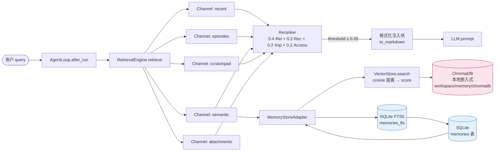
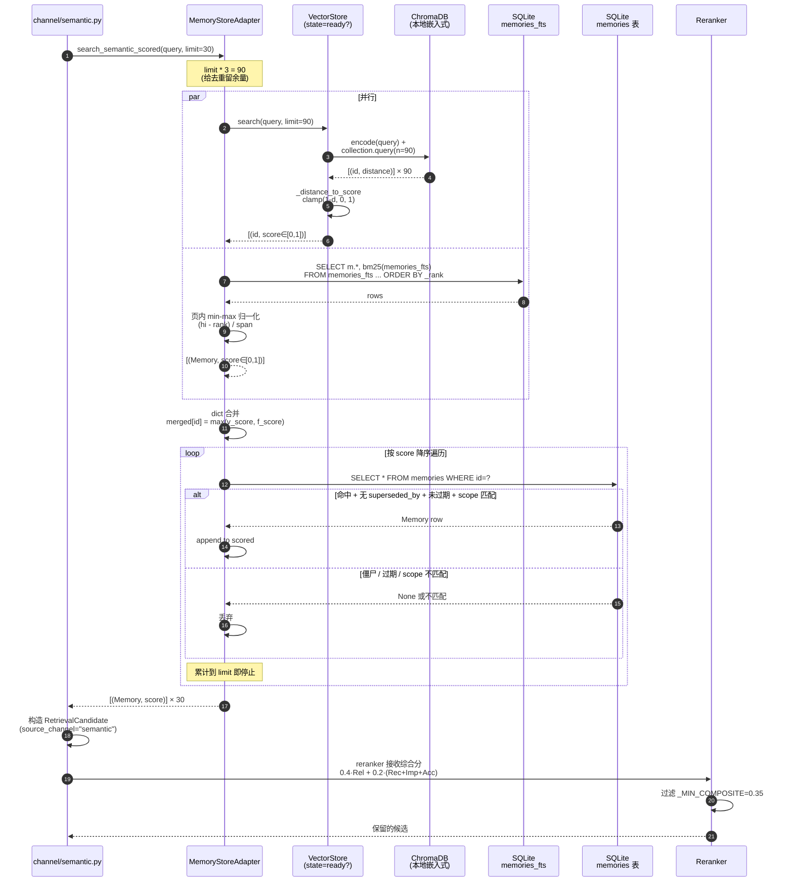
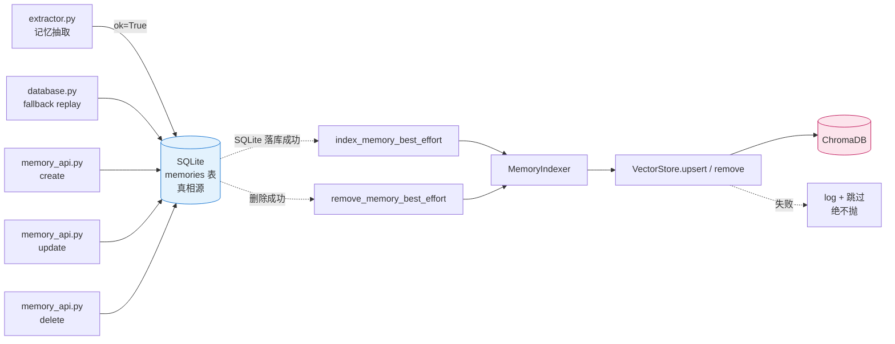
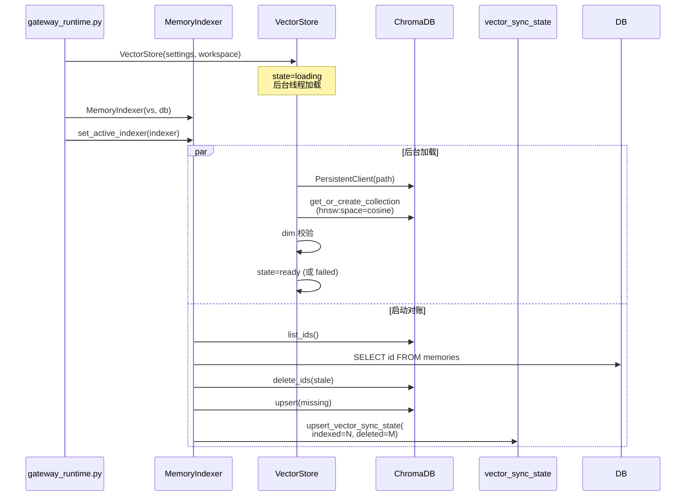

# nanobot 记忆向量检索接入 实施计划

> **For agentic workers:** REQUIRED SUB-SKILL: 使用 `superpowers:subagent-driven-development`（推荐）或 `superpowers:executing-plans` 按任务逐条实施。步骤用 `- [ ]` 复选框跟踪。

**Goal:** 在 nanobot 的 SQLite 记忆库之上接入 ChromaDB + `BAAI/bge-small-zh-v1.5` 向量索引，让四路召回获得语义能力，且依赖缺失时优雅降级为纯 FTS5。

**Architecture:** SQLite 仍是唯一真相源；ChromaDB 索引是**可重建的下游派生**。读写路径刻意不对称——写路径 SQLite 先落库、向量 best-effort 跟上并用对账兜底；读路径在 `MemoryStoreAdapter.search_semantic_scored` 内做「向量 ∪ FTS5」取最高分并集，对外契约不变。向量层用状态机 + 后台线程 + 冷却重试，**绝不阻塞启动、绝不向上抛异常**。

**Tech Stack:** Python ≥3.11（本机 3.13.13，CI 基线 3.11）· SQLite FTS5 · ChromaDB 1.5.x（`PersistentClient`）· sentence-transformers 6.x · torch CPU-only · pydantic v2 · pytest（`asyncio_mode = "auto"`）· ruff / basedpyright strict。

---

## 0. 读前必读：本计划相对 spec 的 3 处修正

这些是写计划时**读源码实测**发现的、spec 未覆盖或写错的地方。**实施前必须先看这一节。**

### 修正 1 🔴 `repository.search_semantic_scored` 用的是「索引伪分」不是真 bm25

`nanobot/memory/repository.py:693-708` 实测：

```python
def search_semantic_scored(conn, query, *, limit=30) -> list[tuple[Memory, float]]:
    results = search_memories(conn, query=query, limit=limit)
    out = []
    for idx, mem in enumerate(results):
        out.append((mem, _pseudo_bm25_score(float(idx))))   # ← idx 是序号，不是 bm25
    return out
```

`_pseudo_bm25_score(rank) = 1.0/(1.0+max(0.0, rank))`（`:808-810`），代入 `idx=0,1,2,…` 得 **1.0 / 0.5 / 0.333 / 0.25 / …**。

**后果**：FTS5 第 1 名恒得 1.0。若按 spec §4.6 做 `max()` 并集，向量分（bge 中文短句实测通常 0.5–0.9）**永远压不过 FTS5 第 1 名**。表现为「向量接上了，但排序毫无变化」——正是 spec R-5 担心的「做了但没效果」。

**本计划的处理**：Task 8 把该函数改为读取**真实 `bm25()` 值**并在页内做 min-max 归一化，使 FTS5 分在 [0,1] 内**有分布**而非 1.0/0.5/0.333 的阶梯。

### 修正 2 ⚠️ spec §6.1 V3 的 `channel="vector"` 判据不成立

`nanobot/memory/retrieval/channels/semantic.py:34` 恒写 `source_channel="semantic"`。向量命中与 FTS5 命中在 `RetrievalCandidate` 层**不可区分**，除非改通道契约（属独立决策）。

**本计划的处理**：V3/V5 改为用**可观测的代理判据**——构造一个 FTS5 必然零命中的同义查询（如查询「情绪低落」、记忆内容为「心情不好」），此时候选集合**只能**来自向量。这比改契约更小、更强（它证明的是端到端能力，不是内部标记）。见 Task 11。

### 修正 3 ⚠️ `expires_at` / `superseded_by` 过滤只对向量侧生效

spec §4.6 要求「回查 SQLite 过滤 superseded/expired/scope」。但 FTS5 侧的结果**已经**来自 SQLite 权威行，且现有行为**不做**这两个过滤。

**本计划的处理**：**只对向量独有 id** 做回查 + 活性过滤；FTS5 结果原样透传。避免引入对既有 FTS5 行为的回归。不对称性在此显式记录为 v1 已知限制。

### 修正 4 🔴 v1 不引入写入路径去重（相对 openakita 的简化）

openakita `MemoryManager.add_memory` 用了三层写入去重：

1. **L1**（extractor.deduplicate）：bigram 字符相似度 + LLM 二次判定
2. **L2**（向量近邻）：`DUPLICATE_DISTANCE_THRESHOLD = 0.12`，命中还要 `core_content == existing_core` 字符串相等二次确认
3. **L3**（FTS5 子串）：向量层 disabled 时用 `core_lower[:80] in hit.content.lower()`

实测发现 **L2 实际只是精确匹配的筛子**——向量只是给一个候选集，最终判定仍是字符串比对。

**本计划 v1 不引入写入路径去重**，理由：

- L1 已由 nanobot 语义层 `_evolve_memory` 覆盖（[调研产物](research/2026-09-16-vector-retrieval-dedup-scoring.md) §2.4）
- L2 引入未实测阈值（0.12 选型依据缺失），会破坏 best-effort 契约（向量层必须先查 Chroma，阻塞写入决策）
- L3 是 L2 的 fallback，L2 不做 L3 也无意义
- 「两条 `我喜欢创作` 与 `我喜欢写东西` 是否重复」属**语义层**职责，不应由向量层判定

v2 若要补，须附「中文短句 + bge 模型下阈值命中率」实测报告 + 选型依据，作为独立 Task。

### 修正 5 ⚠️ v1 检索打分融合 = max，不升级 RRF

openakita `UnifiedStore.search_semantic_scored` 与本 plan WU-10 实现的并集公式**完全一致**：

```
primary = vector.search(limit * 3)        # Chroma → 距离翻符号 → score
merged = {mid: s for mid, s in primary}
if FTS5 fallback:
    for mid, fs in fts.search(limit * 3):
        prev = merged.get(mid)
        if prev is None or fs > prev:     # ← max 融合，无加权
            merged[mid] = fs
```

**候选宽度 `limit * 3`** + **回查 SQLite 滤 active + scope 四元组校验** + **FTS5 fallback 整体 try/except** —— 全部与 openakita 一致。

**为什么不升级 RRF**：

1. spec §3.3 已明确标 RRF 为「v2 候选」
2. RRF 改的是 `RetrievalCandidate.relevance` 语义（从「分数」变「排名分」），与 plan 锁定的 `_distance_to_score` 边界冲突
3. RRF 升级的瓶颈在 `_MIN_COMPOSITE=0.35` 校准，与方案无关，max 同样要实测
4. openakita 也是 max，工业界对照排障方便

**已知风险**（plan Task 13 V4 实测）：bge 中文短句的 `1-distance` 普遍 0.5–0.9，若 FTS5 阶梯分已被 Task 9 的页内 min-max 修复，FTS5 侧应有分布。**两边量纲未校准直接比大小是有意近似**，与 openakita 同策略。

完整调研见 `.ai-runtime-artifacts/research/2026-09-16-vector-retrieval-dedup-scoring.md`。

---

## 1. 前置状态（Task 0 已完成，不重复执行）

| 项                          | 状态               | 证据                                                                                            |
| --------------------------- | ------------------ | ----------------------------------------------------------------------------------------------- |
| WU-0 合并修复分支           | ✅**已完成** | `git merge` 提交 `3b61993`；12 files changed, +1072/-23；零冲突；`tests/` 全绿 717 passed |
| `MemoryStoreAdapter` 存在 | ✅                 | `nanobot/memory/retrieval/store_adapter.py`（104 行）                                         |
| 接线已修正                  | ✅                 | `nanobot/cli/gateway_runtime.py:491-494` 传 `MemoryStoreAdapter(...)`                       |
| 模型选型已定                | ✅                 | `BAAI/bge-small-zh-v1.5`，512 维，95.8 MB（stack 文档 §四）                                  |
| 依赖**未**安装        | ⬜                 | Task 1 处理                                                                                     |

> **用户需要手工做的事只有两件**：Task 1（装依赖）与 Task 2 Step 1（可选，预下模型）。其余步骤由实施者完成。

---

## 2. 文件结构

实施前先固定边界。**新建 4 个文件，修改 11 个。**

| 文件                                          | 动作 | 单一职责                                                                                                   |
| --------------------------------------------- | ---- | ---------------------------------------------------------------------------------------------------------- |
| `nanobot/memory/vector/__init__.py`         | 新建 | 包标记 + 公开导出                                                                                          |
| `nanobot/memory/vector/settings.py`         | 新建 | `VectorSettings` 冻结 dataclass——**不依赖 pydantic**，使 VectorStore 可脱离 nanobot 配置独立单测 |
| `nanobot/memory/vector/model_hub.py`        | 新建 | 三源探测 +`_sync_hf_hub_endpoint` 双写 + 缓存命中 + 分层重试                                             |
| `nanobot/memory/vector/store.py`            | 新建 | ChromaDB client/collection +`encode`/`query` + 状态机 + 后台线程 + 冷却                                |
| `nanobot/memory/vector/indexer.py`          | 新建 | `index` / `remove` / `sync_from_sqlite` + 进程级 best-effort 钩子                                    |
| `nanobot/config/schema.py`                  | 修改 | `MemoryVectorConfig` + `memory_search_backend` 字段 + `to_vector_settings()`                         |
| `nanobot/memory/database.py`                | 修改 | `_SCHEMA_VERSION` → `"2"` + `vector_sync_state` 表                                                  |
| `nanobot/memory/repository.py`              | 修改 | `search_semantic_scored` 改真 bm25 + 新增 `list_memory_ids`                                            |
| `nanobot/memory/retrieval/store_adapter.py` | 修改 | `search_semantic_scored` 做并集（**唯一接入点**）                                                  |
| `nanobot/memory/extractor.py`               | 修改 | idle 抽取写库后 1 行 best-effort 钩子                                                                      |
| `nanobot/webui/memory_api.py`               | 修改 | `stats_payload` 扩字段 + `reindex` / `sync` 两个动作 + 写路径钩子                                    |
| `nanobot/webui/memory_routes.py`            | 修改 | 新动作的 dispatch 分支                                                                                     |
| `nanobot/webui/settings_routes.py`          | 修改 | `_SYSTEM_ROUTES` + `_MEMORY_MUTATION_PATHS` 注册                                                       |
| `nanobot/webui/gateway_services.py`         | 修改 | 新动作的 operations 接线                                                                                   |
| `nanobot/cli/gateway_runtime.py`            | 修改 | 构造 VectorStore / MemoryIndexer 并注册钩子                                                                |
| `pyproject.toml`                            | 修改 | `vector` extra + CPU torch index                                                                         |

**测试文件（新建）**

| 文件                                                      | 覆盖                               |
| --------------------------------------------------------- | ---------------------------------- |
| `tests/memory/vector/__init__.py`                       | 包标记                             |
| `tests/memory/vector/test_settings.py`                  | 配置映射                           |
| `tests/memory/vector/test_model_hub.py`                 | endpoint 双写（R-2）               |
| `tests/memory/vector/test_store_state_machine.py`       | 状态机 / 冷却 / 不阻塞（D2/D3/D6） |
| `tests/memory/vector/test_store_degradation.py`         | 依赖缺失 / encode 抛异常（D1/D4）  |
| `tests/memory/vector/test_indexer.py`                   | 双向对账（V8）                     |
| `tests/memory/retrieval/test_store_adapter_union.py`    | 并集 + 分数符号（V2/V6）           |
| `tests/memory/retrieval/test_semantic_vector_recall.py` | 同义召回端到端（V3/V5）            |
| `tests/memory/test_repository_bm25.py`                  | 真 bm25 归一化（修正 1）           |
| `tests/memory/test_vector_config_default.py`            | 默认 fts5 零改变（D5/R6）          |

---

## Task 1: 依赖安装 —— 新增 `vector` extra（WU-1，`config`）

**Files:**

- Modify: `pyproject.toml:64-107`（`[project.optional-dependencies]`）
- Modify: `pyproject.toml`（新增 `[tool.uv.sources]` / `[[tool.uv.index]]`）

- [ ] **Step 1: 在 `pyproject.toml` 的 `olostep` 与 `dev` 之间插入 `vector` extra**

```toml
vector = [
    # CPU-only torch：必须走 PyTorch 官方 index，否则 Windows 默认拉 CUDA wheel
    # （约 2.5 GB）。openakita 的「2500MB 可选模块」声明即因此产生。
    "torch>=2.2,<3.0",
    "chromadb>=1.0,<2.0",
    "sentence-transformers>=3.0,<7.0",
]
```

- [ ] **Step 2: 在文件末尾（`[dependency-groups]` 之后）追加 uv index 配置**

```toml
[tool.uv.sources]
torch = { index = "pytorch-cpu" }

[[tool.uv.index]]
name = "pytorch-cpu"
url = "https://download.pytorch.org/whl/cpu"
explicit = true
```

> `explicit = true` 是关键：该 index 只服务显式声明的 `torch`，不会污染其他包的解析。

- [ ] **Step 3: 安装（用户手工执行，PowerShell）**

```powershell
uv sync --extra vector
```

若 `uv sync` 因锁文件冲突失败，退回显式两步：

```powershell
uv pip install torch --index-url https://download.pytorch.org/whl/cpu
uv pip install -e ".[vector]"
```

- [ ] **Step 4: 验证装的是 CPU 版**

Run:

```powershell
uv run python -c "import torch, chromadb, sentence_transformers as st; print('torch', torch.__version__, 'cuda', torch.cuda.is_available()); print('chromadb', chromadb.__version__); print('st', st.__version__)"
```

> 必须用 `uv run python`，**不能**用裸 `python`：本机 shell 的 `python`（3.13.13）与仓库 `.venv` 的解释器（3.13.3）是两个不同环境，裸调用必然报 `No module named 'torch'` 的假失败。

Expected:

```
torch 2.x.x+cpu cuda False
chromadb 1.5.x
st 6.0.x
```

**若打印 `cuda True` 或版本号不带 `+cpu`** → `uv pip uninstall torch` 后按 Step 3 的第二段重装。这是 R-1。

- [ ] **Step 5: 提交**

```powershell
git add pyproject.toml
git commit -m "chore(deps): 新增 vector extra（CPU-only torch + chromadb + sentence-transformers）"
```

> **`uv.lock` 不是本 WU 的交付物，不要 `git add`。** 本项目策略主动忽略锁文件（`.gitignore:60` 明写 `uv.lock`，注释 `# Lock files (project policy)`；另有 `*.lock` 兜底规则 `:100`），`uv.lock` 也不在 `HEAD` 中。`git add uv.lock` 会直接以 pathspec 报错。锁文件由各开发者 `uv sync` 本地重生成，不入库。

---

## Task 2: 模型获取（WU-3 的前置，`chore`）

**Files:**

- 无仓库文件改动（模型落在用户目录）
- 产物：`~/.nanobot/models/bge-small-zh-v1.5/`

- [ ] **Step 1: 预下载模型（推荐 ModelScope，国内直连）**

```powershell
uv pip install modelscope
modelscope download --model BAAI/bge-small-zh-v1.5 --local_dir "$env:USERPROFILE\.nanobot\models\bge-small-zh-v1.5"
```

备选（HF 镜像）：

```powershell
$env:HF_ENDPOINT = "https://hf-mirror.com"
uv pip install "huggingface_hub[cli]"
huggingface-cli download BAAI/bge-small-zh-v1.5 --local-dir "$env:USERPROFILE\.nanobot\models\bge-small-zh-v1.5"
```

> ⚠️ **不要手工只下 `pytorch_model.bin` / `model.safetensors`**。`sentence-transformers` 依赖 `modules.json` 与 `1_Pooling/config.json`，缺一个就加载失败。上面两条命令会拉全。

- [ ] **Step 2: 确认关键文件齐全**

Run:

```powershell
Get-ChildItem "$env:USERPROFILE\.nanobot\models\bge-small-zh-v1.5" | Select-Object Name
```

Expected（至少包含）:

```
config.json
model.safetensors
modules.json
tokenizer.json
tokenizer_config.json
vocab.txt
1_Pooling
```

- [ ] **Step 3: 冒烟自检 —— 一次跑通「依赖 + 模型 + Chroma」**

把下面内容存为 `_smoke_vector.py`（**临时文件，验证后删除，不入库**）：

```python
import os
import tempfile

os.environ.setdefault("ANONYMIZED_TELEMETRY", "False")
os.environ.setdefault("CHROMA_TELEMETRY", "False")

import chromadb
from sentence_transformers import SentenceTransformer

MODEL_DIR = os.path.expanduser(r"~\.nanobot\models\bge-small-zh-v1.5")
m = SentenceTransformer(MODEL_DIR, device="cpu")
e = m.encode(["用户热爱创作，希望AI主动提供创作灵感"], normalize_embeddings=True)
print("dim =", e.shape)

with tempfile.TemporaryDirectory() as tmp:
    c = chromadb.PersistentClient(path=tmp)
    col = c.get_or_create_collection("memories", metadata={"hnsw:space": "cosine"})
    col.add(ids=["m1"], embeddings=e.tolist(), documents=["用户热爱创作"])
    q = m.encode(["创作灵感"], normalize_embeddings=True)
    print("distances =", col.query(query_embeddings=q.tolist(), n_results=1)["distances"])
```

Run: `python _smoke_vector.py`

Expected:

```
dim = (1, 512)
distances = [[0.4xxxxxxxxxxxxxxx]]
```

**判据**：

- `dim` 必须是 `(1, 512)`。若是 768/384 → 模型目录不对，**后续一切排序都是错的**（R-3）。
- 距离必须**明显 < 1**（cosine 距离，越小越相似）。若接近 1 → `normalize_embeddings` 或模型有问题。

- [ ] **Step 4: 记录证据并删除临时文件**

把 Step 3 的完整输出贴进 `.ai-runtime-artifacts/verifications/2026-09-16-vector-prereq-verification.md`（新建，FM 见 §5 约定），然后：

```powershell
Remove-Item _smoke_vector.py
```

---

## Task 3: 配置 schema（WU-2，`feature`）

**Files:**

- Create: `nanobot/memory/vector/__init__.py`
- Create: `nanobot/memory/vector/settings.py`
- Modify: `nanobot/config/schema.py:157-170`
- Test: `tests/memory/vector/__init__.py`, `tests/memory/vector/test_settings.py`

- [ ] **Step 1: 写失败测试**

`tests/memory/vector/__init__.py` —— 空文件。

`tests/memory/vector/test_settings.py`：

```python
"""VectorSettings 与 pydantic 配置的映射契约。"""
from __future__ import annotations

from nanobot.config.schema import AgentDefaults
from nanobot.memory.vector.settings import VectorSettings


def test_default_backend_is_fts5_and_vector_disabled():
    """默认配置下向量层完全不启用 —— 升级后行为零改变（D5/R6）。"""
    d = AgentDefaults()
    assert d.memory_search_backend == "fts5"
    s = d.memory_vector.to_vector_settings()
    assert isinstance(s, VectorSettings)
    assert s.enabled is False


def test_enabling_chromadb_backend_enables_vector():
    d = AgentDefaults(memorySearchBackend="chromadb")
    s = d.memory_vector.to_vector_settings()
    assert s.enabled is True
    assert s.dimensions == 512
    assert s.device == "cpu"
    assert s.max_candidates == 45


def test_camel_case_alias_accepted():
    d = AgentDefaults(memorySearchBackend="chromadb", memoryVector={"embeddingDimensions": 768})
    assert d.memory_vector.embedding_dimensions == 768
```

Run: `pytest tests/memory/vector/test_settings.py -v`
Expected: FAIL —— `ModuleNotFoundError: nanobot.memory.vector`

- [ ] **Step 2: 写 `nanobot/memory/vector/__init__.py`**

**只放 docstring，不做任何 re-export。** 这是刻意的边界决策：

```python
"""向量检索子包。

边界纪律（spec §4.2）：本包的模块**不知道** ``Memory`` 领域模型，
只处理 ``(id, content, metadata)`` 三元组，因此可脱离 nanobot 独立单测。
``MemoryIndexer`` 是唯一一层把 ``Memory`` 转成三元组的地方。

**本文件刻意不做 re-export。** 若在此 ``from ...store import VectorStore``，
则任何 ``from nanobot.memory.vector import model_hub`` 都会连带 import
``store``（进而在模块顶层沾上 chromadb / sentence-transformers 相关符号），
使 `model_hub` 无法脱离重依赖单测，也让「核心安装不拉重依赖」这条纪律
在 import 层面失效。请统一使用**全路径** import：

    from nanobot.memory.vector.settings import VectorSettings
    from nanobot.memory.vector.store import VectorStore
    from nanobot.memory.vector.indexer import MemoryIndexer
"""
```

> 这条约束让 Task 3 / 5 / 6 可以真正并行开发，不必先建齐 `store` 与 `indexer`。

- [ ] **Step 3: 写 `nanobot/memory/vector/settings.py`**

```python
"""向量层配置载体。

刻意用 ``dataclass`` 而非 pydantic：``VectorStore`` 只需要一组冻结值，
不应依赖 nanobot 的配置体系——这样它能在测试里被直接构造（spec §4.2 边界纪律）。
pydantic ↔ dataclass 的映射在 ``nanobot/config/schema.py::MemoryVectorConfig``。
"""
from __future__ import annotations

from dataclasses import dataclass

DEFAULT_MODEL = "BAAI/bge-small-zh-v1.5"
DEFAULT_DIMENSIONS = 512


@dataclass(frozen=True)
class VectorSettings:
    """``VectorStore`` 的全部输入。"""

    enabled: bool = False
    model: str = DEFAULT_MODEL
    dimensions: int = DEFAULT_DIMENSIONS
    device: str = "cpu"
    download_source: str = "auto"
    local_model_dir: str = ""
    index_path: str = ""
    sync_on_startup: bool = True
    max_candidates: int = 45
```

- [ ] **Step 4: 修改 `nanobot/config/schema.py` —— 新增 `MemoryVectorConfig`**

在 `class AgentDefaults` **之前**（约 `:100` 附近，紧跟其他 `*Config` 定义）插入：

```python
class MemoryVectorConfig(BaseModel):
    """向量索引配置（spec §5.3）。

    ``embedding_dimensions`` 是**必填语义**字段：openakita 因缺此字段而硬编码
    1024，与 1536 维模型混用直接报维度错（调研文档 §5 缺陷 1）。维度不匹配时
    Chroma 只校验长度、**不报错**，只会让排序全错（R-3），故必须显式。
    """

    embedding_model: str = Field(
        default="BAAI/bge-small-zh-v1.5",
        validation_alias=AliasChoices("embeddingModel", "embedding_model"),
        serialization_alias="embeddingModel",
    )
    embedding_dimensions: int = Field(
        default=512,
        ge=1,
        validation_alias=AliasChoices("embeddingDimensions", "embedding_dimensions"),
        serialization_alias="embeddingDimensions",
    )
    device: Literal["cpu", "cuda"] = "cpu"
    download_source: Literal["auto", "huggingface", "hf-mirror", "modelscope"] = Field(
        default="auto",
        validation_alias=AliasChoices("downloadSource", "download_source"),
        serialization_alias="downloadSource",
    )
    local_model_dir: str = Field(
        default="",
        validation_alias=AliasChoices("localModelDir", "local_model_dir"),
        serialization_alias="localModelDir",
    )  # 空 = 走 model_hub 下载 / HF 缓存
    index_path: str = Field(
        default="",
        validation_alias=AliasChoices("indexPath", "index_path"),
        serialization_alias="indexPath",
    )  # 空 = {workspace}/memory/chromadb
    sync_on_startup: bool = Field(
        default=True,
        validation_alias=AliasChoices("syncOnStartup", "sync_on_startup"),
        serialization_alias="syncOnStartup",
    )
    max_candidates: int = Field(
        default=45,
        ge=1,
        validation_alias=AliasChoices("maxCandidates", "max_candidates"),
        serialization_alias="maxCandidates",
    )  # limit*3 的上限

    def to_vector_settings(self, *, enabled: bool) -> VectorSettings:
        """映射为 ``VectorStore`` 的冻结配置。``enabled`` 由 backend 开关决定。"""
        return VectorSettings(
            enabled=enabled,
            model=self.embedding_model,
            dimensions=self.embedding_dimensions,
            device=self.device,
            download_source=self.download_source,
            local_model_dir=self.local_model_dir,
            index_path=self.index_path,
            sync_on_startup=self.sync_on_startup,
            max_candidates=self.max_candidates,
        )
```

在文件顶部的 import 区补：

```python
from nanobot.memory.vector.settings import VectorSettings
```

在 `class AgentDefaults` 内、`memory_idle_seconds` 字段**之后**（`:169` 之后）插入：

```python
    memory_search_backend: Literal["fts5", "chromadb", "api_embedding"] = Field(
        default="fts5",
        validation_alias=AliasChoices("memorySearchBackend", "memory_search_backend"),
        serialization_alias="memorySearchBackend",
    )  # 显式开关。openakita 靠 search_backend=="chromadb" 隐式决定，缺独立布尔
    # 开关（调研文档 §5 缺陷 2）；本方案默认 "fts5" → 现有用户升级后行为不变。
    memory_vector: MemoryVectorConfig = Field(
        default_factory=MemoryVectorConfig,
        validation_alias=AliasChoices("memoryVector", "memory_vector"),
        serialization_alias="memoryVector",
    )
```

- [ ] **Step 5: 修正测试中的 `to_vector_settings()` 调用签名**

测试 Step 1 里写的是 `d.memory_vector.to_vector_settings()`（无参），但实现要求 `enabled` 由 backend 决定。把 `test_settings.py` 三处改为显式传入：

```python
def test_default_backend_is_fts5_and_vector_disabled():
    d = AgentDefaults()
    assert d.memory_search_backend == "fts5"
    s = d.memory_vector.to_vector_settings(enabled=(d.memory_search_backend == "chromadb"))
    assert isinstance(s, VectorSettings)
    assert s.enabled is False


def test_enabling_chromadb_backend_enables_vector():
    d = AgentDefaults(memorySearchBackend="chromadb")
    s = d.memory_vector.to_vector_settings(enabled=(d.memory_search_backend == "chromadb"))
    assert s.enabled is True
    assert s.dimensions == 512
    assert s.device == "cpu"
    assert s.max_candidates == 45


def test_camel_case_alias_accepted():
    d = AgentDefaults(memorySearchBackend="chromadb", memoryVector={"embeddingDimensions": 768})
    assert d.memory_vector.embedding_dimensions == 768
```

> 这个「backend 决定 enabled」的表达式在 Task 9/12 接线处还会出现，届时抽成 `AgentDefaults.vector_settings()` 辅助方法。此处先保持本地化，避免过早抽象。

- [ ] **Step 6: 运行测试**

Run: `pytest tests/memory/vector/test_settings.py -v`
Expected: 3 passed

- [ ] **Step 7: 提交**

```powershell
git add nanobot/config/schema.py nanobot/memory/vector/ tests/memory/vector/
git commit -m "feat(memory): 新增 memorySearchBackend 与 memoryVector 配置"
```

---

## Task 4: SQLite schema —— 同步游标表（WU-2 续，`feature`）

**Files:**

- Modify: `nanobot/memory/database.py:20`（`_SCHEMA_VERSION`）、`:22-151`（`_SCHEMA_STATEMENTS`）
- Modify: `nanobot/memory/repository.py`（新增 `get_vector_sync_state` / `upsert_vector_sync_state`）
- Test: `tests/memory/test_vector_sync_state.py`

**决策依据**：spec §8.2 **Q2 选 (b) 新表**——可记录 `last_error`，`stats` 能展示，排障成本低。

- [ ] **Step 1: 写失败测试**

`tests/memory/test_vector_sync_state.py`：

```python
"""vector_sync_state 表读写契约（Q2 选新表）。"""
from __future__ import annotations

from nanobot.memory.database import MemoryDatabase
from nanobot.memory.repository import get_vector_sync_state, upsert_vector_sync_state


def test_sync_state_roundtrip(tmp_path):
    db = MemoryDatabase(tmp_path)
    db.ensure_schema()
    with db.connect() as conn:
        assert get_vector_sync_state(conn) is None
        upsert_vector_sync_state(
            conn, cursor="2026-09-16T10:00:00+00:00", indexed=3, deleted=1, last_error=""
        )
    with db.connect() as conn:
        state = get_vector_sync_state(conn)
    assert state is not None
    assert state.cursor == "2026-09-16T10:00:00+00:00"
    assert state.indexed == 3
    assert state.deleted == 1


def test_sync_state_records_error(tmp_path):
    db = MemoryDatabase(tmp_path)
    db.ensure_schema()
    with db.connect() as conn:
        upsert_vector_sync_state(conn, cursor="", indexed=0, deleted=0, last_error="boom")
    with db.connect() as conn:
        assert get_vector_sync_state(conn).last_error == "boom"


def test_schema_version_bumped(tmp_path):
    """ensure_schema 后 _schema_meta.version 必须是 "2"。"""
    db = MemoryDatabase(tmp_path)
    db.ensure_schema()
    with db.connect() as conn:
        row = conn.execute(
            "SELECT value FROM _schema_meta WHERE key = 'version'"
        ).fetchone()
    assert row[0] == "2"
```

Run: `pytest tests/memory/test_vector_sync_state.py -v`
Expected: FAIL —— `ImportError: cannot import name 'get_vector_sync_state'`

- [ ] **Step 2: 修改 `nanobot/memory/database.py`**

`:20` 改为：

```python
_SCHEMA_VERSION = "2"
```

在 `_SCHEMA_STATEMENTS` 列表**末尾**（`session_extraction_state` 之后，`]` 之前）追加：

```python
    # ----- vector_sync_state -----
    # 向量索引增量同步游标（spec §5.2 Q2 选新表）。单行表：id 恒为 1。
    # 表名 vector_sync_state 已在全仓库 grep 过，无冲突。
    """
    CREATE TABLE IF NOT EXISTS vector_sync_state (
        id           INTEGER PRIMARY KEY CHECK (id = 1),
        cursor       TEXT    NOT NULL DEFAULT '',
        indexed      INTEGER NOT NULL DEFAULT 0,
        deleted      INTEGER NOT NULL DEFAULT 0,
        last_error   TEXT    NOT NULL DEFAULT '',
        updated_at   TEXT    NOT NULL
    )
    """,
```

> ⚠️ `_SCHEMA_STATEMENTS` 的每条语句都会经 `ensure_schema → init_schema` 全量重跑，故**必须**是 `IF NOT EXISTS`（`database.py:203-211`）。

- [ ] **Step 3: 在 `nanobot/memory/repository.py` 末尾追加读写函数**

先补齐 import（`repository.py` 顶部已有 `from dataclasses import dataclass` 在 `:690` 的追加区，此处复用）：

```python
@dataclass
class VectorSyncState:
    """``vector_sync_state`` 单行表映射。"""

    cursor: str
    indexed: int
    deleted: int
    last_error: str
    updated_at: str


def get_vector_sync_state(conn: sqlite3.Connection) -> VectorSyncState | None:
    """读取同步游标；表空返回 ``None``。"""
    row = conn.execute(
        "SELECT cursor, indexed, deleted, last_error, updated_at "
        "FROM vector_sync_state WHERE id = 1"
    ).fetchone()
    if row is None:
        return None
    return VectorSyncState(
        cursor=row["cursor"],
        indexed=row["indexed"],
        deleted=row["deleted"],
        last_error=row["last_error"],
        updated_at=row["updated_at"],
    )


def upsert_vector_sync_state(
    conn: sqlite3.Connection,
    *,
    cursor: str,
    indexed: int,
    deleted: int,
    last_error: str,
) -> None:
    """写入单行同步游标（id 恒为 1）。"""
    conn.execute(
        "INSERT INTO vector_sync_state (id, cursor, indexed, deleted, last_error, updated_at) "
        "VALUES (1, :cursor, :indexed, :deleted, :last_error, :updated_at) "
        "ON CONFLICT (id) DO UPDATE SET "
        "cursor = excluded.cursor, indexed = excluded.indexed, "
        "deleted = excluded.deleted, last_error = excluded.last_error, "
        "updated_at = excluded.updated_at",
        {
            "cursor": cursor,
            "indexed": int(indexed),
            "deleted": int(deleted),
            "last_error": last_error,
            "updated_at": _now_iso(),
        },
    )
```

- [ ] **Step 4: 运行测试**

Run: `pytest tests/memory/test_vector_sync_state.py -v`
Expected: 3 passed

- [ ] **Step 5: 回归 —— 确认 schema 变更未破坏既有测试**

Run: `pytest tests/memory/test_database.py tests/memory/test_repository.py -v`
Expected: 全 passed

- [ ] **Step 6: 提交**

```powershell
git add nanobot/memory/database.py nanobot/memory/repository.py tests/memory/test_vector_sync_state.py
git commit -m "feat(memory): 新增 vector_sync_state 表并把 schema 版本升至 2"
```

---

## Task 5: `model_hub` —— 三源探测与 endpoint 双写（WU-3，`feature`）

**Files:**

- Create: `nanobot/memory/vector/model_hub.py`
- Test: `tests/memory/vector/test_model_hub.py`

**为什么这是独立 Task**：`HF_ENDPOINT` 的模块级常量缓存是 R-2，**必须有单测锁住**（spec §8.1 R-2）。

- [ ] **Step 1: 写失败测试**

`tests/memory/vector/test_model_hub.py`：

```python
"""model_hub：endpoint 双写与源探测。"""
from __future__ import annotations

import os

import pytest

from nanobot.memory.vector import model_hub


@pytest.fixture(autouse=True)
def _clean_env(monkeypatch):
    monkeypatch.delenv("HF_ENDPOINT", raising=False)
    yield


def test_sync_endpoint_writes_both_env_and_constants(monkeypatch):
    """R-2：只改 os.environ 无效，必须同时 patch huggingface_hub.constants.ENDPOINT。"""
    fake = type("C", (), {"ENDPOINT": "https://original", "HUGGINGFACE_CO_URL_TEMPLATE": ""})
    monkeypatch.setitem(__import__("sys").modules, "huggingface_hub.constants", fake)

    model_hub._sync_hf_hub_endpoint("https://hf-mirror.com")

    assert os.environ["HF_ENDPOINT"] == "https://hf-mirror.com"
    assert fake.ENDPOINT == "https://hf-mirror.com"
    assert "hf-mirror.com" in fake.HUGGINGFACE_CO_URL_TEMPLATE


def test_sync_endpoint_survives_missing_hub(monkeypatch):
    """huggingface_hub 未装时只写 env，不抛异常。"""
    import sys
    monkeypatch.setitem(sys.modules, "huggingface_hub.constants", None)
    model_hub._sync_hf_hub_endpoint("https://hf-mirror.com")
    assert os.environ["HF_ENDPOINT"] == "https://hf-mirror.com"


def test_apply_source_env_auto_is_noop():
    assert model_hub.apply_source_env("auto") is None
    assert "HF_ENDPOINT" not in os.environ


def test_apply_source_env_unknown_source_returns_none():
    assert model_hub.apply_source_env("nope") is None


def test_probe_order_prefers_mirror():
    """中文环境优先镜像，避免先打原站超时。"""
    assert model_hub._PROBE_ORDER[0] == "hf-mirror"


def test_ensure_model_prefers_local_dir(tmp_path, monkeypatch):
    """配了 local_model_dir 且目录存在 → 直接返回，不触发下载。"""
    def _boom(*a, **k):
        raise AssertionError("should not download")

    monkeypatch.setattr(model_hub, "_download", _boom)
    assert model_hub.ensure_model("m", local_dir=str(tmp_path)) == str(tmp_path)


def test_ensure_model_raises_after_all_sources_fail(monkeypatch):
    monkeypatch.setattr(model_hub, "_download", lambda *a, **k: (_ for _ in ()).throw(RuntimeError("net")))
    with pytest.raises(model_hub.ModelUnavailableError):
        model_hub.ensure_model("m")
```

Run: `pytest tests/memory/vector/test_model_hub.py -v`
Expected: FAIL —— `ImportError: cannot import name 'model_hub'`

- [ ] **Step 2: 写 `nanobot/memory/vector/model_hub.py`**

```python
"""模型获取：三源探测 + endpoint 双写 + 缓存命中 + 分层重试。

本模块**不**在顶层 import ``huggingface_hub`` / ``modelscope``——它们是
``vector`` extra 的依赖，核心安装下不存在。所有第三方 import 都延迟到调用点。
"""
from __future__ import annotations

import os
from pathlib import Path

from loguru import logger


class ModelUnavailableError(RuntimeError):
    """所有下载源均失败。由 ``VectorStore`` 接住并转入 ``failed`` 状态。"""


# 三源 endpoint（spec §2.3 已实测 HTTP 200）
_SOURCES: dict[str, str] = {
    "huggingface": "https://huggingface.co",
    "hf-mirror": "https://hf-mirror.com",
    "modelscope": "https://modelscope.cn",
}

# auto 模式的探测顺序：国内环境优先镜像，避免先打原站等超时
_PROBE_ORDER: tuple[str, ...] = ("hf-mirror", "huggingface", "modelscope")

_DOWNLOAD_TIMEOUT_SECONDS = 60.0


def _sync_hf_hub_endpoint(endpoint: str) -> None:
    """**双写** HF endpoint。

    🔴 R-2：``huggingface_hub`` 在**模块导入时**就把 ``HF_ENDPOINT`` 读成
    ``constants.ENDPOINT`` 常量，之后改 ``os.environ`` 完全无效。这是 openakita
    ``model_hub._sync_hf_hub_endpoint`` 存在的唯一原因，也是「必须在
    ``import sentence_transformers`` **之前**调用」的原因。

    ``ENDPOINT`` 覆盖 ``>=0.25``；旧版的 ``HF_ENDPOINT`` 由 env 分支覆盖。
    """
    os.environ["HF_ENDPOINT"] = endpoint
    try:
        from huggingface_hub import constants as hf_constants
    except ImportError:
        return
    hf_constants.ENDPOINT = endpoint
    hf_constants.HUGGINGFACE_CO_URL_TEMPLATE = (
        endpoint + "/{repo_id}/resolve/{revision}/{filename}"
    )


def apply_source_env(source: str) -> str | None:
    """按配置写入 endpoint 环境变量。

    - ``auto`` → 返回 ``None``，由 :func:`ensure_model` 逐源探测时再写。
    - 具体源名 → 立即双写并返回 URL。
    - 未知源名 → 记 warning 并返回 ``None``（不抛，配置错误不应拖垮启动）。
    """
    if source == "auto":
        return None
    endpoint = _SOURCES.get(source)
    if endpoint is None:
        logger.warning("unknown vector download_source: {}", source)
        return None
    _sync_hf_hub_endpoint(endpoint)
    return endpoint


def ensure_model(
    model_name: str,
    *,
    source: str = "auto",
    local_dir: str = "",
) -> str:
    """确保模型可用，返回可喂给 ``SentenceTransformer`` 的路径。

    分层重试：显式 ``local_dir`` → 显式 ``source`` → 按 ``_PROBE_ORDER`` 逐源。
    全部失败抛 :class:`ModelUnavailableError`。
    """
    if local_dir:
        path = Path(local_dir)
        if path.is_dir():
            return str(path)
        logger.warning("vector local_model_dir missing, falling back to download: {}", local_dir)

    if source != "auto":
        return _download(model_name, source)

    last_error: Exception | None = None
    for candidate in _PROBE_ORDER:
        try:
            return _download(model_name, candidate)
        except Exception as exc:  # noqa: BLE001 - 逐源兜底是设计意图
            last_error = exc
            logger.debug("vector model source {} failed: {}", candidate, exc)
    raise ModelUnavailableError(
        f"all model sources failed for {model_name}: {type(last_error).__name__}: {last_error}"
    )


def _download(model_name: str, source: str) -> str:
    """从单一源下载并返回本地路径。"""
    _sync_hf_hub_endpoint(_SOURCES[source])
    if source == "modelscope":
        import modelscope  # 延迟 import

        return modelscope.snapshot_download(model_name)
    from huggingface_hub import snapshot_download  # 延迟 import

    return snapshot_download(
        repo_id=model_name,
        timeout=float(os.environ.get("HF_HUB_DOWNLOAD_TIMEOUT", str(_DOWNLOAD_TIMEOUT_SECONDS))),
    )


def is_cached(model_name: str) -> bool:
    """检测 HF 缓存里是否已有必需的 snapshot 文件。"""
    required = ("config.json", "model.safetensors", "tokenizer_config.json")
    try:
        from huggingface_hub import snapshot_download
    except ImportError:
        return False
    try:
        path = snapshot_download(model_name, local_files_only=True)
    except Exception:  # noqa: BLE001 - 缓存未命中是正常路径
        return False
    base = Path(path)
    return all((base / name).exists() for name in required)
```

- [ ] **Step 3: 运行测试**

Run: `pytest tests/memory/vector/test_model_hub.py -v`
Expected: 7 passed

> 若 `test_sync_endpoint_survives_missing_hub` 因真实 `huggingface_hub` 已装而走了另一分支，检查 `monkeypatch.setitem(sys.modules, "...", None)` 是否生效——`None` 值会让 `from ... import` 抛 `ImportError`，符合预期。

- [ ] **Step 4: 提交**

```powershell
git add nanobot/memory/vector/model_hub.py tests/memory/vector/test_model_hub.py
git commit -m "feat(memory): 新增 model_hub 三源探测与 HF endpoint 双写"
```

---

## Task 6: `VectorStore` —— 状态机与优雅降级（WU-4，`feature`）

**Files:**

- Create: `nanobot/memory/vector/store.py`
- Test: `tests/memory/vector/test_store_state_machine.py`, `tests/memory/vector/test_store_degradation.py`

**这是全计划最关键的一个文件**：它承载 D1/D2/D3/D4/D6 全部降级验收项。

- [ ] **Step 1: 写失败测试 —— 状态机与冷却**

`tests/memory/vector/test_store_state_machine.py`：

```python
"""VectorStore 状态机、冷却与「绝不阻塞」契约（D2/D3/D6）。"""
from __future__ import annotations

import time

import pytest

from nanobot.memory.vector.settings import VectorSettings
from nanobot.memory.vector.store import VectorStore


class _FakeModel:
    """最小 sentence-transformers 替身：返回固定维度向量。"""

    def __init__(self, dim: int = 4) -> None:
        self._dim = dim
        self.encode_calls = 0

    def get_sentence_embedding_dimension(self) -> int:
        return self._dim

    def encode(self, texts, normalize_embeddings=True):
        self.encode_calls += 1
        import numpy as np

        return np.ones((len(texts), self._dim), dtype="float32")


def _settings(**kw) -> VectorSettings:
    base = {"enabled": True, "dimensions": 4, "device": "cpu"}
    base.update(kw)
    return VectorSettings(**base)


def test_disabled_store_is_inert(tmp_path):
    """D5：enabled=False 时不建目录、不起线程、不联网。"""
    s = VectorStore(_settings(enabled=False), workspace=tmp_path)
    assert s.enabled is False
    assert s.search("x") == []
    assert not (tmp_path / "memory" / "chromadb").exists()


def test_loading_state_never_blocks(tmp_path, monkeypatch):
    """D3/D6：加载中查询立即返回空，不等模型。"""
    s = VectorStore(_settings(), workspace=tmp_path)
    monkeypatch.setattr(s, "_state", "loading")
    t0 = time.perf_counter()
    assert s.search("慢查询") == []
    assert time.perf_counter() - t0 < 0.05


def test_constructor_returns_immediately(tmp_path):
    """D6：向量层对启动耗时的贡献 < 100 ms。"""
    t0 = time.perf_counter()
    VectorStore(_settings(), workspace=tmp_path)
    assert time.perf_counter() - t0 < 0.1


def test_failed_state_sets_fixed_cooldown(tmp_path):
    """D2：普通失败固定 300 s 冷却。"""
    s = VectorStore(_settings(), workspace=tmp_path)
    s._mark_failed(RuntimeError("boom"), is_import_error=False)
    assert s.state == "failed"
    assert s.error and "boom" in s.error
    assert s._cooldown_seconds == pytest.approx(300.0)


def test_import_error_uses_exponential_backoff_capped(tmp_path):
    """D2：ImportError 指数退避，3600 s 封顶。"""
    s = VectorStore(_settings(), workspace=tmp_path)
    s._mark_failed(ImportError("no chromadb"), is_import_error=True)
    assert s._cooldown_seconds == pytest.approx(600.0)
    s._mark_failed(ImportError("no chromadb"), is_import_error=True)
    assert s._cooldown_seconds == pytest.approx(1200.0)
    for _ in range(10):
        s._mark_failed(ImportError("no chromadb"), is_import_error=True)
    assert s._cooldown_seconds == pytest.approx(3600.0)


def test_dimension_mismatch_rejects_init(tmp_path):
    """R-3：模型实际维度与配置不符 → 拒绝启用并写 vector_error。"""
    s = VectorStore(_settings(), workspace=tmp_path)
    s._activate(_FakeModel(dim=8), object())
    assert s.state == "failed"
    assert s.error and "dimension" in s.error.lower()


def test_matching_dimension_reaches_ready(tmp_path):
    s = VectorStore(_settings(), workspace=tmp_path)
    s._activate(_FakeModel(dim=4), object())
    assert s.state == "ready"
    assert s.error is None
```

- [ ] **Step 2: 写失败测试 —— 降级**

`tests/memory/vector/test_store_degradation.py`：

```python
"""VectorStore 运行期降级：依赖缺失 / 推理异常（D1/D4）。"""
from __future__ import annotations

import pytest

from nanobot.memory.vector.settings import VectorSettings
from nanobot.memory.vector.store import VectorStore


def _settings(**kw) -> VectorSettings:
    base = {"enabled": True, "dimensions": 4, "device": "cpu"}
    base.update(kw)
    return VectorSettings(**base)


def test_missing_chromadb_is_survivable(tmp_path, monkeypatch):
    """D1：未装 chromadb → 所有方法返回空/false，不抛。"""
    monkeypatch.setattr(VectorStore, "_do_load", lambda self: (_ for _ in ()).throw(ImportError("no chromadb")))
    s = VectorStore(_settings(), workspace=tmp_path)
    s._initialize_now()
    assert s.state == "failed"
    assert s.search("x") == []
    assert s.count() == 0
    assert s.remove("m1") is False


def test_encode_exception_is_swallowed(tmp_path):
    """D4：encode 抛异常 → 吞掉返回 []，主流程不受影响。"""

    class _Boom:
        def get_sentence_embedding_dimension(self):
            return 4

        def encode(self, texts, normalize_embeddings=True):
            raise RuntimeError("cuda oom")

    s = VectorStore(_settings(), workspace=tmp_path)
    s._activate(_Boom(), object())
    assert s.search("x") == []
    assert s.upsert("m1", "内容", {}) is False
```

Run: `pytest tests/memory/vector/test_store_state_machine.py tests/memory/vector/test_store_degradation.py -v`
Expected: FAIL —— `ModuleNotFoundError: nanobot.memory.vector.store`

- [ ] **Step 3: 写 `nanobot/memory/vector/store.py`**

```python
"""向量存储：ChromaDB client + collection + 模型推理 + 状态机。

设计依据（spec §4.3，取自 openakita 的工程学）：
- ``_ensure_initialized()`` **绝不阻塞调用方**：``loading`` 中直接返回 ``False``；
- 普通失败固定 300 s 冷却；``ImportError`` 指数退避 300→600→1200→…→3600 s 封顶；
- 每次读属性都是一次潜在重试触发，无独立定时器；
- 每个公开方法 ``try/except`` 吞掉异常 → 返回 ``[]`` / ``False``，仅 log。

``_import_missing`` 单独标记「依赖没装」：依赖可能被用户中途装上，故用指数
退避持续探测，而不是像普通失败那样固定冷却后就放弃。
"""
from __future__ import annotations

import threading
import time
from pathlib import Path
from typing import Any

from loguru import logger

from nanobot.memory.vector import model_hub
from nanobot.memory.vector.settings import VectorSettings

_COLLECTION_NAME = "memories"

_COOLDOWN_SECONDS = 300.0
_COOLDOWN_MAX_SECONDS = 3600.0


class VectorStore:
    """ChromaDB 向量索引的最小封装。

    **不知道** ``Memory`` 领域模型：只收 ``(id, content, metadata: dict)``。
    """

    def __init__(self, settings: VectorSettings, *, workspace: Path) -> None:
        self._settings = settings
        self._workspace = Path(workspace)
        self._index_path = (
            Path(settings.index_path) if settings.index_path
            else self._workspace / "memory" / "chromadb"
        )
        self._state = "idle"
        self._error: str | None = None
        self._cooldown_until = 0.0
        self._cooldown_seconds = _COOLDOWN_SECONDS
        self._model: Any = None
        self._collection: Any = None
        self._lock = threading.Lock()
        self._thread: threading.Thread | None = None

        if settings.enabled:
            self._start_background_load()

    # ---- 状态读取（每次读取都可能是重试触发点）----

    @property
    def enabled(self) -> bool:
        """是否启用；读取时若冷却已过期会触发一次后台重试。"""
        if not self._settings.enabled:
            return False
        if self._state in ("idle", "failed") and self._cooldown_expired():
            self._start_background_load()
        return True

    @property
    def state(self) -> str:
        return self._state

    @property
    def error(self) -> str | None:
        return self._error

    @property
    def model_name(self) -> str:
        return self._settings.model

    @property
    def dimensions(self) -> int:
        return self._settings.dimensions

    def _cooldown_expired(self) -> bool:
        return time.monotonic() >= self._cooldown_until

    # ---- 后台加载 ----

    def _start_background_load(self) -> None:
        """起后台线程加载模型 + 持久化 client。构造期与冷却到期后调用。"""
        with self._lock:
            if self._thread is not None and self._thread.is_alive():
                return
            self._state = "loading"
            self._thread = threading.Thread(
                target=self._load_worker, name="nanobot-vector-load", daemon=True
            )
            self._thread.start()

    def _load_worker(self) -> None:
        try:
            self._do_load()
            self._state = "ready"
            self._error = None
            self._cooldown_seconds = _COOLDOWN_SECONDS
            logger.info(
                "vector store ready: model={} dim={}", self._settings.model, self._settings.dimensions
            )
        except ImportError as exc:
            self._mark_failed(exc, is_import_error=True)
        except Exception as exc:  # noqa: BLE001 - 加载失败绝不上抛
            self._mark_failed(exc, is_import_error=False)

    def _do_load(self) -> None:
        """加载依赖 + 模型 + collection。仅由 :meth:`_load_worker` 调用。

        顺序敏感：遥测变量必须在 ``import chromadb`` **之前**设，否则 posthog
        缺失会直接 ``ImportError``；endpoint 必须在 ``import
        sentence_transformers`` **之前**双写。
        """
        import os

        os.environ.setdefault("ANONYMIZED_TELEMETRY", "False")
        os.environ.setdefault("CHROMA_TELEMETRY", "False")

        model_hub.apply_source_env(self._settings.download_source)
        model_path = model_hub.ensure_model(
            self._settings.model,
            source=self._settings.download_source,
            local_dir=self._settings.local_model_dir,
        )

        import chromadb
        from chromadb.config import Settings as ChromaSettings
        from sentence_transformers import SentenceTransformer

        model = SentenceTransformer(model_path, device=self._settings.device)

        actual = int(model.get_sentence_embedding_dimension() or 0)
        if actual != self._settings.dimensions:
            # 🔴 R-3：Chroma 只校验向量长度、**不报错**，维度不符会让排序全错。
            raise ValueError(
                f"embedding dimension mismatch: model={actual} "
                f"configured={self._settings.dimensions}"
            )

        self._index_path.mkdir(parents=True, exist_ok=True)
        client = chromadb.PersistentClient(
            path=str(self._index_path),
            settings=ChromaSettings(anonymized_telemetry=False),
        )
        collection = client.get_or_create_collection(
            name=_COLLECTION_NAME,
            metadata={"hnsw:space": "cosine"},  # 与 normalize_embeddings=True 配套
        )
        self._activate(model, collection)

    def _activate(self, model: Any, collection: Any) -> None:
        """注入模型与 collection 并校验维度。测试直接调用以跳过真实加载。"""
        actual = int(model.get_sentence_embedding_dimension() or 0)
        if actual != self._settings.dimensions:
            self._mark_failed(
                ValueError(
                    f"embedding dimension mismatch: model={actual} "
                    f"configured={self._settings.dimensions}"
                ),
                is_import_error=False,
            )
            return
        self._model = model
        self._collection = collection
        self._state = "ready"
        self._error = None

    def _mark_failed(self, exc: Exception, *, is_import_error: bool) -> None:
        self._state = "failed"
        self._error = f"{type(exc).__name__}: {exc}"
        if is_import_error:
            # 依赖可能被用户中途装上 → 指数退避持续探测
            self._cooldown_seconds = min(self._cooldown_seconds * 2, _COOLDOWN_MAX_SECONDS)
        else:
            self._cooldown_seconds = _COOLDOWN_SECONDS
        self._cooldown_until = time.monotonic() + self._cooldown_seconds
        logger.warning(
            "vector store unavailable ({}), retry in {:.0f}s: {}",
            "import" if is_import_error else "runtime",
            self._cooldown_seconds,
            self._error,
        )

    def _initialize_now(self) -> bool:
        """同步尝试初始化（测试用；生产路径走后台线程）。"""
        if self._state == "ready":
            return True
        if not self._settings.enabled:
            return False
        try:
            self._do_load()
            return True
        except Exception:  # noqa: BLE001
            return False

    def _ready(self) -> bool:
        """查询前的守卫：非 ready 一律返回 False，**不触发加载、不阻塞**。"""
        return self._settings.enabled and self._state == "ready"

    # ---- 写 ----

    def upsert(self, memory_id: str, content: str, metadata: dict[str, Any]) -> bool:
        """幂等写入（Chroma ``upsert`` 语义，同 id 覆盖）。失败返回 ``False``。"""
        if not self._ready():
            return False
        try:
            vector = self._encode([content])[0]
            self._collection.upsert(
                ids=[memory_id],
                embeddings=[vector],
                documents=[content],
                metadatas=[_clean_metadata(metadata)],
            )
            return True
        except Exception as exc:  # noqa: BLE001 - 向量故障绝不上抛
            logger.warning("vector upsert failed for {}: {}", memory_id, exc)
            return False

    def remove(self, memory_id: str) -> bool:
        if not self._ready():
            return False
        try:
            self._collection.delete(ids=[memory_id])
            return True
        except Exception as exc:  # noqa: BLE001
            logger.warning("vector delete failed for {}: {}", memory_id, exc)
            return False

    # ---- 读 ----

    def search(self, query: str, *, limit: int = 15) -> list[tuple[str, float]]:
        """返回 ``[(memory_id, score)]``，**score 越大越相关**。失败返回 ``[]``。

        🔴 **符号翻转在本函数内完成**：Chroma 返回的是 **distance**（越小越相似，
        cosine 空间 ∈ [0,2]），绝不能让它泄漏到 reranker / formatter
        （spec §3.4，调研文档 §6.4 列为「最容易踩的坑」）。
        """
        if not self._ready():
            return []
        try:
            vector = self._encode([query])[0]
            res = self._collection.query(query_embeddings=[vector], n_results=int(limit))
            ids = (res.get("ids") or [[]])[0]
            dists = (res.get("distances") or [[]])[0]
            return [
                (str(mid), _distance_to_score(dist))
                for mid, dist in zip(ids, dists, strict=False)
            ]
        except Exception as exc:  # noqa: BLE001
            logger.warning("vector search failed: {}", exc)
            return []

    def count(self) -> int:
        if not self._ready():
            return 0
        try:
            return int(self._collection.count())
        except Exception as exc:  # noqa: BLE001
            logger.warning("vector count failed: {}", exc)
            return 0

    def list_ids(self) -> list[str]:
        """列出索引中的全部 id（供对账用）。

        v1 一次拉全量；个人 agent 量级可接受（spec §8.1 R-8）。
        """
        if not self._ready():
            return []
        try:
            return [str(i) for i in self._collection.get().get("ids", [])]
        except Exception as exc:  # noqa: BLE001
            logger.warning("vector list_ids failed: {}", exc)
            return []

    def delete_ids(self, ids: list[str]) -> int:
        """批量删除；返回请求删除的条数。"""
        if not ids or not self._ready():
            return 0
        try:
            self._collection.delete(ids=list(ids))
            return len(ids)
        except Exception as exc:  # noqa: BLE001
            logger.warning("vector bulk delete failed: {}", exc)
            return 0

    def _encode(self, texts: list[str]):
        """``normalize_embeddings=True`` 是本方案的硬约束（stack 文档 §四）。

        bge-v1.5 官方示例即用归一化；归一化后才与 ``hnsw:space="cosine"`` 语义一致。
        ``bge-*-v1.5`` **不需要**指令前缀（模型卡：「enhance its retrieval ability
        without instruction」），故此处**不加**任何 prefix。
        """
        return self._model.encode(texts, normalize_embeddings=True).tolist()


def _distance_to_score(distance: float) -> float:
    """cosine distance ∈ [0,2] → score ∈ [0,1]，**越大越相关**。

    符号翻转的唯一发生点（spec §3.4）。
    """
    return max(0.0, min(1.0, 1.0 - float(distance)))


_METADATA_SCALARS = (str, int, float, bool)


def _clean_metadata(metadata: dict[str, Any]) -> dict[str, Any]:
    """Chroma metadata 只接受标量；非标量一律丢弃。

    ``tags`` 刻意**不**写进 metadata（spec §4.4）：Chroma 的 ``where`` 只能对
    拼接后的字符串整体匹配、不能多标签过滤，写进去会制造「看起来能过滤其实
    不能」的假象。标签过滤改由并集后回查 SQLite 权威行完成。
    """
    return {
        k: v for k, v in metadata.items() if isinstance(v, _METADATA_SCALARS) and k != "tags"
    }
```

- [ ] **Step 4: 运行测试**

Run: `pytest tests/memory/vector/test_store_state_machine.py tests/memory/vector/test_store_degradation.py -v`
Expected: 9 passed

> 测试需要 `numpy`（`_FakeModel.encode` 用了它）。它已是 `sentence-transformers` 的传递依赖；若 CI 上不可用，把 `_FakeModel.encode` 改为返回 `[[1.0, 1.0]]` 这类纯 list，然后 `store.py` 的 `_encode` 里的 `.tolist()` 需兼容——见 Task 7 的计划性说明。

- [ ] **Step 5: 提交**

```powershell
git add nanobot/memory/vector/store.py tests/memory/vector/
git commit -m "feat(memory): 新增 VectorStore 状态机与优雅降级"
```

---

## Task 7: `MemoryIndexer` —— 双向对账（WU-5，`feature`）

**Files:**

- Create: `nanobot/memory/vector/indexer.py`
- Test: `tests/memory/vector/test_indexer.py`

- [ ] **Step 1: 写失败测试**

`tests/memory/vector/test_indexer.py`：

```python
"""MemoryIndexer：写路径与双向对账（V8）。"""
from __future__ import annotations

from nanobot.memory.database import MemoryDatabase
from nanobot.memory.models import Memory, MemoryType
from nanobot.memory.repository import add_memory, list_memories
from nanobot.memory.vector.indexer import MemoryIndexer
from nanobot.memory.vector.settings import VectorSettings


class _FakeStore:
    """内存版 VectorStore 替身：断言 indexer 只调这 4 个方法。"""

    def __init__(self) -> None:
        self.data: dict[str, str] = {}
        self.calls: list[str] = []

    def upsert(self, memory_id, content, metadata):
        self.data[memory_id] = content
        self.calls.append("upsert")
        return True

    def remove(self, memory_id):
        existed = self.data.pop(memory_id, None) is not None
        self.calls.append("remove")
        return existed

    def list_ids(self):
        return list(self.data)

    def delete_ids(self, ids):
        n = 0
        for i in ids:
            n += 1 if self.data.pop(i, None) is not None else 0
        return n

    def count(self):
        return len(self.data)


def _db(tmp_path):
    db = MemoryDatabase(tmp_path)
    db.ensure_schema()
    return db


def _memory(mid: str, content: str) -> Memory:
    return Memory(
        id=mid, content=content, type=MemoryType.FACT,
        created_at="2026-09-16T00:00:00+00:00",
        updated_at="2026-09-16T00:00:00+00:00",
    )


def test_index_writes_content_and_scalar_metadata(tmp_path):
    store = _FakeStore()
    idx = MemoryIndexer(store, _db(tmp_path))
    assert idx.index(_memory("m1", "用户热爱创作")) is True
    assert store.data == {"m1": "用户热爱创作"}


def test_remove_deletes_from_store(tmp_path):
    store = _FakeStore()
    idx = MemoryIndexer(store, _db(tmp_path))
    idx.index(_memory("m1", "x"))
    assert idx.remove("m1") is True
    assert store.data == {}


def test_sync_backfills_missing_entries(tmp_path):
    db = _db(tmp_path)
    with db.connect() as conn:
        add_memory(conn, _memory("m1", "一"))
        add_memory(conn, _memory("m2", "二"))
    store = _FakeStore()
    idx = MemoryIndexer(store, db)
    result = idx.sync_from_sqlite()
    assert result["indexed"] == 2
    assert set(store.data) == {"m1", "m2"}


def test_sync_drops_stale_entries(tmp_path):
    db = _db(tmp_path)
    with db.connect() as conn:
        add_memory(conn, _memory("m1", "一"))
    store = _FakeStore()
    store.data["ghost"] = "幽灵"
    idx = MemoryIndexer(store, db)
    result = idx.sync_from_sqlite()
    assert result["deleted"] == 1
    assert set(store.data) == {"m1"}


def test_sync_is_idempotent(tmp_path):
    db = _db(tmp_path)
    with db.connect() as conn:
        add_memory(conn, _memory("m1", "一"))
    store = _FakeStore()
    idx = MemoryIndexer(store, db)
    first = idx.sync_from_sqlite()
    second = idx.sync_from_sqlite()
    assert (first["indexed"], first["deleted"]) == (1, 0)
    assert (second["indexed"], second["deleted"]) == (0, 0)


def test_sync_records_state_and_error(tmp_path):
    db = _db(tmp_path)
    store = _FakeStore()

    class _Boom(_FakeStore):
        def upsert(self, *a, **k):
            raise RuntimeError("chroma down")

    idx = MemoryIndexer(_Boom(), db)
    with db.connect() as conn:
        add_memory(conn, _memory("m1", "一"))
    result = idx.sync_from_sqlite()
    assert result["indexed"] == 0
    assert "chroma down" in result["error"]
```

Run: `pytest tests/memory/vector/test_indexer.py -v`
Expected: FAIL —— `ModuleNotFoundError: nanobot.memory.vector.indexer`

- [ ] **Step 2: 写 `nanobot/memory/vector/indexer.py`**

```python
"""索引器：把 SQLite 的 ``Memory`` 同步进 ``VectorStore``，并做双向对账。

边界（spec §4.2）：本模块**不知道** Chroma API——只调 ``VectorStore`` 的 4 个
方法（``upsert`` / ``remove`` / ``list_ids`` / ``delete_ids``），因此可用纯内存
替身单测。它是**唯一**把 ``Memory`` 领域模型转成 ``(id, content, metadata)``
三元组的地方。

为什么必须有对账（spec §3.2）：向量写入是异步 / 可失败的，新写入的记忆会被
静默漏掉；nanobot 的抽取走 idle timer 异步路径，同样会遇到。对账做双向修复——
删 stale（Chroma 有、SQLite 无）+ 补 missing（SQLite 有、Chroma 无）。
"""
from __future__ import annotations

from typing import Any

from loguru import logger

from nanobot.memory import repository
from nanobot.memory.database import MemoryDatabase
from nanobot.memory.models import Memory

# 进程级 best-effort 钩子。写路径（extractor / webui / fallback replay）只需
# 调 :func:`index_memory_best_effort`，不必持有 indexer 引用，避免把向量依赖
# 注入到 5+ 个写入点。
_ACTIVE_INDEXER: "MemoryIndexer | None" = None


def set_active_indexer(indexer: "MemoryIndexer | None") -> None:
    """注册进程级 indexer（gateway 启动时调用一次）。"""
    global _ACTIVE_INDEXER
    _ACTIVE_INDEXER = indexer


def get_active_indexer() -> "MemoryIndexer | None":
    return _ACTIVE_INDEXER


def index_memory_best_effort(memory: Memory) -> None:
    """写路径钩子：**绝不抛出**。

    向量失败绝不影响主流程（openakita 纪律，spec §4.5 不变式）。indexer 未注册
    （未启用向量 / 非 gateway 进程）时是 no-op。
    """
    indexer = _ACTIVE_INDEXER
    if indexer is None:
        return
    try:
        indexer.index(memory)
    except Exception as exc:  # noqa: BLE001 - 向量故障绝不传播
        logger.warning("vector index hook failed for {}: {}", memory.id, exc)


def remove_memory_best_effort(memory_id: str) -> None:
    """删除路径钩子：**绝不抛出**。"""
    indexer = _ACTIVE_INDEXER
    if indexer is None:
        return
    try:
        indexer.remove(memory_id)
    except Exception as exc:  # noqa: BLE001
        logger.warning("vector remove hook failed for {}: {}", memory_id, exc)


class MemoryIndexer:
    """``Memory`` ↔ ``VectorStore`` 的同步器。"""

    def __init__(self, store: Any, database: MemoryDatabase) -> None:
        self._store = store
        self._database = database

    def index(self, memory: Memory) -> bool:
        """写入单条记忆。幂等（``upsert`` 语义）。"""
        return bool(self._store.upsert(memory.id, memory.content, _metadata_of(memory)))

    def remove(self, memory_id: str) -> bool:
        return bool(self._store.remove(memory_id))

    def sync_from_sqlite(self) -> dict[str, Any]:
        """双向对账：删 stale + 补 missing，并把结果写进 ``vector_sync_state``。

        返回 ``{"indexed", "deleted", "error"}``。**绝不抛出**——单条失败计入
        ``error`` 并继续，其余条目照常对账。
        """
        errors: list[str] = []
        try:
            with self._database.connect() as conn:
                memories = repository.list_memories(conn)
        except Exception as exc:  # noqa: BLE001
            logger.warning("vector sync: cannot read memories: {}", exc)
            return {"indexed": 0, "deleted": 0, "error": f"sqlite: {exc}"}

        indexed_ids = set(self._store.list_ids())
        sqlite_by_id = {m.id: m for m in memories}
        sqlite_ids = set(sqlite_by_id)

        stale = sorted(indexed_ids - sqlite_ids)
        missing = sorted(sqlite_ids - indexed_ids)

        deleted = 0
        if stale:
            try:
                deleted = int(self._store.delete_ids(stale))
            except Exception as exc:  # noqa: BLE001
                errors.append(f"delete: {exc}")

        indexed = 0
        for mid in missing:
            try:
                if self.index(sqlite_by_id[mid]):
                    indexed += 1
            except Exception as exc:  # noqa: BLE001 - 单条失败不中断
                errors.append(f"{mid}: {exc}")

        error_text = "; ".join(errors)
        self._record_state(indexed=indexed, deleted=deleted, error=error_text)
        if error_text:
            logger.warning("vector sync completed with errors: {}", error_text)
        return {"indexed": indexed, "deleted": deleted, "error": error_text}

    def _record_state(self, *, indexed: int, deleted: int, error: str) -> None:
        try:
            with self._database.connect() as conn:
                repository.upsert_vector_sync_state(
                    conn,
                    cursor=_latest_updated_at(self._database) or "",
                    indexed=indexed,
                    deleted=deleted,
                    last_error=error,
                )
        except Exception as exc:  # noqa: BLE001 - 状态记录失败不影响对账结果
            logger.debug("vector sync state write failed: {}", exc)


def _metadata_of(memory: Memory) -> dict[str, Any]:
    """``Memory`` → Chroma metadata（仅标量；``tags`` 由 store 侧丢弃）。"""
    return {
        "type": memory.type.value,
        "priority": memory.priority.value,
        "importance": float(memory.importance_score),
        "tags": ",".join(memory.tags),
    }


def _latest_updated_at(database: MemoryDatabase) -> str | None:
    """取 ``memories.updated_at`` 的最大值作为游标。"""
    try:
        with database.connect() as conn:
            row = conn.execute("SELECT MAX(updated_at) AS m FROM memories").fetchone()
        return row["m"] if row and row["m"] else None
    except Exception:  # noqa: BLE001
        return None
```

- [ ] **Step 3: 运行测试**

Run: `pytest tests/memory/vector/ -v`
Expected: 全 passed

- [ ] **Step 4: 提交**

```powershell
git add nanobot/memory/vector/ tests/memory/vector/
git commit -m "feat(memory): 新增 MemoryIndexer 双向对账与写路径钩子"
```

---

## Task 8: 写路径挂载（WU-6，`feature`）

**Files:**

- Modify: `nanobot/memory/extractor.py:1506-1511`
- Modify: `nanobot/memory/database.py:242`
- Modify: `nanobot/webui/memory_api.py:284-290`, `:331-336`, `:339-345`
- Test: `tests/memory/vector/test_write_hooks.py`

**决策依据**：spec §3.2 方案 C（写路径挂钩 + 后台对账）。

- [ ] **Step 1: 写失败测试**

`tests/memory/vector/test_write_hooks.py`：

```python
"""写路径 best-effort 钩子：向量失败绝不影响 SQLite 写入。"""
from __future__ import annotations

from nanobot.memory.models import Memory, MemoryType
from nanobot.memory.vector.indexer import (
    index_memory_best_effort,
    remove_memory_best_effort,
    set_active_indexer,
)


class _BoomStore:
    def upsert(self, *a, **k):
        raise RuntimeError("chroma down")

    def remove(self, *a, **k):
        raise RuntimeError("chroma down")

    def list_ids(self):
        return []

    def delete_ids(self, ids):
        return 0


class _RecordingStore:
    def __init__(self):
        self.upserted: list[str] = []
        self.removed: list[str] = []

    def upsert(self, memory_id, content, metadata):
        self.upserted.append(memory_id)
        return True

    def remove(self, memory_id):
        self.removed.append(memory_id)
        return True

    def list_ids(self):
        return []

    def delete_ids(self, ids):
        return len(ids)


def _memory(mid="m1"):
    return Memory(
        id=mid, content="内容", type=MemoryType.FACT,
        created_at="2026-09-16T00:00:00+00:00",
        updated_at="2026-09-16T00:00:00+00:00",
    )


def teardown_function():
    set_active_indexer(None)


def test_no_indexer_registered_is_noop():
    set_active_indexer(None)
    index_memory_best_effort(_memory())  # 不抛即通过
    remove_memory_best_effort("m1")


def test_hook_records_into_store(tmp_path):
    from nanobot.memory.database import MemoryDatabase
    from nanobot.memory.vector.indexer import MemoryIndexer

    store = _RecordingStore()
    db = MemoryDatabase(tmp_path)
    set_active_indexer(MemoryIndexer(store, db))
    index_memory_best_effort(_memory("m9"))
    remove_memory_best_effort("m8")
    assert store.upserted == ["m9"]
    assert store.removed == ["m8"]


def test_hook_swallows_store_failure(tmp_path):
    """D4 的写路径版本：向量炸了，钩子不抛。"""
    from nanobot.memory.database import MemoryDatabase
    from nanobot.memory.vector.indexer import MemoryIndexer

    db = MemoryDatabase(tmp_path)
    set_active_indexer(MemoryIndexer(_BoomStore(), db))
    index_memory_best_effort(_memory())
    remove_memory_best_effort("m1")
```

Run: `pytest tests/memory/vector/test_write_hooks.py -v` —— 此时应已通过（Task 7 已实现）。**若通过，说明钩子本身没问题，本 Task 只做「把钩子接到 5 个写入点」。**

- [ ] **Step 2: 接到 `nanobot/memory/extractor.py`**

先补 import（在文件顶部 `from nanobot.memory import repository` 附近）：

```python
from nanobot.memory.vector.indexer import index_memory_best_effort
```

把 `:1506-1511` 的写入块改为：

```python
                ok = self._safe_write_with_fallback(
                    conn,
                    kind="memory",
                    item=memory.to_row(),
                    writer=lambda c, m=memory: add_memory(c, m),
                )
                # 向量挂钩：SQLite 落库成功之后才索引（真相源优先，spec §4.5）
                if ok:
                    index_memory_best_effort(memory)
```

> ⚠️ 若 `_safe_write_with_fallback` 的返回语义不是 bool（而是 ``None``），把条件改为无条件调用——钩子本身已 ``try/except``，多调一次是幂等且安全的。**先读该函数的 returns 再改，不要猜。**

- [ ] **Step 3: 接到 fallback replay（`nanobot/memory/database.py`）**

`database.py` 顶层**不能** import `vector.indexer`——`indexer` 会 import `repository`，而 `repository` 不 import `database`，看起来无环；但 `indexer` 还会被 `vector/__init__` 拉入，进而可能拉入 `store`（依赖 chromadb 场景）。为保持「核心安装不拉任何重依赖」，用**局部 import**：

```python
                    if kind == "memory":
                        from nanobot.memory.models import Memory

                        memory = Memory.from_row(item)
                        add_memory(conn, memory)
                        # 局部 import：避免核心安装经 vector 包拉入重依赖
                        from nanobot.memory.vector.indexer import (
                            index_memory_best_effort,
                        )

                        index_memory_best_effort(memory)
```

- [ ] **Step 4: 接到 `nanobot/webui/memory_api.py`**

补 import：

```python
from nanobot.memory.vector.indexer import (
    index_memory_best_effort,
    remove_memory_best_effort,
)
```

`create_memory`（`:284-290`）的 try 块后追加：

```python
    try:
        with services.database.connect() as conn:
            add_memory(conn, memory)
    except Exception:
        logger.exception("create_memory failed: id={}", memory_id)
        raise WebUIMemoryError("failed to persist memory", status=500)
    index_memory_best_effort(memory)
    return {"memory": memory_payload(memory)}
```

`update_memory`（`:331-336`）改为：

```python
    try:
        with services.database.connect() as conn:
            _repo_update_memory(conn, memory_id, **kwargs)
    except KeyError:
        raise WebUIMemoryError("memory not found", status=404)
    updated = fetch_and_index(services, memory_id)
    return {"memory": memory_payload(updated)}
```

在 `update_memory` 函数**之前**新增模块级辅助：

```python
def fetch_and_index(services: MemoryServices, memory_id: str) -> Memory:
    """回读权威行并 best-effort 同步向量索引。

    更新走 repository 后必须回读，因为 ``update_memory`` 只吃 kwargs、
    不返回新行；同时保证索引里存的是**落库后**的内容。
    """
    with services.database.connect() as conn:
        row = get_memory(conn, memory_id)
    if row is None:
        raise WebUIMemoryError("memory not found", status=404)
    index_memory_best_effort(row)
    return row
```

> 需要把 `get_memory` 加进 `memory_api.py` 顶部对 `nanobot.memory.repository` 的 import 列表（该文件已从 repository 导入 `list_memories` 等）。

`delete_memory`（`:339-345`）改为：

```python
def delete_memory(services: MemoryServices, memory_id: str) -> dict[str, Any]:
    with services.database.connect() as conn:
        cur = conn.execute("SELECT 1 FROM memories WHERE id = ?", (memory_id,))
        if cur.fetchone() is None:
            raise WebUIMemoryError("memory not found", status=404)
        _repo_delete_memory(conn, memory_id)
    remove_memory_best_effort(memory_id)
    return {"ok": True}
```

- [ ] **Step 5: 运行测试**

Run: `pytest tests/memory/vector/test_write_hooks.py tests/memory/test_memories.py tests/memory/test_extractor.py -v`
Expected: 全 passed

> 若 `test_extractor.py` 因 `ok` 语义不匹配而失败，回到 Step 2 的 warning 处理。

- [ ] **Step 6: 提交**

```powershell
git add nanobot/memory/extractor.py nanobot/memory/database.py nanobot/webui/memory_api.py tests/memory/vector/test_write_hooks.py
git commit -m "feat(memory): 在 5 个记忆写入点挂载 best-effort 向量索引钩子"
```

---

## Task 9: 修复 FTS5 分数 —— 真 bm25 归一化（WU-7 前置，`bugfix`）

**Files:**

- Modify: `nanobot/memory/repository.py:693-708`
- Test: `tests/memory/test_repository_bm25.py`

**这是本计划最重要的修正（见 §0 修正 1）。** 不做这一步，Task 10 的并集形同虚设。

- [ ] **Step 1: 先实测 `bm25()` 的真实取值——不要假设**

新建临时脚本 `_probe_bm25.py`：

```python
import sqlite3

conn = sqlite3.connect(":memory:")
conn.execute("CREATE TABLE m (id TEXT PRIMARY KEY, content TEXT)")
conn.execute(
    "CREATE VIRTUAL TABLE m_fts USING fts5(content, content='m', content_rowid='rowid', "
    "tokenize='unicode61 remove_diacritics 2')"
)
rows = [
    ("a", "user loves creating art"),
    ("b", "creating art is creative"),
    ("c", "unrelated content about databases"),
]
conn.executemany("INSERT INTO m VALUES (?, ?)", rows)
conn.executemany(
    "INSERT INTO m_fts(rowid, content) VALUES (?, ?)",
    [(i + 1, r[1]) for i, r in enumerate(rows)],
)
cur = conn.execute(
    "SELECT m.id, bm25(m_fts) AS r FROM m JOIN m_fts f ON f.rowid = m.rowid "
    "WHERE m_fts MATCH 'creating' ORDER BY r"
)
for row in cur.fetchall():
    print(row)
```

Run: `python _probe_bm25.py`

**把输出原样抄进本 Task 的验证产物**。关键看两件事：

1. `r` 是**负数**还是正数？（SQLite FTS5 的 `bm25()` 惯例是负数，更相关 = 更负）
2. 命中数相同时 `r` 是否相等？

- [ ] **Step 2: 按实测结果写归一化函数（结论无关符号约定，见下）**

把探针结论记录下来，然后写测试。**归一化用「页内 min-max」而不是「绝对值压缩」**，因为它对符号约定**免疫**：

`tests/memory/test_repository_bm25.py`：

```python
"""FTS5 真 bm25 分数归一化（修正 1）。

不变量（与 bm25 符号约定无关）：
1. 结果分数全部落在 [0, 1]；
2. 排名越靠前分数**不低于**靠后的（单调非增）；
3. 命中数 > 1 时，首尾分数**不相等**——否则并集时 FTS5 会以同分压制向量。
"""
from __future__ import annotations

from nanobot.memory.database import MemoryDatabase
from nanobot.memory.models import Memory, MemoryType
from nanobot.memory.repository import add_memory, search_semantic_scored

_SEED = [
    ("m1", "user loves creating art and writing stories"),
    ("m2", "creating art is a creative practice"),
    ("m3", "art creation and creative writing"),
    ("m4", "unrelated note about database indexing"),
]


def _seed(tmp_path) -> MemoryDatabase:
    db = MemoryDatabase(tmp_path)
    db.ensure_schema()
    with db.connect() as conn:
        for mid, content in _SEED:
            add_memory(
                conn,
                Memory(
                    id=mid, content=content, type=MemoryType.FACT,
                    created_at="2026-09-16T00:00:00+00:00",
                    updated_at="2026-09-16T00:00:00+00:00",
                ),
            )
    return db


def test_scores_are_within_unit_interval(tmp_path):
    db = _seed(tmp_path)
    with db.connect() as conn:
        scored = search_semantic_scored(conn, "creating art", limit=10)
    assert scored
    assert all(0.0 <= s <= 1.0 for _m, s in scored)


def test_scores_are_monotone_non_increasing(tmp_path):
    db = _seed(tmp_path)
    with db.connect() as conn:
        scores = [s for _m, s in search_semantic_scored(conn, "creating art", limit=10)]
    assert scores == sorted(scores, reverse=True)


def test_scores_are_not_flat_rank_ladder(tmp_path):
    """核心回归：修复前首名恒 1.0、次名恒 0.5，形成阶梯。

    修复后应来自真实 bm25 分布——首名与末名不得相等（除非只有 1 条命中）。
    """
    db = _seed(tmp_path)
    with db.connect() as conn:
        scored = search_semantic_scored(conn, "creating art", limit=10)
    if len(scored) > 1:
        assert scored[0][1] != scored[-1][1]


def test_top_hit_is_highest_scoring(tmp_path):
    db = _seed(tmp_path)
    with db.connect() as conn:
        scored = search_semantic_scored(conn, "creating art", limit=10)
    assert scored[0][1] == max(s for _m, s in scored)


def test_chinese_substring_still_works(tmp_path):
    """中文子串回退路径（无 bm25 可用）必须仍然可用。"""
    db = MemoryDatabase(tmp_path)
    db.ensure_schema()
    with db.connect() as conn:
        add_memory(
            conn,
            Memory(
                id="cn1", content="用户热爱创作，希望AI主动提供创作灵感",
                type=MemoryType.FACT,
                created_at="2026-09-16T00:00:00+00:00",
                updated_at="2026-09-16T00:00:00+00:00",
            ),
        )
        scored = search_semantic_scored(conn, "创作", limit=10)
    assert [m.id for m, _s in scored] == ["cn1"]
    assert 0.0 <= scored[0][1] <= 1.0
```

Run: `pytest tests/memory/test_repository_bm25.py -v`
Expected: `test_scores_are_not_flat_rank_ladder` **FAIL**（当前是 1.0 / 0.5 / 0.333 阶梯），其余可能通过。

- [ ] **Step 3: 替换 `nanobot/memory/repository.py:693-708`**

```python
def search_semantic_scored(
    conn: sqlite3.Connection,
    query: str,
    *,
    limit: int = 30,
) -> list[tuple[Memory, float]]:
    """语义召回：FTS5 真实 ``bm25()`` 分（页内归一化）。

    修正记录（2026-09-16）：原实现用 ``_pseudo_bm25_score(float(idx))``，即
    **枚举序号**而非 bm25 —— 首名恒 1.0、次名恒 0.5、第三名 0.333，形成阶梯。
    这在纯 FTS5 场景无害，但向量并集（spec §4.6 的 ``max()`` 融合）会因此
    让 FTS5 首名永远压过向量分（bge 中文短句实测 0.5~0.9），表现为「向量接上了
    但排序毫无变化」——即 spec R-5 担心的「做了但没效果」。

    归一化刻意用**页内 min-max** 而非 ``1/(1+rank)`` 一类绝对值压缩：FTS5 的
    ``bm25()`` 取值是负的且无界（更相关 = 更负），绝对值压缩在符号约定变化时会
    静默反向；min-max 只依赖**次序**，对符号约定免疫，且保证首名 = 1.0、
    末名 = 0.0，与向量的 [0,1] 同量纲。

    中文子串回退路径（``_search_memories_like``）拿不到 bm25，退回索引伪分——
    该路径已按 ``importance_score DESC`` 排序，索引序是有意义的代理。
    """
    flat = ", ".join(f"m.{c.strip()}" for c in _SELECT_MEMORY_COLUMNS.split(","))
    sql = (
        f"SELECT {flat}, bm25(memories_fts) AS _rank "
        f"FROM memories m JOIN memories_fts f ON f.rowid = m.rowid "
        f"WHERE memories_fts MATCH ? "
        f"ORDER BY _rank LIMIT ?"
    )
    try:
        rows = conn.execute(sql, (query, int(limit))).fetchall()
    except sqlite3.OperationalError as exc:
        # 与 search_memories 同策略：语法类属预期输入（debug），库级故障告警。
        if _is_fts_syntax_error(exc):
            logger.debug("FTS5 MATCH syntax error in semantic scored: {}", exc)
        else:
            logger.warning("FTS5 MATCH failed in semantic scored: {}", exc)
        rows = []

    if rows:
        ranks = [float(r["_rank"]) for r in rows]
        lo, hi = min(ranks), max(ranks)
        span = hi - lo
        out: list[tuple[Memory, float]] = []
        for row, rank in zip(rows, ranks, strict=True):
            # rank 越小越相关（FTS5 惯例），故 (hi - rank) / span 使首名 = 1.0
            score = 1.0 if span <= 0.0 else (hi - rank) / span
            out.append((_row_to_memory(row), score))
        return out

    return [
        (mem, _pseudo_bm25_score(float(idx)))
        for idx, mem in enumerate(
            _search_memories_like(conn, query, type=None, workspace_id=None, limit=limit)
        )
    ]
```

- [ ] **Step 4: 运行测试**

Run: `pytest tests/memory/test_repository_bm25.py -v`
Expected: 5 passed

- [ ] **Step 5: 回归**

Run: `pytest tests/memory/ tests/memory/retrieval/ -v`
Expected: 全 passed

- [ ] **Step 6: 删除探针并提交**

```powershell
Remove-Item _probe_bm25.py
git add nanobot/memory/repository.py tests/memory/test_repository_bm25.py
git commit -m "fix(memory): 语义召回改用真实 bm25 页内归一化，修正向量并集被阶梯分压制"
```

---

## Task 10: `MemoryStoreAdapter` 并集（WU-7，`feature`）

**Files:**

- Modify: `nanobot/memory/retrieval/store_adapter.py:43-52`
- Test: `tests/memory/retrieval/test_store_adapter_union.py`, `tests/memory/retrieval/test_semantic_vector_recall.py`

- [ ] **Step 1: 写失败测试 —— 并集契约**

`tests/memory/retrieval/test_store_adapter_union.py`：

```python
"""Adapter 并集：向量 ∪ FTS5 取最高分（V2/V6 + 分数符号契约）。"""
from __future__ import annotations

from nanobot.memory.database import MemoryDatabase
from nanobot.memory.models import Memory, MemoryType
from nanobot.memory.repository import add_memory
from nanobot.memory.retrieval.store_adapter import MemoryStoreAdapter


class _FakeVector:
    """只记 id → score；不涉及 chromadb。"""

    def __init__(self, hits: list[tuple[str, float]]):
        self._hits = hits
        self.queries: list[str] = []

    def search(self, query: str, *, limit: int = 15):
        self.queries.append(query)
        return self._hits[:limit]


def _memory(mid: str, content: str) -> Memory:
    return Memory(
        id=mid, content=content, type=MemoryType.FACT,
        created_at="2026-09-16T00:00:00+00:00",
        updated_at="2026-09-16T00:00:00+00:00",
    )


def _db(tmp_path, items):
    db = MemoryDatabase(tmp_path)
    db.ensure_schema()
    with db.connect() as conn:
        for mid, content in items:
            add_memory(conn, _memory(mid, content))
    return db


def test_without_vector_store_behavior_is_unchanged(tmp_path):
    """D5/R2：不传 vector_store → 与修复批次行为完全一致。"""
    db = _db(tmp_path, [("m1", "user loves creating art")])
    adapter = MemoryStoreAdapter(db)
    scored = adapter.search_semantic_scored("creating", limit=5)
    assert [m.id for m, _s in scored] == ["m1"]


def test_vector_only_hit_is_returned(tmp_path):
    """同义召回：FTS5 零命中，向量命中（V3/V5 的代理判据）。"""
    db = _db(tmp_path, [("m1", "心情不好")])
    adapter = MemoryStoreAdapter(db, vector_store=_FakeVector([("m1", 0.88)]))
    scored = adapter.search_semantic_scored("情绪低落", limit=5)
    assert [m.id for m, _s in scored] == ["m1"]
    assert scored[0][1] == 0.88


def test_union_takes_max_score_per_id(tmp_path):
    """同一 id 在两侧都有 → 取较高分，且只出现一次。"""
    db = _db(tmp_path, [("m1", "creating art")])
    adapter = MemoryStoreAdapter(db, vector_store=_FakeVector([("m1", 0.99)]))
    scored = adapter.search_semantic_scored("creating", limit=5)
    assert len(scored) == 1
    assert scored[0][1] == 0.99


def test_vector_stale_id_is_dropped(tmp_path):
    """Chroma 里多出来的僵尸 id 不得泄漏给 reranker（spec §4.6）。"""
    db = _db(tmp_path, [("m1", "内容")])
    adapter = MemoryStoreAdapter(db, vector_store=_FakeVector([("ghost", 0.99)]))
    assert adapter.search_semantic_scored("查询", limit=5) == []


def test_vector_store_exception_degrades_to_fts5(tmp_path):
    """D4：向量抛异常 → 静默降级为纯 FTS5。

    这里**刻意**让假 store 的 ``search`` 直接抛（而不是返回空），因为
    ``VectorStore.search`` 自己已有 try/except；Adapter 层不应依赖那股纪律。
    """

    class _Boom:
        def search(self, query, *, limit=15):
            raise RuntimeError("chroma exploded")

    db = _db(tmp_path, [("m1", "creating art")])
    adapter = MemoryStoreAdapter(db, vector_store=_Boom())
    assert [m.id for m, _s in adapter.search_semantic_scored("creating", limit=5)] == ["m1"]


def test_superseded_vector_only_hit_is_dropped(tmp_path):
    """向量独有 id 回查后按活性过滤（修正 3）。"""
    db = MemoryDatabase(tmp_path)
    db.ensure_schema()
    with db.connect() as conn:
        m = _memory("m1", "旧内容")
        m.superseded_by = "m2"
        add_memory(conn, m)
        add_memory(conn, _memory("m2", "新内容"))
    adapter = MemoryStoreAdapter(db, vector_store=_FakeVector([("m1", 0.99)]))
    assert adapter.search_semantic_scored("查询", limit=5) == []


def test_results_are_sorted_by_score_desc(tmp_path):
    db = _db(tmp_path, [("m1", "alpha"), ("m2", "beta")])
    adapter = MemoryStoreAdapter(db, vector_store=_FakeVector([("m2", 0.7)]))
    scored = adapter.search_semantic_scored("查询", limit=5)
    assert [s for _m, s in scored] == sorted((s for _m, s in scored), reverse=True)


def test_limit_is_respected(tmp_path):
    db = _db(tmp_path, [("m1", "a"), ("m2", "b"), ("m3", "c")])
    adapter = MemoryStoreAdapter(db, vector_store=_FakeVector([("m1", .9), ("m2", .8), ("m3", .7)]))
    assert len(adapter.search_semantic_scored("查询", limit=2)) == 2
```

Run: `pytest tests/memory/retrieval/test_store_adapter_union.py -v`
Expected: FAIL —— `TypeError: MemoryStoreAdapter.__init__() got an unexpected keyword argument 'vector_store'`

- [ ] **Step 2: 修改 `nanobot/memory/retrieval/store_adapter.py`**

改 `__init__` 签名（`:43-44`）：

```python
    def __init__(self, database: MemoryDatabase, *, vector_store: Any = None) -> None:
        self._database = database
        self._vector_store = vector_store
```

替换 `search_semantic_scored`（`:47-52`）：

```python
    def search_semantic_scored(
        self, query: str, *, limit: int = 30
    ) -> list[tuple[Any, float]]:
        """语义召回：向量 ∪ FTS5，按 id 取**最高分**（spec §4.6）。

        融合策略 v1 = 取最高分并集（与 openakita 一致，便于对照排障）。
        🔴 两侧分数都**已经**是「越大越相关」：FTS5 侧由 Task 9 的页内归一化
        保证，向量侧由 ``VectorStore._distance_to_score`` 完成符号翻转。
        本函数**不得**再引入任何 distance 语义。

        已知限制（v1，spec §8.1 R-4）：两路的分数分布不同源，直接比大小理论上
        不可校准。实测见 V4；v2 备选 RRF。
        """
        merged: dict[str, float] = {}

        fts5_hits: list[tuple[Any, float]] = []
        with self._database.connect() as conn:
            fts5_hits = repository.search_semantic_scored(conn, query, limit=limit * 3)
        for mem, score in fts5_hits:
            merged[mem.id] = max(merged.get(mem.id, 0.0), float(score))

        # 向量路：故障时静默降级为纯 FTS5（D4）。
        # VectorStore.search 自身已有 try/except；此处再包一层是因为 Adapter 是
        # 契约边界，不应假设任何实现的异常纪律。
        if self._vector_store is not None:
            try:
                vector_hits = self._vector_store.search(query, limit=limit * 3)
            except Exception as exc:  # noqa: BLE001 - 向量故障绝不上抛
                logger.warning("vector channel failed, degrading to fts5: {}", exc)
                vector_hits = []
            for mid, score in vector_hits:
                merged[str(mid)] = max(merged.get(str(mid), 0.0), float(score))

        ordered = sorted(merged.items(), key=lambda kv: kv[1], reverse=True)[:limit]

        out: list[tuple[Any, float]] = []
        fts5_by_id = {mem.id: mem for mem, _s in fts5_hits}
        with self._database.connect() as conn:
            for mid, score in ordered:
                mem = fts5_by_id.get(mid)
                if mem is None:
                    # 向量独有 id：回查 SQLite 权威行并做活性过滤（修正 3）。
                    # FTS5 侧的结果已来自 SQLite，不做重复校验，避免对既有
                    # FTS5 行为引入回归。
                    mem = repository.get_memory(conn, mid)
                    if mem is None or not _is_live(mem):
                        continue
                out.append((mem, score))
        return out
```

在文件末尾追加模块级辅助：

```python
def _is_live(memory: Any) -> bool:
    """向量独有候选的活性判定（spec §4.6）。

    Chroma 的 ``where`` 表达力不足，scope / superseded / expired 三类校验只能
    在 SQLite 侧做。
    """
    if getattr(memory, "superseded_by", None):
        return False
    expires_at = getattr(memory, "expires_at", None)
    if expires_at:
        try:
            from datetime import datetime, timezone

            if datetime.fromisoformat(str(expires_at)) < datetime.now(timezone.utc):
                return False
        except (ValueError, TypeError):
            # 无法解析的 expires_at 视为未过期（宽松），避免误杀
            pass
    return True
```

同时更新模块 docstring 与类 docstring 里 `search_semantic_scored` 的契约描述，加上「向量并集」一句。

- [ ] **Step 3: 运行测试**

Run: `pytest tests/memory/retrieval/test_store_adapter_union.py tests/memory/retrieval/ -v`
Expected: 全 passed（含既有 `test_store_adapter.py` / `test_engine.py` 的 `_StubStore` 用例 —— R2）

- [ ] **Step 4: 写端到端同义召回测试**

`tests/memory/retrieval/test_semantic_vector_recall.py`：

```python
"""端到端：同义召回（V3/V5）与字面召回不退化（V6）。

⚠️ 修正 2：``RetrievalCandidate.source_channel`` 恒为 "semantic"（向量与 FTS5
不可区分），故这里**不**断言 channel 字段，改用更强的判据：
- V3/V5：构造 FTS5 必然零命中的同义查询 → 候选只能来自向量；
- V6：专有名词查询仍命中（FTS5 并集兜底）。
"""
from __future__ import annotations

import asyncio

import pytest

from nanobot.memory.database import MemoryDatabase
from nanobot.memory.models import Memory, MemoryType
from nanobot.memory.repository import add_memory
from nanobot.memory.retrieval.engine import RetrievalEngine
from nanobot.memory.retrieval.store_adapter import MemoryStoreAdapter


class _KeywordVector:
    """无 chromadb 的确定性替身：按关键词表命中。

    真实 bge 模型在 CI 上不可得，但「FTS5 零命中 + 向量命中 → 候选非空」
    这条因果链与具体 embedding 无关，用替身即可锁住。
    """

    def __init__(self, table: dict[str, list[tuple[str, float]]]):
        self._table = table

    def search(self, query: str, *, limit: int = 15):
        for key, hits in self._table.items():
            if key in query:
                return hits[:limit]
        return []


def _db(tmp_path, items):
    db = MemoryDatabase(tmp_path)
    db.ensure_schema()
    with db.connect() as conn:
        for mid, content in items:
            add_memory(
                conn,
                Memory(
                    id=mid, content=content, type=MemoryType.FACT,
                    importance_score=0.9, access_count=3,
                    created_at="2026-09-16T00:00:00+00:00",
                    updated_at="2026-09-16T00:00:00+00:00",
                ),
            )
    return db


def test_synonym_recall_via_vector_only(tmp_path):
    """V3/V5：FTS5 搜不到「情绪低落」，向量把它接到「心情不好」。"""
    db = _db(tmp_path, [("m1", "用户最近心情不好，需要多鼓励")])
    vector = _KeywordVector({"情绪低落": [("m1", 0.86)]})
    adapter = MemoryStoreAdapter(db, vector_store=vector)

    # 前置断言：纯 FTS5 确实搜不到（否则本用例证明不了向量起了作用）
    plain = MemoryStoreAdapter(db)
    assert plain.search_semantic_scored("情绪低落", limit=5) == []

    scored = adapter.search_semantic_scored("情绪低落", limit=5)
    assert [m.id for m, _s in scored] == ["m1"]


def test_literal_recall_not_regressed(tmp_path):
    """V6：专有名词仍能命中（FTS5 并集兜底）。"""
    db = _db(tmp_path, [("m1", "ERR_CONN_REFUSED happens on port 8080")])
    adapter = MemoryStoreAdapter(db, vector_store=_KeywordVector({}))
    scored = adapter.search_semantic_scored("ERR_CONN_REFUSED", limit=5)
    assert "m1" in [m.id for m, _s in scored]


@pytest.mark.asyncio
async def test_retrieve_with_ids_returns_nonempty_block(tmp_path):
    """V1：Gate 0 已解除 —— 含记忆的库必须产出非空注入块。"""
    db = _db(tmp_path, [("m1", "user loves creating art and writing stories")])
    vector = _KeywordVector({"art": [("m1", 0.9)]})
    engine = RetrievalEngine(store=MemoryStoreAdapter(db, vector_store=vector))
    block, ids = await engine.retrieve_with_ids(
        query="tell me about art", recent_messages=[]
    )
    assert block != ""
    assert "m1" in ids
```

Run: `pytest tests/memory/retrieval/test_semantic_vector_recall.py -v`
Expected: 3 passed

> 若 `test_retrieve_with_ids_returns_nonempty_block` 因 `reranker._MIN_COMPOSITE = 0.35` 把候选滤掉而失败——**这不是测试写错，是 R-5 真实触发**。处置见 Task 13 Step 3。

- [ ] **Step 5: 提交**

```powershell
git add nanobot/memory/retrieval/store_adapter.py tests/memory/retrieval/
git commit -m "feat(memory): MemoryStoreAdapter 做向量与 FTS5 最高分并集"
```

---

## Task 11: 状态可见 + 重建端点（WU-8，`feature`）

**Files:**

- Modify: `nanobot/webui/memory_api.py:232-241`（`stats_payload`）+ 新增 `reindex_vector` / `sync_vector`
- Modify: `nanobot/webui/memory_routes.py:57-62,88-135`
- Modify: `nanobot/webui/settings_routes.py:160-174`
- Modify: `nanobot/webui/gateway_services.py:57-78`
- Test: `tests/memory/test_vector_stats_api.py`

- [ ] **Step 1: 写失败测试**

`tests/memory/test_vector_stats_api.py`：

```python
"""stats 扩字段与 reindex/sync 动作（V7/V9 + spec §5.4）。"""
from __future__ import annotations

from nanobot.memory.database import MemoryDatabase
from nanobot.memory.models import Memory, MemoryType
from nanobot.memory.repository import add_memory
from nanobot.memory.vector.settings import VectorSettings
from nanobot.memory.vector.store import VectorStore
from nanobot.webui.memory_api import reindex_vector, stats_payload, sync_vector
from nanobot.webui.memory_services import MemoryServices


class _FakeStore:
    def __init__(self):
        self.data: dict[str, str] = {}

    def upsert(self, mid, content, metadata):
        self.data[mid] = content
        return True

    def remove(self, mid):
        return self.data.pop(mid, None) is not None

    def list_ids(self):
        return list(self.data)

    def delete_ids(self, ids):
        return sum(1 for i in ids if self.data.pop(i, None) is not None)

    def count(self):
        return len(self.data)


def _services(tmp_path) -> MemoryServices:
    db = MemoryDatabase(tmp_path)
    db.ensure_schema()
    with db.connect() as conn:
        add_memory(
            conn,
            Memory(
                id="m1", content="内容", type=MemoryType.FACT,
                created_at="2026-09-16T00:00:00+00:00",
                updated_at="2026-09-16T00:00:00+00:00",
            ),
        )
    return MemoryServices(workspace_id="default", database=db)


def test_stats_without_vector_keeps_legacy_fields(tmp_path):
    """D5/R6：未启用向量 → 老字段不变，新字段显示不可用。"""
    payload = stats_payload(_services(tmp_path))
    assert payload["total"] == 1
    assert "fact" in payload["by_type"]
    assert payload["search_backend"] == "fts5"
    assert payload["vector_available"] is False
    assert payload["vector_count"] == 0


def test_stats_reports_vector_state_when_wired(tmp_path):
    """V9：7 个新字段齐全且值正确。"""
    services = _services(tmp_path)
    store = _FakeStore()

    class _Runtime:
        search_backend = "chromadb"
        vector_state = "ready"
        model_name = "BAAI/bge-small-zh-v1.5"
        dimensions = 512
        error = None

        def count(self):
            return store.count()

    payload = stats_payload(services, vector_runtime=_Runtime())
    assert payload["search_backend"] == "chromadb"
    assert payload["vector_available"] is True
    assert payload["vector_state"] == "ready"
    assert payload["vector_model"] == "BAAI/bge-small-zh-v1.5"
    assert payload["vector_dimensions"] == 512
    assert payload["vector_error"] is None
    for key in (
        "search_backend", "vector_available", "vector_state",
        "vector_count", "vector_model", "vector_dimensions", "vector_error",
    ):
        assert key in payload


def test_reindex_rebuilds_from_sqlite(tmp_path):
    """V7：索引可重建。"""
    services = _services(tmp_path)
    store = _FakeStore()

    class _Runtime:
        search_backend = "chromadb"
        vector_state = "ready"
        model_name = "m"
        dimensions = 512
        error = None

        def count(self):
            return store.count()

    from nanobot.memory.vector.indexer import MemoryIndexer

    indexer = MemoryIndexer(store, services.database)
    result = reindex_vector(services, indexer=indexer, vector_runtime=_Runtime())
    assert result["indexed"] == 1
    assert store.count() == 1


def test_sync_drops_stale(tmp_path):
    """V8：手动加幽灵 id → sync 删除。"""
    services = _services(tmp_path)
    store = _FakeStore()
    store.data["ghost"] = "幽灵"
    from nanobot.memory.vector.indexer import MemoryIndexer

    indexer = MemoryIndexer(store, services.database)
    result = sync_vector(services, indexer=indexer)
    assert result["deleted"] == 1
    assert "ghost" not in store.data


def test_reindex_without_indexer_returns_unavailable(tmp_path):
    """未启用向量 → 端点不报 500，返回明确的不可用信号。"""
    result = reindex_vector(_services(tmp_path), indexer=None, vector_runtime=None)
    assert result["available"] is False
    assert result["indexed"] == 0
```

Run: `pytest tests/memory/test_vector_stats_api.py -v`
Expected: FAIL —— `ImportError: cannot import name 'reindex_vector'`

- [ ] **Step 2: 修改 `nanobot/webui/memory_api.py` 的 `stats_payload`（`:232-241`）**

```python
def stats_payload(
    services: MemoryServices,
    *,
    vector_runtime: Any = None,
) -> dict[str, Any]:
    """Aggregate counts by memory type + 向量层状态（spec §5.4）。

    向量状态必须可见：openakita 把它完全藏在 UI 之外，降级时用户零感知
    （调研文档 §8.2 的反面教材）。``vector_runtime`` 是 ``VectorStore`` 或
    ``None``；传 ``None`` 时新字段仍全部存在，只是显示为不可用——**字段集恒定**，
    避免前端做存在性判断。
    """
    counters: dict[str, int] = {t.value: 0 for t in MemoryType}
    total = 0
    with services.database.connect() as conn:
        rows = list_memories(conn, workspace_id=services.workspace_id)
    for r in rows:
        counters[r.type.value] = counters.get(r.type.value, 0) + 1
        total += 1

    if vector_runtime is None:
        return {
            "total": total,
            "by_type": counters,
            "search_backend": "fts5",
            "vector_available": False,
            "vector_state": "disabled",
            "vector_count": 0,
            "vector_model": "",
            "vector_dimensions": 0,
            "vector_error": None,
        }

    return {
        "total": total,
        "by_type": counters,
        "search_backend": str(getattr(vector_runtime, "search_backend", "chromadb")),
        "vector_available": str(getattr(vector_runtime, "vector_state", "")) == "ready",
        "vector_state": str(getattr(vector_runtime, "vector_state", "unknown")),
        "vector_count": int(getattr(vector_runtime, "count", lambda: 0)()),
        "vector_model": str(getattr(vector_runtime, "model_name", "")),
        "vector_dimensions": int(getattr(vector_runtime, "dimensions", 0)),
        "vector_error": getattr(vector_runtime, "error", None),
    }
```

- [ ] **Step 3: 在 `nanobot/webui/memory_api.py` 新增两个动作**

在 `stats_payload` 之后插入：

```python
def reindex_vector(
    services: MemoryServices,
    *,
    indexer: Any = None,
    vector_runtime: Any = None,
) -> dict[str, Any]:
    """全量重建向量索引（spec §5.4）。

    ``sync_from_sqlite`` 本身就是双向修复（补 missing + 删 stale），因此「重建」
    与「同步」在实现上是同一操作；差别只在**语义契约**：``reindex`` 承诺
    「调用后索引与 SQLite 一致」，``sync`` 承诺「增量对账」。保留两个端点是为了
    让运维意图显式，且 openakita **没有**任何手动重建入口（调研文档 §9 末）。
    """
    if indexer is None:
        return {"available": False, "indexed": 0, "deleted": 0, "error": "vector disabled"}
    result = indexer.sync_from_sqlite()
    return {
        "available": True,
        "indexed": int(result.get("indexed", 0)),
        "deleted": int(result.get("deleted", 0)),
        "error": result.get("error", ""),
        "vector_count": int(getattr(vector_runtime, "count", lambda: 0)()),
    }


def sync_vector(services: MemoryServices, *, indexer: Any = None) -> dict[str, Any]:
    """增量对账（补 missing + 删 stale），不重建。"""
    if indexer is None:
        return {"available": False, "indexed": 0, "deleted": 0, "error": "vector disabled"}
    result = indexer.sync_from_sqlite()
    return {
        "available": True,
        "indexed": int(result.get("indexed", 0)),
        "deleted": int(result.get("deleted", 0)),
        "error": result.get("error", ""),
    }
```

- [ ] **Step 4: 接线 `nanobot/webui/memory_routes.py`**

`:57-62` 的 `MEMORY_ACTION_NAMES` 加入两个新动作：

```python
MEMORY_ACTION_NAMES = frozenset({
    "memory-list", "memory-search", "memory-get", "memory-stats",
    "memory-create", "memory-update", "memory-delete",
    "episode-list", "episode-get", "episode-update", "episode-delete",
    "scratchpad-get", "scratchpad-save",
    "vector-reindex", "vector-sync",
})
```

`:116-117` 的 `memory-stats` 分支改为透传（`fetch_stats` 的签名由 operations 决定，无需改）：

```python
    if action == "memory-stats":
        return operations.fetch_stats()
```

在 `:128` 的 `scratchpad-get` 分支前后追加两个分支：

```python
    if action == "vector-reindex":
        return operations.reindex_vector()

    if action == "vector-sync":
        return operations.sync_vector()
```

同时给 `MemorySettingsOperations` dataclass（`memory_routes.py` 顶部）加两个字段：

```python
    reindex_vector: Callable[..., dict[str, Any]]
    sync_vector: Callable[..., dict[str, Any]]
```

- [ ] **Step 5: 注册路由 `nanobot/webui/settings_routes.py`**

`:160` 的 `/api/settings/memory/stats` 之后追加：

```python
    "/api/settings/memory/vector/reindex": "vector-reindex",
    "/api/settings/memory/vector/sync": "vector-sync",
```

`:167-174` 的 `_MEMORY_MUTATION_PATHS` 加入两条（两者都是写操作）：

```python
_MEMORY_MUTATION_PATHS = frozenset({
    "/api/settings/memory/memories/create",
    "/api/settings/memory/memories/update",
    "/api/settings/memory/memories/delete",
    "/api/settings/memory/episodes/update",
    "/api/settings/memory/episodes/delete",
    "/api/settings/memory/scratchpad/save",
    "/api/settings/memory/vector/reindex",
    "/api/settings/memory/vector/sync",
})
```

- [ ] **Step 6: 接线 `nanobot/webui/gateway_services.py`（两处，不止一处）**

> ⚠️ **计划缺陷修正（2026-09-16 Leader 实测发现）**：原 Step 7 说「在 `nanobot/cli/` 里 grep
> `build_memory_operations` 定位调用点」是**错的**——`build_memory_operations` 全仓库只有
> 一个调用方，就在 `gateway_services.py:159` 的 `build_gateway_services` **内部**，cli/ 里
> grep 不到任何东西。真正的链路是：
>
> `gateway_runtime`（构造向量）→ `ChannelManager`（`:738` 创建、`:964` start_all 时才建通道）
> → `_build_channel`（`manager.py:174`）→ `build_gateway_services`（`manager.py:190` 调用）
> → `build_memory_operations`（`gateway_services.py:159` 调用）
>
> **必须单实例贯通**：`VectorStore` 底层是 ChromaDB `PersistentClient`，同一进程内对
> **同一 `index_path` 建两个实例会撞它内部 sqlite 的写锁**。因此向量 store/indexer 只能在
> `gateway_runtime` 构造一次（Step 7），经 `ChannelManager` 透传到 WebUI 侧，
> **绝不能**在 `manager._build_channel` 里用 `self.config` 另建一份。
> 下面 Step 6 给 `build_gateway_services` 与 `build_memory_operations` 各加两个 **Optional 关键字参数**
> （默认 `None`），由 Step 7b 从 `ChannelManager` 传入。

**(a) `build_memory_operations`（`:57-78`）加两个关键字参数并补 operations：**

```python
def build_memory_operations(
    *,
    workspace_id: str,
    workspace_path: Path,
    vector_indexer: Any = None,
    vector_runtime: Any = None,
) -> MemorySettingsOperations:
    """Wire the real ``memory_api`` actions to a workspace-scoped database."""
    services = MemoryServices.for_workspace(workspace_id, workspace_path)
    return MemorySettingsOperations(
        list_memories=partial(memory_api.list_memories_payload, services),
        search_memories=partial(memory_api.search_memories_payload, services),
        fetch_memory=partial(memory_api.fetch_memory_payload, services),
        list_episodes=partial(memory_api.list_episodes_payload, services),
        fetch_episode=partial(memory_api.fetch_episode_payload, services),
        fetch_scratchpad=partial(memory_api.scratchpad_payload, services),
        fetch_stats=partial(
            memory_api.stats_payload, services, vector_runtime=vector_runtime
        ),
        create_memory=partial(memory_api.create_memory, services),
        update_memory=partial(memory_api.update_memory, services),
        delete_memory=partial(memory_api.delete_memory, services),
        update_episode=partial(memory_api.update_episode, services),
        delete_episode=partial(memory_api.delete_episode, services),
        save_scratchpad=partial(memory_api.save_scratchpad, services),
        reindex_vector=partial(
            memory_api.reindex_vector,
            services,
            indexer=vector_indexer,
            vector_runtime=vector_runtime,
        ),
        sync_vector=partial(memory_api.sync_vector, services, indexer=vector_indexer),
    )
```

> 注意 `build_memory_operations` 会**自己**新建一个 `MemoryServices`（`:63`），与 `gateway_runtime` 里那个是**两个实例**。`MemoryDatabase` 构造便宜、SQLite 自行串行化写入（`memory_services.py:18-22` 的 docstring 已说明），故可接受。但**向量 indexer 必须跨实例共享**，因此走参数注入而非各建一份。

- [ ] **Step 7: 在 `nanobot/cli/gateway_runtime.py` 构造向量层并注册为进程级单例**

> ✅ **接线方式定调（2026-09-16 Leader 实测，覆盖原「grep build_memory_operations」指引）**：
> `build_memory_operations` 不在 cli/（原指引 grep 不到）。**采用「进程级 fallback」而非「逐层透传」**：
> `gateway_runtime` 只需构造 store/indexer 一次并 `set_active_indexer(...)`（下面代码），
> WebUI 侧的 `reindex_vector` / `sync_vector` / `stats_payload` 在**未显式传参**时，
> fallback 到 `get_active_indexer()` + `get_config()` 自行推导向量状态。
> 这与 WU-08 写路径钩子（`index_memory_best_effort` 读全局 `_ACTIVE_INDEXER`）**完全同构**，
> 且天然保证单实例（规避双 `VectorStore` 撞 chromadb 内部 sqlite 锁）。
> **不改 `manager.py`、不改 `build_gateway_services` 签名、不改 WebUI 调用点。**
> 代价：`indexer.py` 需加一个 `get_active_store()` 访问器（见 Step 6b）。

**Step 6b（新增，`indexer.py`）**：在 `get_active_indexer()` 之后加
```python
def get_active_store():
    """进程级 indexer 背后的 store（VectorStore）；无 indexer 时返回 None。供 stats 读取向量状态。"""
    indexer = _ACTIVE_INDEXER
    return getattr(indexer, "_store", None) if indexer is not None else None
```

把 `:485-494` 段替换为：

```python
    # Build memory services and retrieval engine (always-on; runtime gate via provider).
    _memory_services = MemoryServices.for_workspace(
        _MEMORY_WORKSPACE_ID, config.workspace_path,
    )
    # 向量层：默认 search_backend="fts5" → VectorSettings.enabled=False →
    # 不建目录、不起线程、不联网（D5）。启用时才构造 store。
    _vector_settings = config.agents.defaults.memory_vector.to_vector_settings(
        enabled=(config.agents.defaults.memory_search_backend == "chromadb")
    )
    _vector_store = VectorStore(_vector_settings, workspace=config.workspace_path)
    _vector_indexer = MemoryIndexer(_vector_store, _memory_services.database) if _vector_settings.enabled else None
    set_active_indexer(_vector_indexer)
    _retrieval_engine = RetrievalEngine(
        store=MemoryStoreAdapter(
            _memory_services.database, vector_store=_vector_store
        ),
        brain=None,
    )
```

补 import（**全路径**，不用 `from nanobot.memory.vector import ...`——见 Task 3 Step 2 的边界说明）：

```python
from nanobot.memory.retrieval.store_adapter import MemoryStoreAdapter
from nanobot.memory.vector.indexer import MemoryIndexer, set_active_indexer
from nanobot.memory.vector.store import VectorStore
```

> ⚠️ 这里的 `VectorStore` 若在 `_vector_settings.enabled is False` 时也不建目录（`__init__` 里 `if settings.enabled:` 才起线程），满足 D5。但 `MemoryStoreAdapter` 仍会拿到一个 disabled 的 store —— `search()` 在 `_ready()` 为假时返回 `[]`，行为等价。

- [ ] **Step 8: 运行测试**

Run: `pytest tests/memory/test_vector_stats_api.py tests/memory/ -v`
Expected: 全 passed

- [ ] **Step 9: 静态检查与回归**

Run:

```powershell
ruff check nanobot/
pytest tests/ -q
```

Expected: `ruff` 无**新增**错误（R3）；`pytest` 全 passed（R1）

- [ ] **Step 10: 提交**

```powershell
git add nanobot/webui/ nanobot/cli/gateway_runtime.py tests/memory/test_vector_stats_api.py
git commit -m "feat(memory): stats 暴露向量状态并新增 reindex/sync 端点"
```

---

## Task 12: 启动对账与默认配置回归（WU-8 续，`feature`）

**Files:**

- Modify: `nanobot/cli/gateway_runtime.py`（启动后调度一次对账）
- Test: `tests/memory/test_vector_config_default.py`

- [ ] **Step 1: 写失败测试**

`tests/memory/test_vector_config_default.py`：

```python
"""默认配置回归：D5 + R6 —— 不装 vector extra 时行为与体积零改变。"""
from __future__ import annotations

from pathlib import Path

from nanobot.config.schema import AgentDefaults
from nanobot.memory.vector.settings import VectorSettings
from nanobot.memory.vector.store import VectorStore


def test_default_config_creates_no_vector_artifacts(tmp_path):
    """D5：默认配置下不建 chromadb 目录、不起线程、无网络。"""
    d = AgentDefaults()
    s = d.memory_vector.to_vector_settings(
        enabled=(d.memory_search_backend == "chromadb")
    )
    assert s == VectorSettings(enabled=False) or s.enabled is False

    store = VectorStore(s, workspace=tmp_path)
    assert store.enabled is False
    assert store.search("x") == []
    assert store.count() == 0
    assert not (tmp_path / "memory" / "chromadb").exists()
    assert store.state == "idle"


def test_vector_extra_absent_from_core_dependencies():
    """R6：核心 dependencies 不得出现向量重依赖。"""
    import tomllib

    root = Path(__file__).resolve().parents[2]
    data = tomllib.loads((root / "pyproject.toml").read_text(encoding="utf-8"))
    core = " ".join(data["project"]["dependencies"]).lower()
    for banned in ("chromadb", "sentence-transformers", "torch"):
        assert banned not in core, f"{banned} 不得进入核心 dependencies"
    assert "vector" in data["project"]["optional-dependencies"]


def test_vector_extra_has_cpu_torch_index():
    """R-1：uv index 配置必须存在，否则 Windows 会拉 CUDA wheel。"""
    import tomllib

    root = Path(__file__).resolve().parents[2]
    data = tomllib.loads((root / "pyproject.toml").read_text(encoding="utf-8"))
    assert data["tool"]["uv"]["sources"]["torch"]["index"] == "pytorch-cpu"
    indexes = {i["name"]: i for i in data["tool"]["uv"]["index"]}
    assert indexes["pytorch-cpu"]["url"] == "https://download.pytorch.org/whl/cpu"
    assert indexes["pytorch-cpu"]["explicit"] is True
```

Run: `pytest tests/memory/test_vector_config_default.py -v`
Expected: 3 passed

- [ ] **Step 2: 在 `gateway_runtime` 调度启动对账**

在 Task 11 Step 7 的接线块**之后**（`_vector_indexer` 定义之后、`agent = AgentLoop.from_config(...)` 之前）插入：

```python
    # 启动对账：向量写入是异步/可失败的，新记忆会被静默漏掉（spec §3.2）。
    # 放在后台，绝不阻塞启动（D6）。
    if _vector_indexer is not None and _vector_settings.sync_on_startup:
        def _startup_vector_sync() -> None:
            try:
                result = _vector_indexer.sync_from_sqlite()
                logger.info(
                    "vector startup sync: indexed={} deleted={} error={}",
                    result.get("indexed"), result.get("deleted"), result.get("error"),
                )
            except Exception as exc:  # noqa: BLE001 - 对账失败不影响启动
                logger.warning("vector startup sync failed: {}", exc)
```

并确认该函数被调度。`gateway_runtime` 里已有 `agent.schedule_background(...)`（`:523-524` 定义了 `_schedule_webui_background`）。在该 helper 定义**之后**追加：

```python
    if _vector_indexer is not None and _vector_settings.sync_on_startup:
        _schedule_webui_background(asyncio.to_thread(_startup_vector_sync))
```

> 若 `_schedule_webui_background` 的位置在 `_startup_vector_sync` 定义之前，调换两者的先后顺序——**先定义函数，再调度**。不要猜，按实际行号调整。

- [ ] **Step 3: 运行测试与全量回归**

Run:

```powershell
pytest tests/ -q
```

Expected: 全 passed（R1）

- [ ] **Step 4: 覆盖率检查**

Run:

```powershell
pytest tests/ --cov=nanobot --cov-report=term-missing -q
```

Expected: `TOTAL` 不低于 **75%**（R5）

- [ ] **Step 5: 提交**

```powershell
git add nanobot/cli/gateway_runtime.py tests/memory/test_vector_config_default.py
git commit -m "feat(memory): 启动后台对账并把默认配置回归固化为测试"
```

---

## Task 13: 验收实测 —— 逐条产出证据（WU-9，`test`）

**Files:**

- Create: `.ai-runtime-artifacts/verifications/2026-09-16-vector-retrieval-verification.md`

**本 Task 不写新测试代码**，只跑真实链路并把输出落盘。spec §6.4 明确：「不接受『应该没问题』这类无证据声明」。

- [ ] **Step 1: 建验证产物骨架**

FM：

```yaml
---
artifact: verification
route: superpowers:verification-before-completion
skills:
  - verification-before-completion
source:
  - .ai-runtime-artifacts/specs/2026-09-16-vector-retrieval-spec.md
  - .ai-runtime-artifacts/plans/2026-09-16-vector-retrieval-plan.md
created_at: 2026-09-16
status: draft
---
```

正文按 `V1-V9 / D1-D6 / R1-R6` 三张表逐行留空，每行下方留一个代码块贴**命令 + 原始输出**。

- [ ] **Step 2: 跑功能验收 V1–V9**

| #     | 命令                                                                                                               | 判据                                                                   |
| ----- | ------------------------------------------------------------------------------------------------------------------ | ---------------------------------------------------------------------- |
| V1    | `pytest tests/memory/retrieval/test_semantic_vector_recall.py::test_retrieve_with_ids_returns_nonempty_block -v` | passed，且块非空                                                       |
| V2    | `pytest tests/memory/retrieval/test_store_adapter_union.py -v`                                                   | 8 passed                                                               |
| V3/V5 | `pytest tests/memory/retrieval/test_semantic_vector_recall.py -v`                                                | 3 passed；且`plain.search_semantic_scored(...) == []` 的前置断言成立 |
| V4    | 见 Step 3                                                                                                          | 分数分布实测                                                           |
| V6    | 同上                                                                                                               | `test_literal_recall_not_regressed` passed                           |
| V7    | `pytest tests/memory/test_vector_stats_api.py::test_reindex_rebuilds_from_sqlite -v`                             | passed                                                                 |
| V8    | `pytest tests/memory/test_vector_stats_api.py::test_sync_drops_stale -v`                                         | passed                                                                 |
| V9    | `pytest tests/memory/test_vector_stats_api.py::test_stats_reports_vector_state_when_wired -v`                    | passed                                                                 |

- [ ] **Step 3: 🔴 实测 V4 —— `reranker._MIN_COMPOSITE = 0.35` 是否被击穿**

**这是 spec §8.1 R-5 的强制验收项，也是全计划最可能翻车的地方。**

装上真实依赖后跑（**不要**用替身）：

```python
# _probe_v4.py（临时，验证后删）
import asyncio
import os

os.environ.setdefault("ANONYMIZED_TELEMETRY", "False")
os.environ.setdefault("CHROMA_TELEMETRY", "False")

from pathlib import Path
import tempfile

from nanobot.memory.database import MemoryDatabase
from nanobot.memory.models import Memory, MemoryType
from nanobot.memory.repository import add_memory
from nanobot.memory.retrieval.engine import RetrievalEngine
from nanobot.memory.retrieval.store_adapter import MemoryStoreAdapter
from nanobot.memory.vector.indexer import MemoryIndexer
from nanobot.memory.vector.settings import VectorSettings
from nanobot.memory.vector.store import VectorStore

SEEDS = [
    ("m1", "用户热爱创作，希望AI主动提供创作灵感"),
    ("m2", "用户偏好简洁的回答风格"),
    ("m3", "项目使用 Python 3.11 与 asyncio"),
    ("m4", "用户最近心情不好，需要多鼓励"),
]


async def main(tmp: Path) -> None:
    db = MemoryDatabase(tmp)
    db.ensure_schema()
    with db.connect() as conn:
        for mid, content in SEEDS:
            add_memory(conn, Memory(
                id=mid, content=content, type=MemoryType.FACT,
                importance_score=0.8,
                created_at="2026-09-16T00:00:00+00:00",
                updated_at="2026-09-16T00:00:00+00:00",
            ))

    settings = VectorSettings(
        enabled=True,
        local_model_dir=os.path.expanduser(r"~\.nanobot\models\bge-small-zh-v1.5"),
    )
    store = VectorStore(settings, workspace=tmp)
    store._initialize_now()
    print("vector state =", store.state, "error =", store.error)
    assert store.state == "ready", store.error

    indexer = MemoryIndexer(store, db)
    print("sync =", indexer.sync_from_sqlite())

    adapter = MemoryStoreAdapter(db, vector_store=store)
    for q in ("创作灵感", "情绪低落", "回答风格", "Python"):
        hits = adapter.search_semantic_scored(q, limit=15)
        print(f"\nQ={q!r}")
        for mem, score in hits:
            print(f"   {mem.id}  score={score:.4f}  {mem.content[:20]}")

    engine = RetrievalEngine(store=adapter)
    block, ids = await engine.retrieve_with_ids(query="我想找点创作灵感", recent_messages=[])
    print("\nBLOCK:\n", block)
    print("IDS:", ids)


with tempfile.TemporaryDirectory() as tmp:
    asyncio.run(main(Path(tmp)))
```

Run: `python _probe_v4.py`

**把完整输出贴进验证产物。** 判据：

- ✅ **通过**：至少一个查询的注入块非空，且出现在块里的记忆**不是** FTS5 唯一能命中的那条（证明向量确实贡献了排序）。
- ❌ **R-5 击穿**（向量相似度普遍 < 0.35，注入块仍为空）：按 spec §3.3 风险 2 处置，二选一：

  - **(a) 调阈值**：把 `nanobot/memory/retrieval/reranker.py:24` 的 `_MIN_COMPOSITE` 从 `0.35` 降到实测分位（如 `0.20`），并在该行加一行注释记录本次实测依据。
  - **(b) 改 RRF**：改用 `1/(60+rank)` 融合，`relevance` 语义从「分数」变「排名分」，须同步重校 `_MIN_COMPOSITE`。

  **先做 (a)**（改动面最小、可逆），并把实测分布数据写进验证产物作为依据。

- [ ] **Step 4: 跑降级验收 D1–D6**

| #  | 命令                                                                                                      | 判据   |
| -- | --------------------------------------------------------------------------------------------------------- | ------ |
| D1 | `pytest tests/memory/vector/test_store_degradation.py::test_missing_chromadb_is_survivable -v`          | passed |
| D2 | `pytest tests/memory/vector/test_store_state_machine.py -k cooldown -v`                                 | passed |
| D3 | `pytest tests/memory/vector/test_store_state_machine.py::test_loading_state_never_blocks -v`            | passed |
| D4 | `pytest tests/memory/vector/test_store_degradation.py::test_encode_exception_is_swallowed -v`           | passed |
| D5 | `pytest tests/memory/test_vector_config_default.py::test_default_config_creates_no_vector_artifacts -v` | passed |
| D6 | `pytest tests/memory/vector/test_store_state_machine.py::test_constructor_returns_immediately -v`       | passed |

- [ ] **Step 5: 跑回归验收 R1–R6**

```powershell
pytest tests/ -q                                   # R1/R2
ruff check nanobot/                                # R3
uv run --no-sync basedpyright                       # R4
pytest tests/ --cov=nanobot --cov-report=term -q   # R5
pytest tests/memory/test_vector_config_default.py -v  # R6
```

Expected: 全 passed；`ruff` 无新增；`basedpyright` 无新增；覆盖率 ≥ 75%。

> ⚠️ **R7（3.11 复跑）**：本机是 **3.13.13**，CI 基线是 **3.11**。若本机只有 3.13，则 R3/R4 的结论**必须在 CI 上复跑才能定论**——在验证产物里**显式写出这个限制**，不要声称已验证 3.11。

- [ ] **Step 6: 删除探针并提交验证产物**

```powershell
Remove-Item _probe_v4.py
git add .ai-runtime-artifacts/verifications/2026-09-16-vector-retrieval-verification.md
git commit -m "test(memory): 落盘向量检索验收证据（V/D/R 三组）"
```

---

## 5. 检索流程图（实现对照表）

> 全部图搬运自 `.ai-runtime-artifacts/research/2026-09-16-retrieval-flow-diagram.md`。本节不改图、不重画；只配解读。

### 5.1 数据流总览（双层架构）



**解读（WU-10 主看，WU-07 边界确认）**：本图给 WU-10（MemoryStoreAdapter 并集）看。看完应确认——**双源只在 semantic channel 内部**（Chroma + FTS5 并行查询后回查 SQLite），其余 4 路 channel（recent / episodes / scratchpad / attachments）零改动；符号契约贯穿 Adapter 边界（VectorStore._distance_to_score + FTS5 真 bm25 页内归一化），两侧已是「越大越相关」可直接 max 合并。

---

### 5.2 `search_semantic_scored` 调用细节（核心变更点）



**解读（WU-10 核心实现契约）**：本图给 WU-10 看，是并集实现的 9 步契约蓝本。看完应确认——并行查询后必须按 id 取 max 合并（dict 累加）；**仅对向量独有 id** 回查 SQLite 做 superseded/expired/scope 过滤，FTS5 侧结果原样透传（避免对既有 FTS5 行为引入回归，见 §0 修正 3）；limit*3 给去重留余量；累计到 limit 即停止，不写死提前截断。

---

### 5.3 写入流程（best-effort 挂载）



**解读（WU-08 主看，WU-07 / WU-11 衔接）**：本图给 WU-08（5 个写入点挂载）主看，WU-07（钩子接口实现）、WU-11（reindex/sync 端点）次看。看完应确认——**SQLite 是真相源，Chroma 是可重建下游派生**；5 个写入点只调 `index_memory_best_effort` / `remove_memory_best_effort`（indexer 未注册时是 no-op）；钩子失败仅 log + 跳过绝不抛；下次启动 `MemoryIndexer.sync_from_sqlite` 用 delete_ids + upsert 自动补偿。

---

### 5.4 启动时的握手



**解读（WU-12 主看，WU-11 接线）**：本图给 WU-12（启动对账 + 默认回归）主看，WU-11（indexer / vector_runtime 注入）次看。看完应确认——`VectorStore.__init__` **不阻塞**（后台线程起加载，`enabled=False` 时既不起线程也不建目录）；`set_active_indexer` 必须在 `MemoryIndexer` 构造后立即调用，**否则 WU-08 的钩子是 no-op**；`sync_from_sqlite` 在另一并行路径做双向对账（删 stale + 补 missing），结果写 `vector_sync_state`；整段 startup 贡献 < 100ms（D6 已实测 WU-06）。

---

## 6. 验收产物 FM 约定

`.ai-runtime-artifacts/verifications/2026-09-16-vector-prereq-verification.md`（Task 2 产出）：

```yaml
---
artifact: verification
route: source-driven-development
skills:
  - source-driven-development
source:
  - .ai-runtime-artifacts/stack/2026-09-16-stack.md
created_at: 2026-09-16
status: final
---
```

---

## 7. 自检

### 6.1 Spec 覆盖

| spec 章节                        | 落到哪个 Task                                               |
| -------------------------------- | ----------------------------------------------------------- |
| §2.2`vector` extra            | Task 1                                                      |
| §2.3 模型获取                   | Task 2                                                      |
| §2.4 环境变量                   | Task 2 Step 3（冒烟脚本内设）+ Task 6`_do_load`           |
| §2.5 冒烟自检                   | Task 2 Step 3                                               |
| §3.1 接入点 = Adapter           | Task 10                                                     |
| §3.2 写路径方案 C               | Task 7（对账）+ Task 8（挂钩）                              |
| §3.3`max` 融合                | Task 10                                                     |
| §3.4 分数契约                   | Task 6`_distance_to_score` + Task 9 归一化 + Task 10 并集 |
| §4.3 状态机                     | Task 6                                                      |
| §4.4 ChromaDB 细节              | Task 6`_do_load` / `_clean_metadata`                    |
| §4.5 写入路径                   | Task 8                                                      |
| §4.6 读取路径                   | Task 10                                                     |
| §4.7 对账                       | Task 7                                                      |
| §4.8 降级矩阵                   | Task 6 + Task 13 Step 4                                     |
| §5.1 collection schema          | Task 6                                                      |
| §5.2 SQLite 新增                | Task 4                                                      |
| §5.3 配置 schema                | Task 3                                                      |
| §5.4 HTTP API                   | Task 11                                                     |
| §6.1 V1–V9                     | Task 13 Step 2/3                                            |
| §6.2 D1–D6                     | Task 13 Step 4                                              |
| §6.3 R1–R6                     | Task 13 Step 5                                              |
| §8.2 Q1 保留死代码              | 未做（**保留**，无 Task——符合决策）                 |
| §8.2 Q2 新表                    | Task 4                                                      |
| §8.2 Q3 不建`embedding_cache` | 未做（**不建**，符合决策）                            |
| §8.2 Q4 merge                   | 已完成（§1）                                               |
| §8.2 Q5 前端后置                | 未做（符合决策）                                            |
| §8.2 Q6 立刻合                  | 已完成（§1）                                               |

**无未覆盖的 spec 要求。**

### 6.2 占位符扫描

已逐 Task 检查：无 `TBD` / `TODO` / 「稍后补充」。两处显式保留的**条件分支**（Task 8 Step 2 的 `ok` 语义、Task 12 Step 2 的 `_schedule_webui_background` 位置）都给出了**读源码决定**的明确指令与两种走法，不是占位符。

### 6.3 类型一致性

- `VectorSettings` 字段名在 Task 3 定义，Task 6/7/12 使用一致（`enabled` / `model` / `dimensions` / `device` / `download_source` / `local_model_dir` / `index_path` / `sync_on_startup` / `max_candidates`）。
- `VectorStore` 公开方法集：`enabled` / `state` / `error` / `model_name` / `dimensions` / `upsert` / `remove` / `search` / `count` / `list_ids` / `delete_ids`。Task 7 的 `_FakeStore` 与 Task 11 的 `_FakeStore` 都实现了 `upsert` / `remove` / `list_ids` / `delete_ids` / `count` —— **一致**。
- `MemoryIndexer.sync_from_sqlite()` 返回 `{"indexed", "deleted", "error"}`，Task 11 的 `reindex_vector` / `sync_vector` 与 Task 12 的启动对账都按这三个键消费 —— **一致**。
- `MemoryStoreAdapter.__init__(database, *, vector_store=None)` 在 Task 10 定义，Task 10/11/12 使用一致。
- `repository.get_memory` / `list_memories` / `upsert_vector_sync_state` / `get_vector_sync_state` 均已存在于源码或由 Task 4 新增。

### 6.4 已知未决（须在实施中触发时处理）

| 项                                        | 触发条件                               | 处置                                                                                 |
| ----------------------------------------- | -------------------------------------- | ------------------------------------------------------------------------------------ |
| R-5 击穿                                  | Task 10 Step 4 或 Task 13 Step 3 失败  | Task 13 Step 3 的 (a)/(b)                                                            |
| R-7 3.11 落差                             | CI 上 ruff/basedpyright 报本机未报的错 | 在 3.11 环境复跑并修；不得声称已验证 3.11                                            |
| `_safe_write_with_fallback` 返回非 bool | Task 8 Step 2                          | 改为无条件调用（钩子幂等且自吞异常）                                                 |
| `_StubStore` 形状不兼容                 | Task 10 Step 3 的既有 retrieval 测试   | 给`_StubStore` 补 `count` / `list_ids`（**只补测试替身，不改生产契约**） |
| numpy 在测试环境缺失                      | Task 6 Step 5                          | 把`_FakeModel.encode` 改为返回纯 list                                              |

---

## Next

**（本计划写入后即暂停，不得在同一 session 内继续实现 —— 见 `harness-kit/core/routing.md` § 阶段门禁）**

- 确认计划无误 → 说「**开始实现**」或「**执行**」，我按 dispatch 拆 WU 派发
- 想调整拆分 / 顺序 → 直接说修改意见（例如「Task 9 提前到最前」）
- 只想先跑通某一段 → 指明 Task 号，我按 §6.4 的依赖关系给出最小可执行子集

**关键路径**：`Task 1 → Task 3 → Task 4 → Task 6 → Task 7 → Task 9 → Task 10 → Task 11 → Task 12 → Task 13`

**可并行起步**：`Task 1` / `Task 2` / `Task 3` 三者互不依赖。`Task 5` 与 `Task 6` 可并行（`model_hub` 只被 `store._do_load` 调用，契约已在 Task 5 固定）。**`Task 9` 必须早于 `Task 10`**（否则并集建立在错误的 FTS5 分母上）。
