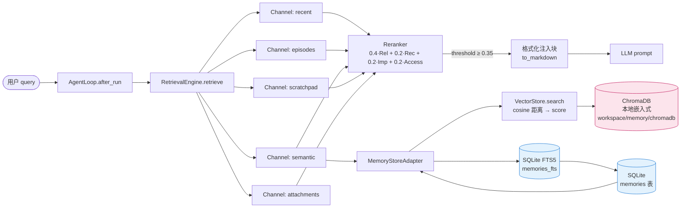
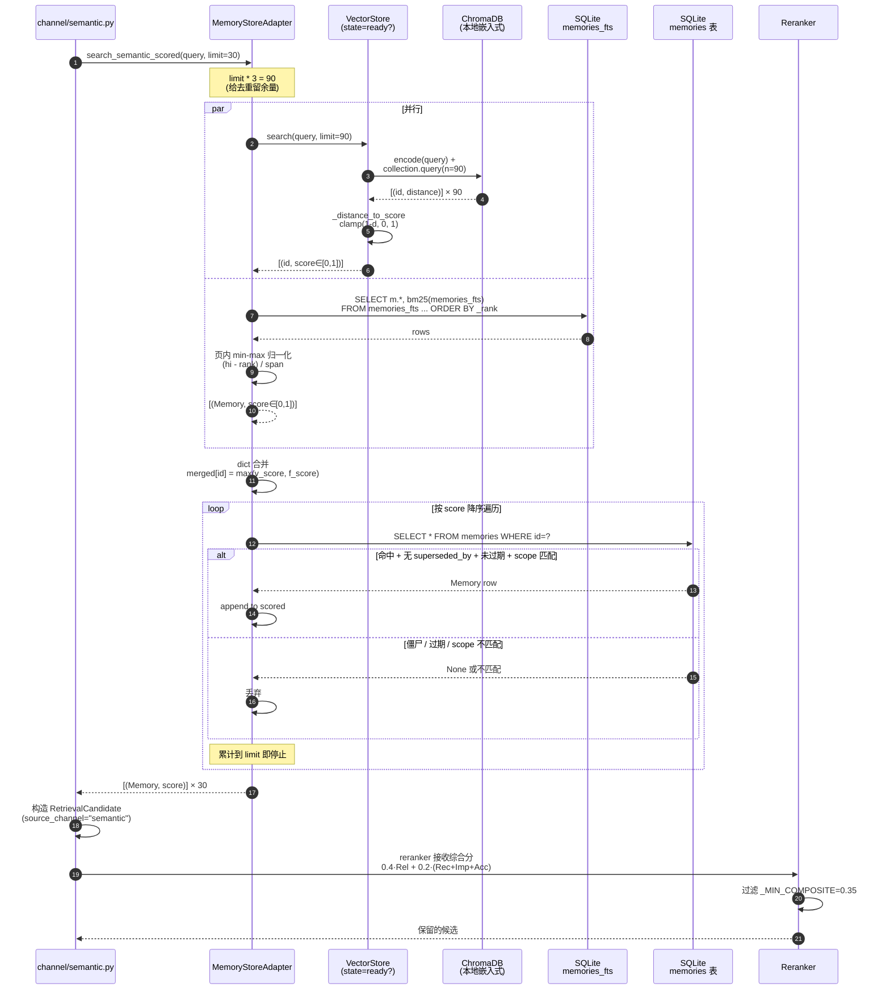
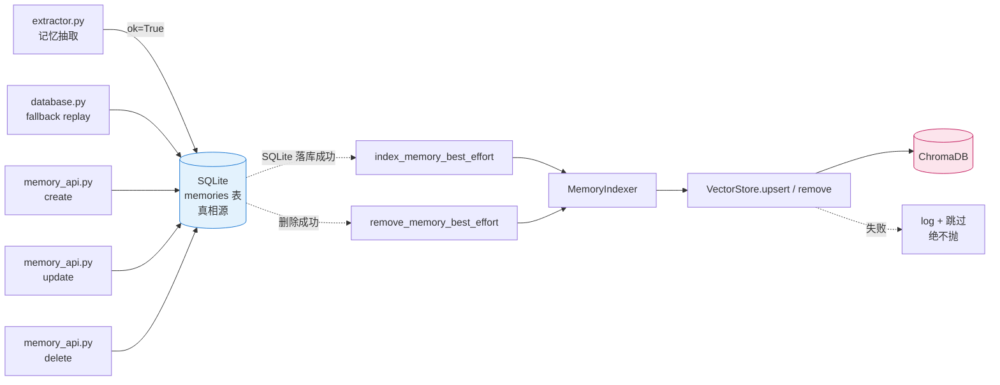
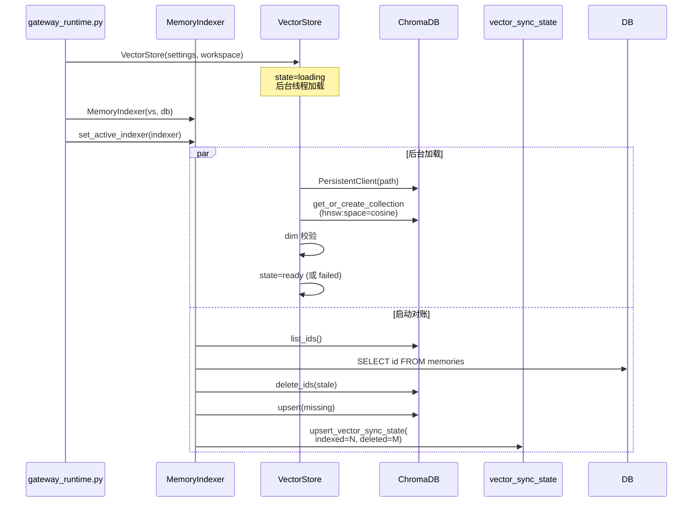

# 向量检索接入后的检索流程

## 1. 数据流总览（双层架构）

**核心结论**：用户 query → RetrievalEngine → 5 个并行 channel → 只有 semantic channel
会**双源**查询（Chroma + FTS5），其余 channel 维持现状。其他流程零变化。

## 2. 一次 `search_semantic_scored` 调用的细节（核心变更点）

## 3. 写入流程（best-effort 挂载）

**关键边界**：SQLite 是**唯一真相源**。向量写入失败只 log，下次启动 `MemoryIndexer.sync_from_sqlite()` 会**自动补偿**（delete_ids + upsert 补漏）。

## 4. 与现状（无向量层）的差异

| 环节 | 现状（无向量） | 加向量后 |
|---|---|---|
| 检索后端 | FTS5 单源 | **Chroma + FTS5 双源**（同 score 量纲） |
| semantic channel 候选 | FTS5 命中 30 条 | **Chroma 90 + FTS5 90，取最高分合并，回查 SQLite 后留 30** |
| 写入路径 | SQLite only | SQLite first → best-effort 索引到 Chroma |
| 启动耗时 | baseline | **+100ms 后台线程**（spec D6，已实测 WU-06） |
| 离线/依赖缺失 | FTS5 always works | Chroma 不可用 → 静默降级到 FTS5 only |
| 维度错配 | n/a | 模型实际 dim ≠ 配置 → 拒绝启用 + 写 error |

## 5. 启动时的握手

## 6. 关键不变量（保留自查）

1. **SQLite = 真相源**：向量层可重建、可丢失，不影响记忆数据
2. **score 越大越相关**：`_distance_to_score` 翻符号的唯一发生点 = `VectorStore` 边界
3. **零失败上抛**：VectorStore 任一方法异常 → `[]` / `False` / `0` + warning log
4. **启动 +100ms 内完成**：VectorStore 构造非阻塞，后台线程加载
5. **写顺序 = SQLite first**：落库成功后才索引（避免索引里有 SQLite 没的孤儿）

## 7. 一句话总结

**修改是只增不改**：原本 FTS5 单源检索变成「FTS5 + Chroma 取最高分」的双源检索，但所有其他环节（5 个 channel、reranker、注入块、LLM prompt）零改动。Chromadb 是进程内嵌入式，不需要额外装服务。
