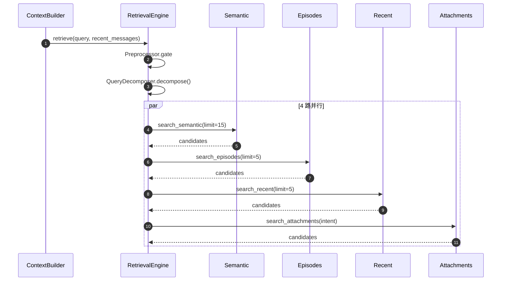
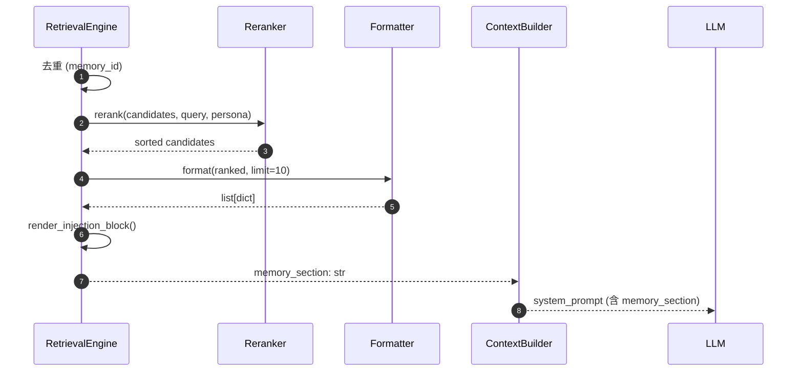
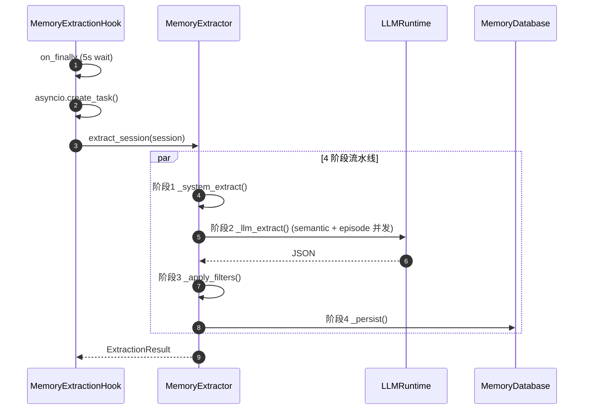
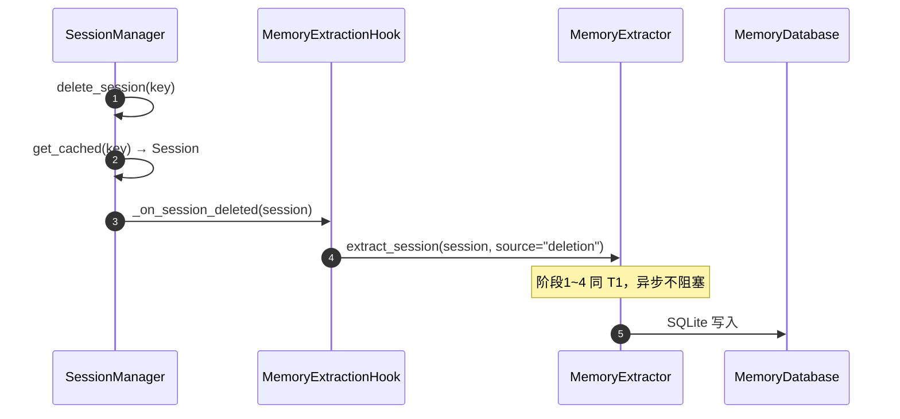

# Phase 3 记忆检索 — 代码审查表

**分支**：`feature/memory-system`
**审查范围**：`ef7e71d..6589eca`（30 files, +3088 -21）
**计划**：[2026-09-11-phase3-memory-retrieval-plan.md](.ai-runtime-artifacts/plans/2026-09-11-phase3-memory-retrieval-plan.md)
**dispatch**：[2026-09-11-phase3-memory-retrieval-dispatch.md](.ai-runtime-artifacts/plans/2026-09-11-phase3-memory-retrieval-dispatch.md)

---

## 审查维度

| # | 维度 | 说明 | 关注文件 |
|---|---|---|---|
| 1 | **正确性** | 数据流：gate → decompose → 4路并行 → rerank → format → 注入 | engine.py, formatter.py, reranker.py |
| 2 | **并发安全** | 4路 `asyncio.gather` + `asyncio.to_thread` 是否有竞态 | engine.py |
| 3 | **失败隔离** | 各路异常是否被 catch 而不传播 | engine.py, memory_extraction.py |
| 4 | **SQL注入安全** | `search_episodes` 等用 `LIKE ?` 参数化查询 | repository.py |
| 5 | **opt-in 默认关闭** | `active_retrieval_enabled=False` / `memory_extraction_enabled=False` | loop.py, context.py |
| 6 | **反注入** | preprocessor 的 `<vault-context>` / section-header 清洗 | preprocessor.py |
| 7 | **工具发现** | `memory_search.py` 是否被 pkgutil 自动发现 | memory_search.py, tools/loader.py |
| 8 | **记忆提取集成** | Phase 2 extractor + Phase 3 retrieval 是否隔离 | extractor.py, engine.py |

---

## 文件清单与审查要点

### 核心检索编排

| 文件 | 行数 | 关键审查点 |
|---|---|---|
| `nanobot/memory/retrieval/engine.py` | ~200 | 4路并发 gather 异常处理 / 去重逻辑 / `max_tokens` 透传 |
| `nanobot/memory/retrieval/__init__.py` | ~10 | 导出是否完整（`RetrievalEngine`, `RetrievalCandidate`）|

### 通道

| 文件 | 行数 | 关键审查点 |
|---|---|---|
| `nanobot/memory/retrieval/channels/semantic.py` | ~60 | FTS5 匹配 / BM25 score / `compute_recency` |
| `nanobot/memory/retrieval/channels/episodes.py` | ~60 | LIKE 路径过滤 / intent 闸门 |
| `nanobot/memory/retrieval/channels/recent.py` | ~60 | recency floor / keyword boost |
| `nanobot/memory/retrieval/channels/attachments.py` | ~60 | 媒体暗示词闸门 / 跨 term 去重 |

### 后处理

| 文件 | 行数 | 关键审查点 |
|---|---|---|
| `nanobot/memory/retrieval/reranker.py` | ~180 | composite formula / CJK 边界 / boost / exemption |
| `nanobot/memory/retrieval/formatter.py` | ~88 | score label 三段 / limit 截断 / 输出字段 |

### 基础组件

| 文件 | 行数 | 关键审查点 |
|---|---|---|
| `nanobot/memory/retrieval/candidate.py` | ~120 | `RetrievalCandidate` 字段 / channel 校验 |
| `nanobot/memory/retrieval/preprocessor.py` | ~120 | gate 逻辑 / 反注入正则 |
| `nanobot/memory/retrieval/decomposer.py` | ~120 | LLM 调用 / rule fallback / LRU cache |
| `nanobot/memory/retrieval/search_backend.py` | ~200 | `FTS5SearchBackend` / `BM25SearchBackend` / LIKE fallback |

### 集成（Phase 2 + Phase 3 交叉）

| 文件 | 行数 | 关键审查点 |
|---|---|---|
| `nanobot/agent/context.py` | +74 | `_build_memory_section` / `active_retrieval_enabled` / 失败隔离 |
| `nanobot/agent/loop.py` | +49 | `_wire_retrieval_engine` / opt-in / `pending_retrieved_memory_section` |
| `nanobot/agent/hooks/memory_extraction.py` | ~500 | T0/T1/T5 触发点 / fire-and-forget / `TASK` 重复提取 |
| `nanobot/memory/extractor.py` | ~835 | 4阶段流水线 / `extract_quick_facts` |
| `nanobot/memory/scratchpad_writer.py` | ~178 | `update_focus` / `archive_completed` |
| `nanobot/memory/filters.py` | ~218 | `is_task_artifact` / `is_ai_self_talk` / N-gram |
| `nanobot/memory/intent.py` | ~146 | 优先级 / CHAT/TASK/QUERY/FOLLOW_UP/COMMAND |
| `nanobot/memory/prompts.py` | ~204 | 4个 prompt 常量 |
| `nanobot/agent/autocompact.py` | +19 | `quick_facts_hook` / `_run_quick_facts` |

### 工具

| 文件 | 行数 | 关键审查点 |
|---|---|---|
| `nanobot/agent/tools/memory_search.py` | ~75 | `create()` / `enabled()` / `execute()` / `read_only` |
| `nanobot/templates/agent/identity.md` | +4行 | `memory_search` 工具告知 |

### Repository 增量

| 文件 | 行数 | 关键审查点 |
|---|---|---|
| `nanobot/memory/repository.py` | +~120 | `search_semantic_scored` / `search_episodes` / `query_semantic` / `search_attachments` 参数化查询 |

---

## 审查问题登记

> 审查时填写此表。Severity: CRITICAL / MAJOR / MINOR / INFO

| # | Severity | 文件 | 行号 | 问题描述 | 建议修复 |
|---|---|---|---|---|---|
| 1 | | | | | |
| 2 | | | | | |
| 3 | | | | | |
| 4 | | | | | |
| 5 | | | | | |

---

## 审查结论

| 维度 | 结论 | 说明 |
|---|---|---|
| 正确性 | ⏳ | 待审查 |
| 并发安全 | ⏳ | 待审查 |
| 失败隔离 | ⏳ | 待审查 |
| SQL安全 | ⏳ | 待审查 |
| opt-in | ⏳ | 待审查 |
| 反注入 | ⏳ | 待审查 |
| 工具发现 | ⏳ | 待审查 |
| 记忆提取集成 | ⏳ | 待审查 |

**总体结论**：⏳ 待审查

---

## 审查命令

```bash
# 审查范围
git log --oneline ef7e71d..6589eca

# 逐文件审查
git diff ef7e71d..6589eca -- nanobot/memory/retrieval/engine.py
git diff ef7e71d..6589eca -- nanobot/memory/retrieval/reranker.py
git diff ef7e71d..6589eca -- nanobot/agent/context.py
git diff ef7e71d..6589eca -- nanobot/agent/loop.py
git diff ef7e71d..6589eca -- nanobot/memory/repository.py

# Lint
ruff check nanobot/memory/retrieval/ nanobot/agent/context.py nanobot/agent/loop.py nanobot/agent/tools/memory_search.py

# 测试（验证）
pytest tests/memory/ tests/agent/tools/test_memory_search_tool.py -q
```

---

## 时序图

> 拆成 6 张子图分别对应 4 路并行召回 / 后处理注入 / T0 / T1 / T2 / T3。

### 图 1A：检索触发 + 4 路并行召回



### 图 1B：检索后处理 + 系统提示注入



### 图 2A：T0 — 即时同步（每轮触发）

```mermaid
sequenceDiagram
    autonumber
    participant Loop as AgentLoop
    participant Hook as MemoryExtractionHook
    participant SW as ScratchpadWriter
    participant DB as MemoryDatabase

    Loop->>Hook: after_run(context)
    Hook->>Hook: classify_intent(last_user_msg)

    alt intent != CHAT
        Hook->>SW: update_focus(session_key, msg[:200])
        SW->>DB: upsert_scratchpad()
    end
```

### 图 2B：T1 — 异步提取（4 阶段流水线）



### 图 2C：T2 — 会话删除触发



### 图 2D：T3 — Quick Facts（压缩后）

```mermaid
sequenceDiagram
    autonumber
    participant Loop as AgentLoop
    participant AC as AutoCompact
    participant Ex as MemoryExtractor
    participant DB as MemoryDatabase

    Loop->>AC: _archive(key, runtime)
    AC->>Ex: extract_quick_facts(session)
    Note over Ex: 仅正则规则信号，不调 LLM
    Ex->>DB: SQLite 写入 (rules only)
```
