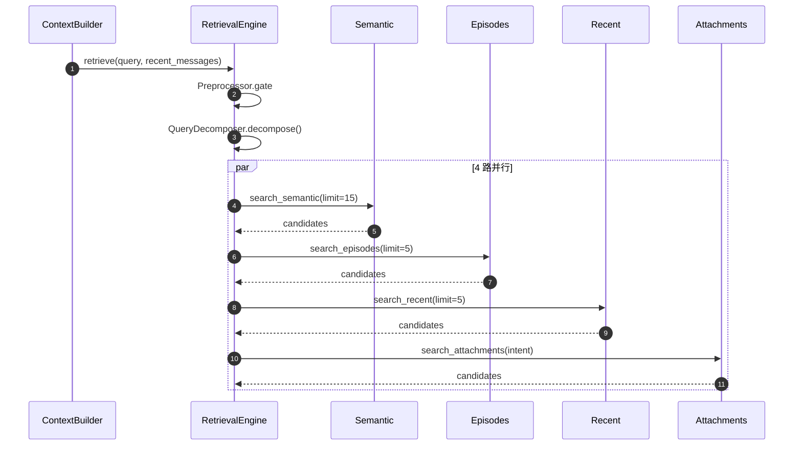
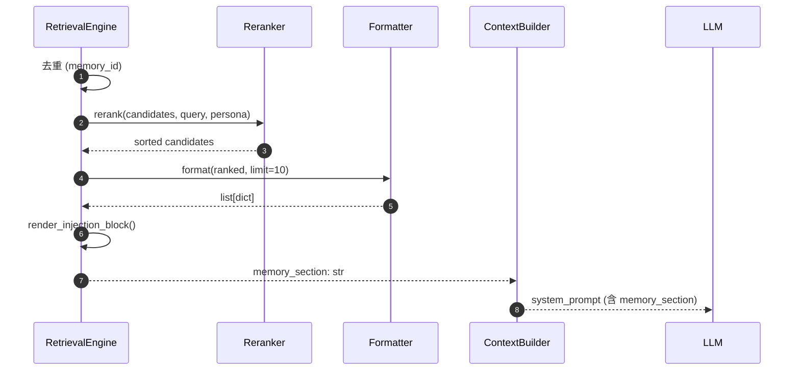
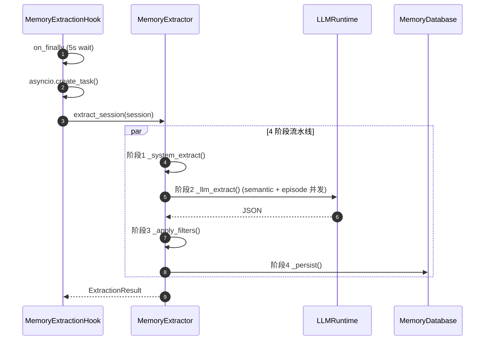
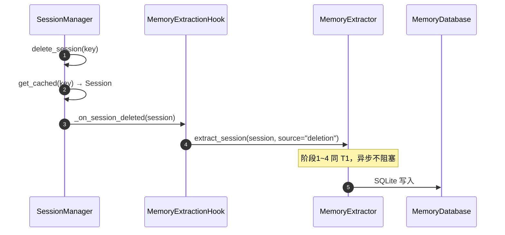

# Phase 3 记忆检索 — 代码审查表

**分支**：`feature/memory-system`
**审查范围**：`ef7e71d..6589eca`（30 files, +3088 -21）
**计划**：[2026-09-11-phase3-memory-retrieval-plan.md](.ai-runtime-artifacts/plans/2026-09-11-phase3-memory-retrieval-plan.md)
**dispatch**：[2026-09-11-phase3-memory-retrieval-dispatch.md](.ai-runtime-artifacts/plans/2026-09-11-phase3-memory-retrieval-dispatch.md)

---

## 审查维度

| # | 维度 | 说明 | 关注文件 |
|---|---|---|---|
| 1 | **正确性** | 数据流：gate → decompose → 4路并行 → rerank → format → 注入 | engine.py, formatter.py, reranker.py |
| 2 | **并发安全** | 4路 `asyncio.gather` + `asyncio.to_thread` 是否有竞态 | engine.py |
| 3 | **失败隔离** | 各路异常是否被 catch 而不传播 | engine.py, memory_extraction.py |
| 4 | **SQL注入安全** | `search_episodes` 等用 `LIKE ?` 参数化查询 | repository.py |
| 5 | **opt-in 默认关闭** | `active_retrieval_enabled=False` / `memory_extraction_enabled=False` | loop.py, context.py |
| 6 | **反注入** | preprocessor 的 `<vault-context>` / section-header 清洗 | preprocessor.py |
| 7 | **工具发现** | `memory_search.py` 是否被 pkgutil 自动发现 | memory_search.py, tools/loader.py |
| 8 | **记忆提取集成** | Phase 2 extractor + Phase 3 retrieval 是否隔离 | extractor.py, engine.py |

---

## 文件清单与审查要点

> 字段：`现/增` = 当前文件总行数 / 本次 review 范围（ef7e71d..6589eca）新增行数。
> "Phase 2 既有" = 文件本轮 review 范围无 diff，但属集成相关。

### 核心检索编排

#### `nanobot/memory/retrieval/__init__.py` — 8 行（+8 全新增）
- **作用**：导出 `RetrievalEngine` / `RetrievalCandidate` / `MemoryQueryPreprocessor` 等公共符号
- **关键定义**：模块级 re-export
- **审查要点**：导出是否完整；是否有命名冲突

#### `nanobot/memory/retrieval/engine.py` — 200 行（+200 全新增）
- **作用**：Layer 4 Active Retrieval 编排器；`retrieve()` 是被动注入的唯一入口
- **关键定义**：
  - `class RetrievalEngine` — 行 43
  - `__init__(store, brain, persona, max_tokens=700)` — 行 46
  - `async retrieve(query, recent_messages, ...)` — 行 60（gate → decompose → 4 路 gather → dedupe → rerank → format → render）
  - `_dedupe_by_memory_id` — 行 155
  - `_build_recency_fn()` — 行 167
  - `_coerce_dt(value)` — 行 177
  - `_render_injection_block(items)` — 行 187
- **审查要点**：4 路 `asyncio.gather(..., return_exceptions=True)` 是否覆盖所有失败；dedupe 策略；`max_tokens` 默认 700 与 `tokens // _TOKENS_PER_CANDIDATE` 截断；`asyncio.to_thread` 包装同步通道是否真的不阻塞 event loop

#### `nanobot/memory/retrieval/candidate.py` — 29 行（+29 全新增）
- **作用**：检索候选统一数据结构（`RetrievalCandidate`）
- **关键定义**：
  - `class RetrievalCandidate` — 行 12（@dataclass）
  - `__post_init__` — 行 24（channel 字段校验）
- **审查要点**：channel 取值范围是否限定为 4 路之一；字段是否 frozen

#### `nanobot/memory/retrieval/preprocessor.py` — 75 行（+75 全新增）
- **作用**：query 闸门 + 反注入清洗，决定是否跳过检索
- **关键定义**：
  - `class PreparedQuery` — 行 32
  - `class MemoryQueryPreprocessor` — 行 39
  - `should_skip_retrieval(query, recent_messages)` — 行 43（classmethod）
  - `clean_query(query)` — 行 57（反注入正则）
  - `prepare(query, recent_messages)` — 行 70（合并 skip + clean）
- **审查要点**：闸门触发条件（CHAT / 短文本 / 空字符串）；反注入正则是否覆盖 `<vault-context>` / section-header

#### `nanobot/memory/retrieval/decomposer.py` — 91 行（+91 全新增）
- **作用**：query 拆解（关键词 + intent），LLM 优先 / 规则兜底
- **关键定义**：
  - `class DecompositionResult` — 行 23
  - `class QueryDecomposer` — 行 29
  - `__init__(brain, cache_max)` — 行 32
  - `async decompose(query, recent)` — 行 37
  - `_do_decompose(query, recent)` — 行 48（LLM 调用）
  - `_build_prompt(query)` — 行 63
  - `_parse_payload(payload)` — 行 66
  - `_rule_decompose(query)` — 行 82（LLM 失败兜底）
- **审查要点**：LRU cache key 是否含 query + recent；`_CACHE_MAX` 默认值；规则兜底覆盖哪些 intent

#### `nanobot/memory/retrieval/reranker.py` — 88 行（+88 全新增）
- **作用**：去重后按 composite 公式重排（relevance × boost × (1 − penalty)）
- **关键定义**：
  - `_compute_recency(updated_at, *, now)` — 行 45
  - `class Reranker` — 行 51
  - `__init__(*, fact_type_names=("fact", "FACT"))` — 行 52
  - `rerank(candidates, query, persona, focus_terms)` — 行 55
- **审查要点**：composite 公式权重；CJK action-prefix 边界（commit `1b2082c` 修复点）；boost 与 penalty 是否互斥

#### `nanobot/memory/retrieval/formatter.py` — 88 行（+88 全新增）
- **作用**：将候选列表格式化为注入 LLM 的 markdown dict 列表
- **关键定义**：
  - `_extract_type_value(raw)` — 行 23
  - `class RetrievalFormatter` — 行 42
  - `__init__(limit=10)` — 行 45
  - `limit` property — 行 51
  - `format(candidates)` — 行 54
  - `_score_label(score)` — 行 77（≥0.8 高度相关 / ≥0.5 中等相关 / 弱相关）
- **审查要点**：`limit` 截断位置（rerank 后 vs 前）；输出字段完整性；`_score_label` 三段阈值

#### `nanobot/memory/retrieval/search_backend.py` — 127 行（+127 全新增）
- **作用**：搜索后端抽象 + FTS5/BM25 实现 + LIKE 兜底
- **关键定义**：
  - `class SearchBackend(Protocol)` — 行 10
  - `score_from_bm25_rank(rank)` — 行 16
  - `class Fts5SearchBackend` — 行 23
  - `__init__(db_path)` — 行 26
  - `search(query, *, limit=10)` — 行 29
  - `_open()` — 行 41
  - `_try_fts5(...)` — 行 50（FTS5 路径）
  - `_fallback_like(...)` — 行 82（LIKE 路径）
  - `create_search_backend(...)` — 行 109（工厂）
- **审查要点**：FTS5 schema 探测；LIKE 兜底触发条件；`score_from_bm25_rank` 归一化

### 通道

#### `nanobot/memory/retrieval/channels/__init__.py` — 9 行（+9 全新增）
- **作用**：导出 4 个通道函数
- **审查要点**：`search_semantic` 是否漏导出（Batch 2 收口修复点）

#### `nanobot/memory/retrieval/channels/semantic.py` — 44 行（+44 全新增）
- **作用**：语义通道（FTS5 + 访问频率加权）
- **关键定义**：
  - `_access_freq(access_count)` — 行 11
  - `search_semantic(store, query, limit, compute_recency)` — 行 15
- **审查要点**：FTS5 BM25 score 与 recency 合成；`compute_recency` 回调签名

#### `nanobot/memory/retrieval/channels/episodes.py` — 53 行（+53 全新增）
- **作用**：episode 通道（事件级别 + intent 闸门）
- **关键定义**：
  - `_extract_query_entities(query)` — 行 15
  - `search_episodes(store, query, limit, compute_recency)` — 行 26
- **审查要点**：LIKE 路径过滤是否参数化；intent 闸门是否漏放 CHAT 类的纯聊天 query

#### `nanobot/memory/retrieval/channels/recent.py` — 52 行（+52 全新增）
- **作用**：最近记忆通道（recency floor + keyword boost）
- **关键定义**：
  - `search_recent(store, query, keywords, limit, compute_recency)` — 行 15
- **审查要点**：recency floor 阈值；keyword boost 是否被 `_RELEVANCE_HIT_LO = 0.5` 设计冗余分支（execution-log 阻塞 #6）

#### `nanobot/memory/retrieval/channels/attachments.py` — 71 行（+71 全新增）
- **作用**：附件/媒体通道（媒体暗示词闸门 + 跨 term 去重）
- **关键定义**：
  - `search_attachments(store, raw_query, keywords, intent, limit, compute_recency)` — 行 27
- **审查要点**：媒体暗示词表；跨 term 去重是否真的去重（Batch 2 收口补 2 个用例）

### 集成（Phase 2 + Phase 3 交叉）

#### `nanobot/agent/context.py` — 433 行（+74）
- **作用**：构建 system prompt；新增 `_build_memory_section()` 触发 Layer 4 检索
- **关键定义**：
  - `class ContextBuilder` — 行 98
  - `__init__(..., active_retrieval_enabled=False, retrieval_engine=None)` — 行 104（opt-in 默认关闭）
  - `async _build_memory_section(query, recent_messages)` — 行 122（异常隔离）
  - `build_system_prompt(...)` — 行 155
- **审查要点**：TYPE_CHECKING-only `RetrievalEngine` import；`_build_memory_section` 失败隔离（try/except → 返回 `""`）；opt-in 默认值

#### `nanobot/agent/loop.py` — 2621 行（+49）
- **作用**：Agent 主循环；新增 `_wire_memory_extraction()` 注册 Phase 2 + Phase 3
- **关键定义**：
  - `class AgentLoop` — 行 209
  - `__init__(memory_extraction_enabled=False, memory_services=None)` — 行 276
  - `_wire_memory_extraction(memory_services)` — 行 491
- **审查要点**：opt-in 默认值；`memory_services.for_workspace(...)` 解析；`_runtime_for_key` 失败降级

#### `nanobot/agent/autocompact.py` — 149 行（+19）
- **作用**：AutoCompact；新增 Quick Facts（T3 触发）
- **关键定义**：`_archive(key, runtime)`、`quick_facts_hook`、`_run_quick_facts`
- **审查要点**：Quick Facts 是否阻塞 archive；`extract_quick_facts` 同步签名

### 工具

#### `nanobot/agent/tools/memory_search.py` — 99 行（+99 全新增）
- **作用**：LLM 可调用的主动检索工具（与 Layer 4 自动注入互补）
- **关键定义**：
  - `class MemorySearchTool(Tool)` — 行 35
  - `__init__` — 行 54
  - `@classmethod create(ctx)` — 行 61
  - `@classmethod enabled(ctx)` — 行 71
  - `async execute(query, max_tokens=500)` — 行 75
  - `read_only` property — 行 98
- **审查要点**：`StringSchema(min_length=1, max_length=200)`；`IntegerSchema(minimum=50, maximum=2000)`；`enabled()` 依赖 `active_retrieval_enabled`；`execute()` 异常隔离

#### `nanobot/templates/agent/identity.md` — 37 行（+2）
- **作用**：LLM 身份模板；新增 `memory_search` 工具告知段
- **审查要点**：两处条件分支（workspace_path）是否对称

### Repository 增量

#### `nanobot/memory/repository.py` — 589 行（+140）
- **作用**：内存存储层新增 4 个检索 API + 3 个 row dataclass
- **关键定义**（新增）：
  - `search_semantic_scored(...)` — 行 464（语义 + 分数）
  - `search_episodes(...)` — 行 482（事件）
  - `query_semantic(...)` — 行 504（语义纯查询）
  - `search_attachments(...)` — 行 534（附件）
  - `_pseudo_bm25_score(rank)` — 行 557
  - `class _EpisodeRow` — 行 563
  - `class _MemoryRow` — 行 572
  - `class _AttachmentRow` — 行 583
- **审查要点**：所有 `LIKE ?` 是否参数化；row dataclass 与 `Memory`/`Episode` 字段映射是否完整

### Phase 2 既有（无 diff，仅集成相关）

| 文件 | 行数 | 作用 | 关键定义 |
|---|---|---|---|
| `nanobot/agent/hooks/__init__.py` | 17 | 导出 hook 工厂 | `create_memory_extraction_hook_factory` |
| `nanobot/agent/hooks/memory_extraction.py` | 524 | Phase 2 提取 hook（T0/T1/T2/T5 触发） | `class MemoryExtractionHook` 行 167；`before_iteration` 行 206；`after_run` 行 216；`on_error` 行 234；`on_finally` 行 250；`_apply_immediate_focus` 行 264；`_detect_topic_change` 行 280；`_judge_topic_change` 行 323；`_schedule_run_extraction` 行 378；`_await_pending_extractions` 行 386；`_run_extraction` 行 418；`create_memory_extraction_hook_factory` 行 449 |
| `nanobot/memory/extractor.py` | 921 | 4 阶段提取流水线 | 8 dataclass（`ActionNode` 行 124、`SystemExtractionResult` 行 148、`LLMMemoryItem` 行 157、`LLMEpisodeItem` 行 170、`LLMExtractionResult` 行 182、`FilteredExtractionResult` 行 196、`PersistenceResult` 行 205、`ExtractionResult` 行 213）；`class MemoryExtractor` 行 526；`extract_session` 行 551；`extract_quick_facts` 行 575；`_system_extract` 行 612；`_llm_extract` 行 629；`_call_track` 行 680；`_build_prompt_messages` 行 718；`_load_existing_memories` 行 744；`_apply_filters` 行 766；`_has_high_similarity` 行 812；`_persist` 行 826；`_map_source` 行 916 |
| `nanobot/memory/scratchpad_writer.py` | 195 | scratchpad 持久化 + 跨用户隔离 | `class ScratchpadWriter` 行 26；`user_id_for_key(session_key)` 行 53；`update_focus` 行 89；`archive_completed` 行 144 |
| `nanobot/memory/filters.py` | 218 | 防污染/去重/N-gram | `class FilterResult` 行 66；`is_task_artifact` 行 86；`is_ai_self_talk` 行 110；`compute_content_hash` 行 141；`_extract_ngrams` 行 166；`ngram_similarity` 行 185 |
| `nanobot/memory/intent.py` | 146 | 用户消息意图分类（8 优先级） | `class IntentType(str, Enum)` 行 20；`classify_intent(message)` 行 90 |
| `nanobot/memory/prompts.py` | 204 | 4 个 LLM prompt 常量 | `EXTRACTION_SYSTEM_PROMPT` / `EPISODE_SYSTEM_PROMPT` / `DECOMPOSITION_SYSTEM_PROMPT` / `JUDGE_TOPIC_CHANGE_PROMPT` |

### 汇总

| 类别 | 文件数 | 新增行数 | 现有总行数 |
|---|---|---|---|
| 核心检索编排 | 9 | 783 | 783 |
| 通道 | 4 | 220 | 220 |
| 集成（Phase 3 新增） | 3 | 142 | 3203 |
| 工具 | 2 | 101 | 136 |
| Repository 增量 | 1 | 140 | 589 |
| Phase 2 既有（无 diff） | 7 | 0 | 2225 |
| **合计** | **28** | **1386** | **7156** |

> 上述不含测试文件。测试增量：13 个文件 / **+1232 行**（execution-log §回归基线 全量 2041 passed）。

---

## 审查问题登记

> 审查时填写此表。Severity: CRITICAL / MAJOR / MINOR / INFO

| # | Severity | 文件 | 行号 | 问题描述 | 建议修复 |
|---|---|---|---|---|---|
| 1 | | | | | |
| 2 | | | | | |
| 3 | | | | | |
| 4 | | | | | |
| 5 | | | | | |

---

## 审查结论

| 维度 | 结论 | 说明 |
|---|---|---|
| 正确性 | ⏳ | 待审查 |
| 并发安全 | ⏳ | 待审查 |
| 失败隔离 | ⏳ | 待审查 |
| SQL安全 | ⏳ | 待审查 |
| opt-in | ⏳ | 待审查 |
| 反注入 | ⏳ | 待审查 |
| 工具发现 | ⏳ | 待审查 |
| 记忆提取集成 | ⏳ | 待审查 |

**总体结论**：⏳ 待审查

---

## 审查命令

```bash
# 审查范围
git log --oneline ef7e71d..6589eca

# 逐文件审查
git diff ef7e71d..6589eca -- nanobot/memory/retrieval/engine.py
git diff ef7e71d..6589eca -- nanobot/memory/retrieval/reranker.py
git diff ef7e71d..6589eca -- nanobot/agent/context.py
git diff ef7e71d..6589eca -- nanobot/agent/loop.py
git diff ef7e71d..6589eca -- nanobot/memory/repository.py

# Lint
ruff check nanobot/memory/retrieval/ nanobot/agent/context.py nanobot/agent/loop.py nanobot/agent/tools/memory_search.py

# 测试（验证）
pytest tests/memory/ tests/agent/tools/test_memory_search_tool.py -q
```

---

## 时序图

> 拆成 6 张子图分别对应 4 路并行召回 / 后处理注入 / T0 / T1 / T2 / T3。

### 图 1A：检索触发 + 4 路并行召回



### 图 1B：检索后处理 + 系统提示注入



### 图 2A：T0 — 即时同步（每轮触发）

```mermaid
sequenceDiagram
    autonumber
    participant Loop as AgentLoop
    participant Hook as MemoryExtractionHook
    participant SW as ScratchpadWriter
    participant DB as MemoryDatabase

    Loop->>Hook: after_run(context)
    Hook->>Hook: classify_intent(last_user_msg)

    alt intent != CHAT
        Hook->>SW: update_focus(session_key, msg[:200])
        SW->>DB: upsert_scratchpad()
    end
```

### 图 2B：T1 — 异步提取（4 阶段流水线）



### 图 2C：T2 — 会话删除触发



### 图 2D：T3 — Quick Facts（压缩后）

```mermaid
sequenceDiagram
    autonumber
    participant Loop as AgentLoop
    participant AC as AutoCompact
    participant Ex as MemoryExtractor
    participant DB as MemoryDatabase

    Loop->>AC: _archive(key, runtime)
    AC->>Ex: extract_quick_facts(session)
    Note over Ex: 仅正则规则信号，不调 LLM
    Ex->>DB: SQLite 写入 (rules only)
```
