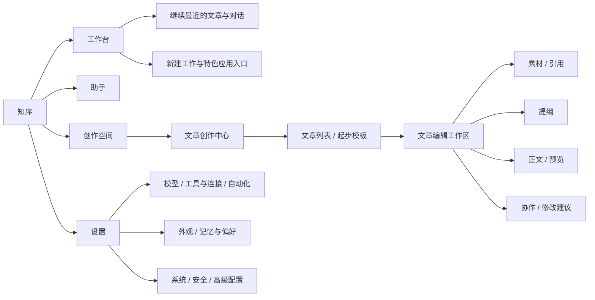

# 知序：个人工作空间与文章创作中心需求及页面设计

> 本文件是待评审设计稿。访谈已完成，以下具体布局、功能优先级与原型交互为推荐方案，尚未获准实施。当前没有可点击原型；页面结构图是设计说明，不能当作已运行页面。

## 1. 产品定位与首轮交付

**知序，是帮助个人整理资料、推进工作并形成成果的 AI 工作与创作助手。**

文章创作中心是知序的首个特色应用，面向技术博客与学习总结。它把一篇文章的素材、观点、提纲、正文与协作建议放进同一个空间，帮助用户把自己的理解整理成可分享的内容。

首轮目标是交付本需求文档与独立可点击原型，用示例数据体验核心流程。先验证页面是否顺手，再设计和接入真实文章存储、Agent 调用与系统迁移。

### 1.1 已确认与本稿建议的区别

| 已确认意图 | 本稿具体建议，等待评审 |
| --- | --- |
| 产品名「知序」 | 文字标志搭配简单的页签/书页图形；不依赖新生成 logo 才能开始原型 |
| 暖白、安静、适度留白、文字导航 | 暖灰侧栏、深色文字、低饱和青绿强调色、三层表面 |
| 个人工作助手与独立文章应用 | 工作台 / 助手 / 创作空间三项全局导航 |
| 技术博客与学习总结 | 技术解析、源码阅读、实践复盘、学习总结四种起步模板 |
| 用户主导、AI 协作 | 正文居中；左侧素材与提纲，右侧 AI 建议；采用前查看修改 |
| 文档 + 可点击原型 | 独立本地演示，不替换当前生产 WebUI，不连接真实 AI |

### 1.2 不纳入首轮的事项

真实 AI 生成、后端保存、实时联网搜集与核验、真实文件解析、网站自动发布、多平台改写运营、多人协作、文章数据迁移、付费与增长分析、Python 包重命名，不属于首轮原型范围。原型中的 AI 内容明确标为演示建议。

## 2. 现状分析与改造原则

### 2.1 当前 UI 的具体问题

| 观察 | 依据 | 改造建议 |
| --- | --- | --- |
| 图标导航、项目和聊天列表同时长期占位 | 用户聊天/应用截图；Sidebar 的 rail 与 ChatList | 改为有文字的全局导航；聊天列表只在助手页面显示 |
| 应用页实际是 CLI / MCP 工具目录 | 用户应用截图；App 的非聊天视图复用 SettingsView | 业务应用进入创作空间；接入能力进入设置中的「工具与连接」 |
| 对话常驻环境、权限、文件变更等工程信息 | 用户聊天截图；既有 SessionWorkbench 设计 | 按需打开「任务详情」；普通对话默认仅显示结果、必要状态与来源 |
| 工作台一词同时可能指首页与会话右栏 | 既有 spec 中工作台右栏与本次首页定位 | 首页保留「工作台」，会话右栏统一叫「任务详情」 |
| 配置页与工作页面有相似的大留白，但缺少统一层级 | 用户设置与应用截图 | 统一字体、内容宽度、分组密度与按钮层级；工作入口和配置入口分开 |
| 品牌与助手回复可能不一致 | 界面 Mira 与截图回复中的 nanobot | 集成阶段统一用户可见品牌；旧会话历史不改写 |

截图中部分中文字形显得偏细、偏衬线；当前代码已有中文无衬线回退，尚不能判断是字体缺失、运行环境还是截图缩放导致。原型需在目标 Windows 浏览器核对实际字形，不能把猜测写成已定位的字体缺陷。

### 2.2 方案比较

| 方案 | 优点 | 代价与适配情况 |
| --- | --- | --- |
| **A. 工作台 + 独立创作空间（推荐）** | 每次打开知道继续什么；文章有自己的工作流程；可扩展其他个人应用 | 需要重做导航与页面切换，但最符合已确认定位 |
| B. 保留聊天首页，增加文章侧栏 | 迁移较小，既有对话逻辑容易复用 | 写作仍依附聊天，难以解决作品管理与正文编辑的中心地位 |
| C. 以文章库为首页的写作产品 | 创作聚焦，文章管理直观 | 会弱化个人工作助手定位，后续加入其他应用较别扭 |

采用 A。正文和成果优先；聊天承担协作；能力配置保持可找到，不长期占据工作画布。

## 3. 整体信息架构



### 3.1 全局导航

- 左侧导航展开约 216–224px：顶部知序文字标志；主要入口「工作台」「助手」「创作空间」；底部「设置」与简洁连接状态。
- 首页与创作空间不显示全部聊天历史，不再额外叠一条常驻功能图标栏。
- 助手页面才出现最近会话、项目过滤等上下文导航；首屏仅显示最近项，完整记录通过搜索查看。
- 文章编辑模式可把全局导航收为 64px；折叠图标必须有提示和可访问名称。退出编辑后恢复上次导航宽度。
- 搜索按当前页面确定范围，输入框明确写「搜索文章」或「搜索对话」；不在第一版引入多种内容混合搜索。

### 3.2 设置的结构

业务空间与能力配置分开。原来的应用目录改称「工具与连接」，与模型、自动化归到能力配置；记忆与写作偏好在个人配置；渠道、环境、权限等放系统和高级配置。

首轮原型仅提供设置分组弹窗作为导航示意，不重做所有配置表单，也不展示虚假的已连接服务状态。

## 4. 视觉语言与排版

**设计关键词：像安静的书桌，清晰、轻盈、便于长时间阅读。**

| 项目 | 推荐值 / 用法 |
| --- | --- |
| 应用底色 | `#F7F6F2`，很浅的暖灰 |
| 侧栏 | `#F0EFE9`，比主背景略深 |
| 正文与卡片 | `#FFFEFB`，接近白的纸面 |
| 主文字 | `#292D29` |
| 次级文字 | `#62685F`；避免用很浅的灰承载必要正文 |
| 分隔线 | `#E3E3DB`，细线 |
| 强调色 | `#3F6B58`，用于主动作、当前导航、焦点；覆盖旧蓝色风格是本稿建议 |
| 状态 | 少量青绿 / 琥珀 / 红；状态同时有文字，不只依靠颜色 |
| 圆角 | 按钮 8px；面板 12px；主输入框 16px；避免全部做胶囊 |
| 阴影 | 弹层和浮动输入区使用轻阴影；普通列表用留白或细线分组 |
| 中文字体 | 优先可用的系统无衬线中文字体，不依赖网络字体；代码用等宽字体 |
| 字号 | 导航与按钮 14px；辅助信息 12–13px；页面标题 28–32px；文章正文 16–17px |
| 行距与宽度 | UI 约 1.5；文章正文约 1.8；阅读列目标宽度 680–760px，随窗口缩放 |
| 间距 | 基于 4/8px 阶梯；页面边距 28–40px；模块间距 24–32px |

主按钮只给当前最重要动作。模板不是巨大的图片海报，文章也不用大面积封面卡片；主要靠标题、摘要、状态与更新时间帮助找回工作。

键盘焦点清晰可见。原型不加入闪烁、自动轮播、装饰性渐变与持续动画。首轮优先完成浅色风格；现有系统的暗色能力在后续集成时保留，并另做视觉核对。

## 5. 页面一：工作台首页

### 5.1 目的与布局

首页回答两件事：「我正在做什么」「下一步从哪里开始」。不以 token 热力图或技术状态作为首页主内容。

```text
┌────────────┬───────────────────────────────────────────┐
│ 知序       │ 工作台                         搜索对话  │
│            │                                           │
│ ● 工作台   │ 继续手头的工作                            │
│   助手     │ 有一个想法，或一件需要推进的事？           │
│   创作空间 │ [ 描述想做的事…              ] [交给助手] │
│            │                                           │
│            │ 继续进行                                  │
│            │ [文章 · Agent 记忆系统…] [最近对话…]      │
│            │                                           │
│            │ 创作空间                                  │
│            │ [文章创作中心   整理资料，写出自己的理解] │
│            │                                           │
│            │ 最近成果                                  │
│            │ 文章标题 / 类型 / 更新时间 / 继续编辑      │
│ 设置       │                                           │
└────────────┴───────────────────────────────────────────┘
```

### 5.2 原型行为

- 「交给助手」进入助手示意页面并带入输入文本，显示明确的演示回复；不调用真实 Agent。
- 继续文章卡片打开对应文章；最近对话卡片打开助手示意。
- 点击文章创作中心进入创作入口。只展示真正有演示内容的应用，不摆未实现功能的可点击占位卡片。
- 最近成果列表最多 3–5项，可直接继续编辑；不做 KPI 仪表盘。
- 无记录时改为明确的空状态与「开始一篇文章」，不以样例记录伪装为用户已有数据。

## 6. 页面二：创作空间 / 文章创作中心

### 6.1 内容结构

初版只有文章这一款应用，因此创作空间直接呈现文章创作中心，避免先点应用卡片再进入第二个几乎相同的首页。页面标题同时说明归属「创作空间 / 文章创作中心」，未来有第二款应用时再增加应用选择层。

```text
┌────────────┬───────────────────────────────────────────┐
│ 知序       │ 创作空间 / 文章创作中心                  │
│ 工作台     │                                           │
│ 助手       │ 今天想写点什么？                          │
│ ●创作空间  │ 把资料、代码和理解，整理成值得分享的文章。 │
│            │ [ 主题或想说明的问题…       ] [开始创作]  │
│            │                                           │
│            │ 从熟悉的方式开始                          │
│            │ [技术解析] [源码阅读] [实践复盘] [学习总结]│
│            │                                           │
│            │ 我的文章                    [搜索文章]    │
│            │ [全部] [构思中] [写作中] [待校对] [已完成]│
│            │ 标题 / 摘要 / 状态 / 素材数 / 更新时间    │
│ 设置       │                                           │
└────────────┴───────────────────────────────────────────┘
```

### 6.2 创建与管理

- 主题必填，纯空白不可创建；模板可选，允许自由写作。标题初始采用主题，之后可修改。
- 点击模板填入对应的提纲结构，进入新文章编辑页；不创建看似已有的完成稿。
- 创建之后状态为「构思中」；用户可手动改状态，填写正文不自动宣称质量合格或文章已完成。
- 文章列表展示标题、短摘要、状态、关联素材数和更新时间；点击打开，菜单支持复制与删除，删除有确认。
- 搜索覆盖标题和摘要；状态过滤与搜索可以组合；无结果时提供清除筛选操作。
- 首次进入原型显示「示例内容」标识；提供可恢复的清空示例体验，以便检查真实空状态。

### 6.3 起步模板

| 模板 | 引导结构 | 主要用途 |
| --- | --- | --- |
| 技术解析 | 问题 → 核心概念 → 原理 → 示例 → 限制与总结 | 解释一个技术主题 |
| 源码阅读 | 阅读目标 → 入口与调用链 → 关键实现 → 设计取舍 → 自己的理解 | 代码与资料整理 |
| 实践复盘 | 背景 → 做法 → 问题与排查 → 结果 → 经验 | 项目经验与踩坑记录 |
| 学习总结 | 学习问题 → 关键知识 → 示例 → 理解变化 → 后续问题 | 阶段性知识沉淀 |

模板提供起点，不把文章锁死在固定字段表单里。用户可以删除、改名与重新排序章节。

## 7. 页面三：文章编辑工作区

### 7.1 布局与主次

```text
┌─────┬─────────────────────────────────────────────────────────────┐
│知序 │ ← 我的文章   Agent 记忆系统实践      写作中      [导出]      │
│导航 ├────────────┬────────────────────────────┬───────────────────┤
│     │ 素材 / 提纲│ 正文                       │ AI 协作           │
│     │            │ [编辑] [预览]              │ 当前文章上下文    │
│     │ + 添加素材 │                            │ [提纲][起草][润色]│
│     │ 资料链接   │ 文章标题                   │                   │
│     │ 代码片段   │                            │ 你的要求…         │
│     │ 自己的观点 │ 在这里整理自己的理解…      │ [生成演示建议]    │
│     │            │                            │                   │
│     │ 引用与备注 │                            │ 修改前 / 修改后   │
│     │            │                            │ [采用] [忽略]     │
│     ├────────────┴────────────────────────────┴───────────────────┤
│     │ 字数 · 示范草稿 · 当前访问内保留修改                         │
└─────┴─────────────────────────────────────────────────────────────┘
```

- 编辑时可折叠全局导航。左栏约 220px，右栏约 300–320px；正文获得剩余空间并设阅读最大宽度。
- 素材和提纲用同一左栏的两个标签，不叠加第四个固定侧栏。
- 首轮正文采用 Markdown 文本编辑与预览切换；代码片段、标题、列表与引用为核心。不把富文本编辑器开发加入原型范围。
- AI 右栏支持折叠；专注模式只保留正文与顶部必要动作。关闭专注模式恢复先前布局。
- 顶部保留返回、标题/状态、导出；模型、推理强度等工程配置不常驻正文工具栏。

### 7.2 素材

原型支持「粘贴文字」「粘贴代码」「添加链接记录」「记录自己的观点」。资料、代码和个人观点在视觉上可区分，均可改标题、修改内容、添加备注、删除，以及切换是否用于本次协作。

链接记录只保存用户填写的标题与 URL，不下载网页、不声称已经核验来源。允许安全的 http/https 链接；不能把用户内容直接当 HTML 执行。真实文件导入、代码仓库解析与网页提取属于后续功能。

点击素材打开正文旁的详情面板，不替换正在编辑的文章。引用可从素材插入到 Markdown 中；原型的“引用”只是内容组织和出处记录，不等于事实验证。

### 7.3 提纲

支持新增章节、改名、删除、上移与下移。使用按钮完成排序，保证键盘可操作，不要求拖拽才能完成。

「整理提纲」产生待采用的演示结构，用户先查看，确认后替换提纲；已有正文不因此被删除。可把章节标题插入正文，编辑与预览模式都能跳转到对应章节。

### 7.4 AI 协作

| 操作 | 用户提供 | 输出与采用方式 |
| --- | --- | --- |
| 整理提纲 | 主题、读者、核心观点、选中素材 | 提纲建议；确认后替换提纲 |
| 起草章节 | 选定章节、自己的观点、相关素材 | 章节草稿；在指定位置插入，不覆盖整篇 |
| 润色选段 | 选中的文字与修改要求 | 原文/建议对照；用户采用后替换选区 |
| 检查表达 | 正文或选段 | 问题清单与修改建议；不自动写入 |

默认强调保留作者观点、技术细节与代码；缺少依据的内容提示需要补资料，不模拟“已验证”标章。写作偏好先用简洁的临时选项呈现，例如读者、表达风格、保留术语；长期学习用户偏好属于后续。

每条修改建议关联目标段落和生成时的正文版本。用户在建议产生后又修改目标段落时，旧建议变为「正文已变化，请重新生成」，不能继续覆盖新文本。采用后可撤销最近一次 AI 修改；撤销也必须检查目标段落之后是否再次变化，冲突时保留新正文。

演示区持续标明「AI 演示建议」，只生成预置或按用户输入组合的本地示例，不伪装成已调用真实模型。选段润色没有选中文本时给出选择文本的提示，不默认处理整篇。

### 7.5 导出与保存提示

- P0 原型导出 Markdown 文件，包含标题、正文与用户插入的引用；文件名去除不适合本地文件名的字符。
- 原型在当前访问内保存编辑状态；切换页面再返回仍保留。刷新恢复示例，不宣称后端已保存。
- 底部使用「当前访问内保留修改」等准确文案；刷新与关闭前提示可导出草稿。浏览器离开提示受环境限制，不能作为持久化保证。
- 复制、导出失败时显示失败原因和保留当前内容的重试路径，不展示成功提示。

## 8. 助手与任务详情的设计边界

助手作为独立页面承载通用对话，不作为文章的唯一存储位置。正文中的 AI 协作与通用助手共享视觉语言，但拥有明确的文章上下文，不自动把所有聊天和素材传给模型。

助手页的原型辅助示意包含最近会话、消息列表、输入区、演示回复和按需打开的任务详情。任务详情以任务目标、过程摘要、产出、来源为主；路径、权限与工具参数在展开后查看。普通问候不展示文件变更统计。

本设计只展示适合用户查看的状态和过程摘要，不把原始内部推理作为默认对话内容。权限相关操作仍应清楚可见，视觉收敛不代表改变权限边界。

既有多会话分屏与桌面壳能力在未来集成阶段保留，作为进阶功能；首轮独立原型不重建分屏引擎。

## 9. 功能优先级与未来需求

| 优先级 | 功能 | 首轮深度 |
| --- | --- | --- |
| P0 | 工作台、创作入口、文章列表、编辑工作区 | 可切换、可操作的独立原型 |
| P0 | 模板、新建、搜索、过滤、删除确认、文章状态 | 当前访问内的示例状态变更 |
| P0 | 素材记录、关联开关、提纲调整、Markdown 编辑与预览 | 本地原型交互 |
| P0 | AI 演示建议、对照、采用、忽略、撤销与过期建议 | 明确标注演示；保护用户正在编辑的内容 |
| P0 | Markdown 导出、空状态、基本失败反馈、响应式 | 可验证的体验，不接业务 API |
| P0 | 助手页面示意、设置分类示意 | 辅助验证全局导航，不复建配置系统 |
| P1 | 真实文章保存、自动保存、版本历史与恢复 | 后续单独设计持久化与并发语义 |
| P1 | 接入现有 Agent，流式生成、中止、失败重试 | 后续设计文章上下文与调用权限 |
| P1 | 文件/网页/仓库素材导入、出处追踪 | 后续确认解析、安全和引用能力 |
| P1 | 写作偏好与既有记忆系统连接 | 用户选择和管理哪些偏好生效 |
| P1 | 技术事实与代码示例检查 | 有来源或执行证据才能声称检查通过 |
| P2 | 配图、结构图、平台排版、更多导出格式 | 在核心写作体验验证后评估 |
| P2 | 发布集成、跨文章知识关联、选题规划 | 不作为首轮验收前提 |

## 10. 概念数据与原型实现边界

以下为页面状态概念，不是已批准后端 API 契约。

| 实体 | 必要字段 |
| --- | --- |
| Article | id、title、topic、template、status、bodyMarkdown、outline、materialIds、updatedAt、revision |
| Material | id、kind、title、content/url、note、included；是否纳入当前协作按文章维护 |
| Suggestion | id、articleId、action、target、baseRevision、before、after、status |
| ConversationDemo | id、title、messages；不关联真实 session key |
| PrototypeState | 当前页面、活动文章、导航折叠、专注模式、搜索与过滤、示例标识 |

建议下一阶段制作一个可独立预览的 HTML 原型，放 `.ai-runtime-artifacts/research/zhixu-prototype/index.html`。不要求后端进程或密钥；不引入新的生产依赖。示例资料采用合成内容，显示“示例”，不读取用户现有记忆或本地私有资料。

页面切换、素材、文章、AI 建议分别管理状态，切换布局不会丢失正文。示例状态与现有 WebUI 的 localStorage、会话和配置隔离。后续集成根据设计拆分页面和组件，不继续把文章功能堆入现有 App.tsx。

未来真实服务至少需要文章 CRUD、素材关联、版本记录和生成任务状态等边界，但本轮不拍定接口 URL、数据库结构或记忆写入策略，以免原型决定业务实现。

### 10.1 品牌迁移边界

原型显示「知序」。未来集成更新 WebUI、桌面窗口、用户可见文案与品牌资产；Python 包名、CLI、配置路径、已有 localStorage key 保持兼容。旧 Mira 品牌 spec 是历史背景，本设计针对新界面的视觉与信息架构提出替代建议，不改写旧 spec 的批准记录。

## 11. 响应式、可访问性与异常状态

| 场景 | 行为 |
| --- | --- |
| >=1280px | 编辑页允许素材、正文、AI 三栏；全局导航可折叠 |
| 900–1279px | 默认正文 + AI；素材作为抽屉，避免把正文挤成窄条 |
| <900px | 正文单栏；素材和 AI 通过标签/抽屉访问；全局导航收起 |
| 约390px手机宽度 | 标题与操作换行；正文与弹层不横向溢出；不是原型的主要工作设备 |
| 空文章 / 无素材 | 简短引导和明确添加入口，正文仍可自由写作 |
| 空主题 / 不合法链接 | 字段旁说明，保留已输入内容 |
| AI 建议等待 | 用「准备演示建议」等准确状态；可取消，不显示真实模型耗时 |
| 建议目标失效 | 保留当前正文，旧建议不可采用，提供重新生成 |
| Markdown 特殊字符 | 作为内容处理，禁止任意脚本执行 |
| 导出或复制失败 | 显示失败；内容不丢失；提供重试 |

交互元素使用可访问名称，弹窗可通过 Escape 关闭、焦点可回到触发位置。编辑控件有标签；按钮可键盘操作。采用/忽略与文章状态均有文字反馈。颜色与排版在真实浏览器核验，设计色值本身不等于已经通过可访问性检查。

## 12. 原型验收场景

以下是下一阶段的验收标准，本轮没有执行或声称通过这些 UI 场景。

1. 打开原型默认是知序工作台，主要导航有文字；应用入口不存在长期占位的全部聊天历史。
2. 点击继续文章进入正确正文；返回列表再进入，当前访问中的编辑仍在。
3. 从源码阅读模板创建文章，主题必填；标题、提纲可改，文章初始没有假完成稿。
4. 添加文字、代码与链接记录，能编辑、排除和删除；不声称已抓取或核验链接。
5. 调整提纲顺序并插入章节标题，已有正文保留；Markdown 编辑与预览可切换。
6. 选段生成演示润色建议，先看原文/建议，再采用；忽略不改正文；采用后可撤销。
7. 在建议生成后修改原段落，旧建议失效，不能覆盖新的编辑；撤销发生冲突时同样保护正文。
8. 搜索与状态过滤可组合；无结果和清空示例后的空状态有可恢复入口。
9. 导出真实可打开的 Markdown 文件，内容与当前正文一致；页面没有「已同步后端」的误导提示。
10. 工作台、创作入口、编辑页及辅助助手示意之间可导航；所有可见主操作有定义好的结果。
11. 在1440px与1024px宽度体验主要流程；390px宽度检查无主要横向溢出；键盘可完成添加素材和采用建议。
12. 原型不调用业务 API、真实模型或发布服务；不改当前生产 UI，不读取用户私有资料。

## 13. 设计稿自检

- 需求均能追溯到访谈，色板、栏宽、模板与数据状态明确标为本稿推荐。
- 页面结构与原型范围一致；助手/设置是辅助示意，未把所有配置系统或任务平台加入首轮。
- 「当前访问内状态」与「未来后端保存」区分清楚；AI 为演示，没有虚假服务集成承诺。
- 本稿没有接口实现、未决定数据库；未来品牌迁移沿用已知兼容边界。
- 文章主体、作者观点和采用权限一致，没有生成即覆盖正文的路径。
- 原型验收覆盖主流程、空状态、编辑冲突、导出、键盘与不同屏宽；待实施阶段运行。

## Next

本设计稿等待用户评审，`approved: false`。按 `harness-kit/core/routing.md` 的阶段门禁，写入设计后本轮停止，不写原型代码或实施计划。

- 认可设计 → 说「写计划」或「制定实施计划」，下一阶段制定可点击原型实施计划。
- 需要调整 → 指出导航、风格、页面或功能的修改意见。
- 希望跳过单独计划 → 明确说「直接实现原型」，再依据任务规模走项目实施路由；本轮不会把设计授权当作实施批准。
